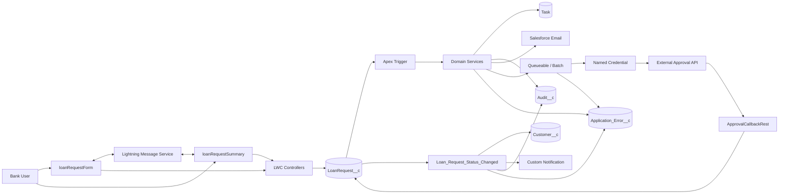
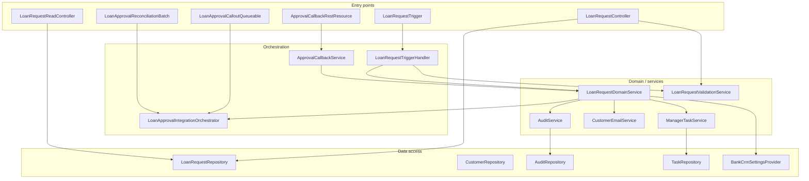
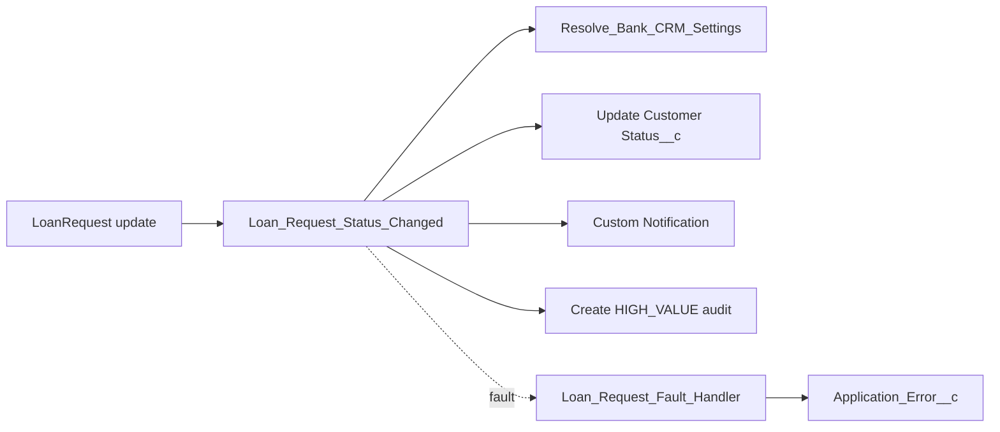

# Bank CRM

Salesforce DX project for a bank CRM that manages customers and loan requests (Tasks, audit, Flow, LWC, and optional external approval integration).

Design documents live in [`docs/`](docs/). The assignment brief is [`project_task.md`](project_task.md).

## Architecture

The system manages bank customers and loan requests on Salesforce. Automation is split deliberately between Apex, Flow, and LWC so Tasks, audits, and notifications are not duplicated.

### High-level system flow



### Architectural layers

| Layer | Components |
|---|---|
| **Presentation** | `loanRequestForm`, `loanRequestSummary`, Bank CRM Lightning app page |
| **Application** | LWC controllers, `LoanRequestTrigger`, record-triggered Flow |
| **Domain** | Task, email, audit, validation, and integration services |
| **Data** | `Customer__c`, `LoanRequest__c`, `Audit__c`, `Task`, `Application_Error__c` |
| **Integration** | Queueable callouts, Named Credential, REST callback, reconciliation batch |
| **Cross-cutting** | Security (CRUD/FLS/sharing), `Bank_CRM_Settings__mdt`, error logging |

### Low-level Apex structure



Thin trigger and controllers delegate to a handler and domain services. Repositories own SOQL/DML; settings come from Custom Metadata, not hard-coded literals.

### Data model and Flow (Part C)

Core relationships:

- `Customer__c` 1──* `LoanRequest__c` (required lookup)
- `LoanRequest__c` 1──* `Audit__c` and `Application_Error__c`
- `Task.WhatId` → `LoanRequest__c`; manager routing via `User` or Queue



F1 runs **after save** when `LoanStatus__c` changes:

- **Approved** → `Customer__c.Status__c = Active Customer`
- **Rejected** → `Customer__c.Status__c = Requires Additional Review`
- **Amount > threshold** → manager custom notification + `HIGH_VALUE_STATUS_REVIEW` audit

### Flow screenshots (Part C)

#### Loan Request Status Changed

Primary record-triggered Flow (`Loan_Request_Status_Changed`). Runs when `LoanStatus__c` changes: updates customer status, and for high-value loans notifies the manager and creates a `HIGH_VALUE_STATUS_REVIEW` audit.


#### Resolve Bank CRM Settings

Autolaunched subflow (`Resolve_Bank_CRM_Settings`) invoked by the main Flow to load threshold, notification type, and manager routing from `Bank_CRM_Settings__mdt`.


#### Loan Request Flow Fault Handler

Autolaunched subflow (`Loan_Request_Flow_Fault_Handler`) for exception handling: creates `Application_Error__c` when a mandatory Flow step fails.


### Automation ownership (no duplicate side effects)

| Concern | Owner | Implementation |
|---|---|---|
| High-value Task on amount threshold | Apex | `ManagerTaskService` + `HighValueTaskCreated__c` |
| `STATUS_CHANGED` audit (every status change) | Apex | `AuditService` |
| Approval email when status → Approved | Apex | `CustomerEmailService` / Queueable |
| External submit / callback / retry | Apex | Orchestrator + Queueable + REST + Batch |
| Customer `Status__c` on Approve / Reject | Flow | `Loan_Request_Status_Changed` |
| Manager custom notification (high-value status change) | Flow | `customNotificationAction` |
| `HIGH_VALUE_STATUS_REVIEW` audit | Flow | Create `Audit__c` with `Source__c = Flow` |
| LWC form save + summary refresh | LWC + Apex | `loanRequestForm` / `loanRequestSummary` + controllers + LMS |

`loanRequestForm` and `loanRequestSummary` are placed in **separate App Builder regions** with no shared parent component. After save, the form publishes a record Id on `Loan_Request_Message_Channel`; the summary reloads authoritative data from Salesforce.

### Runtime sequence (happy path)

1. User saves a loan in `loanRequestForm` → `LoanRequestController`
2. Insert/update on `LoanRequest__c` fires the Apex trigger and after-save Flow
3. Apex creates a Task (if amount > ₪250,000), writes audits, plans approval email, enqueues integration when submitted
4. Flow updates customer status and, on high-value status changes, sends notification + audit
5. Form publishes LMS message with record Id → summary reloads via `LoanRequestReadController`
6. Async Queueable submits to the external approval API; callback updates the loan record

Configuration (threshold, manager routing, integration flags) lives in `Bank_CRM_Settings__mdt`. Operational faults are logged to `Application_Error__c`.

Further detail: [`docs/system-design.md`](docs/system-design.md), [`docs/apex-design.md`](docs/apex-design.md), [`docs/flow-design.md`](docs/flow-design.md), [`docs/data-model.md`](docs/data-model.md), [`docs/lwc-design.md`](docs/lwc-design.md).

## Prerequisites

- [Salesforce CLI](https://developer.salesforce.com/tools/salesforcecli) (`sf`)
- A Dev Hub org you can authenticate against
- Node.js 18+ (for LWC Jest)

## Authenticate

```bash
sf org login web --set-default-dev-hub --alias DevHub
```

## Create a scratch org

```bash
sf org create scratch --definition-file config/project-scratch-def.json --alias BankCRM --set-default --duration-days 7
```

## Deploy source

Production metadata:

```bash
sf project deploy start --source-dir force-app/main
```

Production + Apex tests package directory:

```bash
sf project deploy start --source-dir force-app/main --source-dir force-app/test
```

Assign a role permission set to the default scratch user (needed for FLS on optional fields during manual checks):

```bash
sf org assign permset --name Bank_CRM_Loan_Officer
```

Do not assign `Bank_CRM_Approver` to the same user used for Apex test runs unless you intend to; it grants `Reopen_Final_Loan_Decision` and changes terminal-status validation behavior.
## Run tests

LWC Jest (after `npm install`):

```bash
npm install
npm test
```

Apex (in the default scratch org) — full local suite:

```bash
sf project deploy start --source-dir force-app/main --source-dir force-app/test
sf apex run test --test-level RunLocalTests --result-format human --code-coverage --wait 60
```

Targeted Part E suites (M13):

```bash
sf apex run test --class-names LoanRequestBulkTest,LoanRequestSecurityTest,LoanRequestNegativeTest,LoanApprovalIntegrationContractsTest --code-coverage --result-format human --wait 30
```

Archive a coverage report for submission narrative:

```bash
sf apex get test --test-run-id <runId> --code-coverage --result-format human
```

Coverage goal: **≥ 90%** aggregate on assignment Apex (stretch 92%+). Do not use `SeeAllData=true` or live callouts.
## Project layout

| Path | Purpose |
|---|---|
| `force-app/main` | Deployable production metadata |
| `force-app/test` | Apex test classes (separate package directory) |
| `config/` | Scratch org definition (no credentials) |
| `manifest/` | Explicit deploy/retrieve package manifests |
| `docs/` | Design and submission documentation |
| `scripts/` | Optional Apex/SOQL smoke scripts |

See [`docs/project-structure.md`](docs/project-structure.md) for the full catalog and [`docs/implementation-plan.md`](docs/implementation-plan.md) for the build roadmap.

