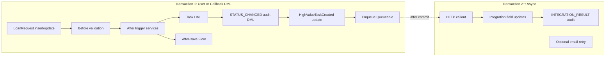
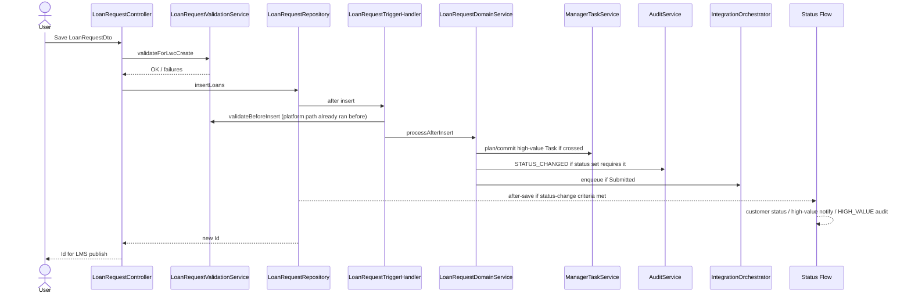
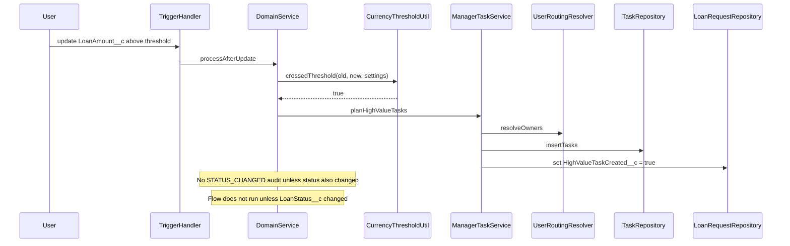
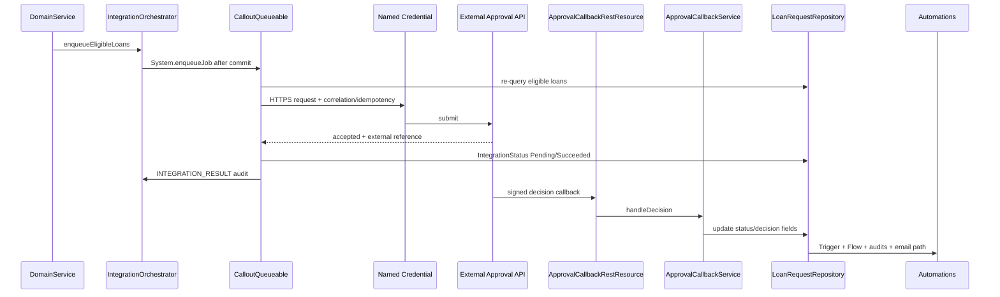
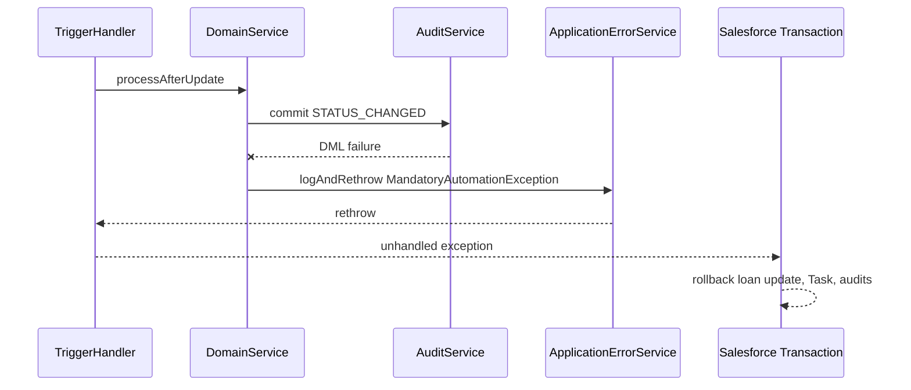
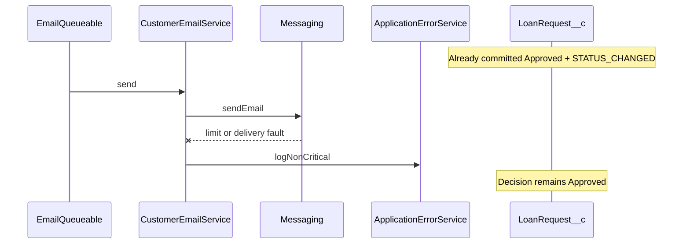

# Bank CRM Apex Design

**Platform:** Salesforce  
**Sources:** `project_task.md`, `docs/project-analysis.md`, `docs/system-design.md`, `docs/data-model.md`  
**Scope:** Apex layer architecture and class design only. No Apex implementation code.

---

## 1. Overall Apex Architecture

The Apex layer implements the assignment’s imperative behaviors: high-value Task creation, approval emails, status-change audits, LWC save/read, and external approval orchestration. Declarative Flow owns customer status updates and the high-value custom notification plus `HIGH_VALUE_STATUS_REVIEW` audit. Apex must not duplicate those Flow responsibilities.

### Design principles

- One trigger per object; zero business logic inside the trigger body.
- Handler coordinates bulk work; services own business rules and side effects.
- Repositories own SOQL/DML so services stay testable and free of query sprawl.
- Configuration (threshold, manager routing, retries, integration enablement) comes from `Bank_CRM_Settings__mdt`, not hard-coded literals.
- Mandatory side effects (Task, `STATUS_CHANGED` audit) fail the transaction; non-critical email failures are logged and retried.
- Callouts never run in the same transaction as the loan DML that enqueues them.
- CRUD/FLS and sharing are enforced at controller and repository boundaries.

### Layered structure

```mermaid
flowchart TB
    subgraph Entry["Entry Points"]
        TR[LoanRequestTrigger]
        LC[LoanRequestController]
        RC[LoanRequestReadController]
        CB[ApprovalCallbackRestResource]
        Q[LoanApprovalCalloutQueueable]
        B[LoanApprovalReconciliationBatch]
    end

    subgraph Orchestration["Orchestration"]
        TH[LoanRequestTriggerHandler]
        IO[LoanApprovalIntegrationOrchestrator]
        CBS[ApprovalCallbackService]
    end

    subgraph Domain["Domain / Services"]
        DS[LoanRequestDomainService]
        VS[LoanRequestValidationService]
        TS[ManagerTaskService]
        ES[CustomerEmailService]
        AS[AuditService]
        ERS[ApplicationErrorService]
    end

    subgraph Access["Data Access"]
        LR_R[LoanRequestRepository]
        CU_R[CustomerRepository]
        AU_R[AuditRepository]
        TK_R[TaskRepository]
        ER_R[ApplicationErrorRepository]
        CFG[BankCrmSettingsProvider]
        USR[UserRoutingResolver]
    end

    subgraph CrossCutting["Cross-Cutting"]
        SEC[ApexSecurityHelper]
        EX[BankCrmException Hierarchy]
        COR[CorrelationIdUtil]
        CUR[CurrencyThresholdUtil]
        DTO[LoanRequestDto / AuditEventDto]
    end

    TR --> TH
    TH --> DS
    TH --> VS
    DS --> TS
    DS --> ES
    DS --> AS
    DS --> IO
    LC --> VS
    LC --> LR_R
    RC --> LR_R
    CB --> CBS
    CBS --> DS
    Q --> IO
    B --> IO
    TS --> TK_R
    TS --> USR
    ES --> CU_R
    AS --> AU_R
    ERS --> ER_R
    DS --> LR_R
    DS --> CU_R
    DS --> CFG
    VS --> CFG
    Entry --> SEC
    Domain --> EX
    Domain --> COR
    Domain --> CUR
    Domain --> DTO
```



### Automation ownership (Apex vs Flow)

| Concern | Owner | Apex class(es) |
|---|---|---|
| High-value Task on threshold crossing | Apex | `ManagerTaskService` |
| `STATUS_CHANGED` audit | Apex | `AuditService` |
| Approval email on transition to `Approved` | Apex | `CustomerEmailService` |
| Integration enqueue / callout / callback | Apex | Integration classes |
| Customer `Status__c` update | Flow | — |
| Manager custom notification on high-value status change | Flow | — |
| `HIGH_VALUE_STATUS_REVIEW` audit | Flow | — |

---

## 2. Trigger Framework

### Purpose

Provide a single, predictable entry point for `LoanRequest__c` database events and delegate all work to a handler that can be unit-tested without invoking the full trigger stack unnecessarily.

### Components

| Component | Role |
|---|---|
| `LoanRequestTrigger` | Thin trigger; routes context to the handler once. |
| `LoanRequestTriggerHandler` | Interprets `Trigger` context, builds change sets, invokes domain/validation services. |
| Recursion / re-entrancy control | Change detection + idempotent field markers (`HighValueTaskCreated__c`), not a blanket static “skip all” flag. |

### Trigger events

| Event | Work |
|---|---|
| Before insert | Validate amount, customer, initial status, integration defaults. |
| Before update | Validate status transitions and protected integration fields. |
| After insert | Detect high-value crossing; enqueue submission if status is `Submitted`. |
| After update | Detect threshold crossings, status changes, newly submitted records. |

### Class: `LoanRequestTrigger`

| Attribute | Detail |
|---|---|
| **Purpose** | Salesforce trigger entry for `LoanRequest__c`. |
| **Responsibilities** | Fire on insert/update; pass `Trigger.new`, `Trigger.oldMap`, and operation type to the handler; contain no business rules. |
| **Public methods** | None (trigger body only). |
| **Inputs** | Platform trigger context. |
| **Outputs** | Side effects via handler/services. |
| **Dependencies** | `LoanRequestTriggerHandler`. |
| **Why it exists** | Assignment requires a trigger; keeping it thin enables reusable, testable logic. |

### Class: `LoanRequestTriggerHandler`

| Attribute | Detail |
|---|---|
| **Purpose** | Orchestrate one bulk pass per trigger invocation. |
| **Responsibilities** | Dispatch by operation; build `LoanRequestChangeContext` (new records + old map); call validation before save; call domain service after save; catch unexpected exceptions, log via `ApplicationErrorService`, and rethrow mandatory failures. |
| **Public methods** | `run(TriggerOperation operation, List<LoanRequest__c> newList, Map<Id, LoanRequest__c> oldMap)` |
| **Inputs** | Operation enum, new list, old map (null on insert). |
| **Outputs** | Void; may throw `BankCrmException` subtypes. |
| **Dependencies** | `LoanRequestValidationService`, `LoanRequestDomainService`, `ApplicationErrorService`, `CorrelationIdUtil`. |
| **Why it exists** | Separates platform plumbing from domain decisions and keeps the trigger one line of delegation. |

### Recursion strategy

- Prefer detecting meaningful field changes (`LoanAmount__c`, `LoanStatus__c`, submission flags) before acting.
- Use `HighValueTaskCreated__c` as durable idempotency for Tasks.
- Allow the same transaction’s later handler invocations (for example, after Flow updates related records) only when change sets still require work.
- Avoid a single static Boolean that suppresses entire subsequent chunks in bulk API scenarios.

---

## 3. Trigger Handlers

The system uses one handler class (`LoanRequestTriggerHandler`) with internal phase methods rather than separate before/after handler classes. This matches the single-object scope of the assignment while remaining clear.

### Internal phase responsibilities

| Phase method (private or package-visible) | Responsibility |
|---|---|
| `handleBeforeInsert` | Default `IntegrationStatus__c`, validate create rules. |
| `handleBeforeUpdate` | Transition and protected-field validation. |
| `handleAfterInsert` | Domain actions for new loans. |
| `handleAfterUpdate` | Domain actions for updates using old/new comparison. |

No additional trigger-handler classes are required for `Customer__c` or `Audit__c` in this design: customer status is Flow-owned; audits are append-only writes from services.

---

## 4. Service Layer

Services express business intent. They accept bulk contexts, return planned side-effect collections or execute through repositories, and do not perform SOQL inside nested loops.

### Class: `LoanRequestDomainService`

| Attribute | Detail |
|---|---|
| **Purpose** | Central domain orchestrator for loan insert/update after-save effects. |
| **Responsibilities** | Compare old/new values; decide which loans need Tasks, audits, emails, or integration enqueue; build action plans; invoke specialized services; update `HighValueTaskCreated__c` when a Task is planned/reset. |
| **Public methods** | `processAfterInsert(List<LoanRequest__c> newRecords, DomainExecutionContext ctx)` · `processAfterUpdate(List<LoanRequest__c> newRecords, Map<Id, LoanRequest__c> oldMap, DomainExecutionContext ctx)` |
| **Inputs** | New records, optional old map, execution context (correlation ID, actor, settings). |
| **Outputs** | Void; persists mandatory side effects; may enqueue async work. |
| **Dependencies** | `ManagerTaskService`, `AuditService`, `CustomerEmailService`, `LoanApprovalIntegrationOrchestrator`, `LoanRequestRepository`, `CustomerRepository`, `BankCrmSettingsProvider`, `CurrencyThresholdUtil`. |
| **Why it exists** | Keeps decision rules in one place so trigger, callback, and future batch paths share identical behavior. |

### Class: `ManagerTaskService`

| Attribute | Detail |
|---|---|
| **Purpose** | Create one high-value manager Task per threshold crossing. |
| **Responsibilities** | Identify crossings (insert above threshold, or update from ≤ threshold to > threshold); resolve owner; build Tasks; reset `HighValueTaskCreated__c` when amount returns to ≤ threshold; skip when marker already true for the current above-threshold period. |
| **Public methods** | `planHighValueTasks(List<LoanRequestChange> changes, BankCrmSettings settings) → TaskPlan` · `commitTasks(TaskPlan plan)` |
| **Inputs** | Change set with old/new amount and customer Ids; settings for threshold and due-date SLA. |
| **Outputs** | Planned `Task` records and loan Ids requiring marker updates. |
| **Dependencies** | `TaskRepository`, `UserRoutingResolver`, `CustomerRepository`, `BankCrmSettingsProvider`. |
| **Why it exists** | Isolates escalation idempotency and ownership rules from status/email logic. |

### Class: `CustomerEmailService`

| Attribute | Detail |
|---|---|
| **Purpose** | Send customer approval confirmation when status transitions into `Approved`. |
| **Responsibilities** | Detect Approved transitions; load customer emails; build messages; send in bulk; optionally write `APPROVAL_EMAIL_SENT` audit; treat send failures as non-critical (log + retry path). |
| **Public methods** | `planApprovalEmails(List<LoanRequestChange> changes) → EmailPlan` · `send(EmailPlan plan, DomainExecutionContext ctx)` |
| **Inputs** | Changes with status old/new and customer Ids. |
| **Outputs** | Send results; may create audit events and application errors. |
| **Dependencies** | `CustomerRepository`, `AuditService`, `ApplicationErrorService`, Messaging API wrapper (utility). |
| **Why it exists** | Assignment requires approval email; isolating it allows partial failure without rolling back the loan decision. |

### Class: `LoanApprovalIntegrationOrchestrator`

| Attribute | Detail |
|---|---|
| **Purpose** | Decide when loans should leave Salesforce for external approval and coordinate outbound/inbound technical state. |
| **Responsibilities** | Detect transition into `Submitted` (or insert as `Submitted`); ensure `ExternalRequestId__c`; enqueue `LoanApprovalCalloutQueueable` after commit; update `IntegrationStatus__c`; honor `IntegrationEnabled__c`. |
| **Public methods** | `enqueueEligibleLoans(Set<Id> loanIds, DomainExecutionContext ctx)` · `processOutboundBatch(List<LoanRequest__c> loans)` · `applyAcceptedResponse(...)` · `scheduleRetry(...)` |
| **Inputs** | Eligible loan Ids or loaded loan records; external response DTOs. |
| **Outputs** | Queueable jobs; updated integration fields; integration audits/errors. |
| **Dependencies** | `LoanRequestRepository`, `AuditService`, `ApplicationErrorService`, `BankCrmSettingsProvider`, Named Credential (config). |
| **Why it exists** | Part A integration requirement; keeps callout timing and retries out of the trigger. |

### Class: `ApprovalCallbackService`

| Attribute | Detail |
|---|---|
| **Purpose** | Apply authenticated external decisions to loans through the same domain rules as UI updates. |
| **Responsibilities** | Validate signature/token; deduplicate by external reference / correlation; map decision to `LoanStatus__c` / references; update via repository so trigger/Flow run normally. |
| **Public methods** | `handleDecision(ApprovalCallbackRequest request) → ApprovalCallbackResult` |
| **Inputs** | Authenticated callback payload (external request Id, decision, reason, correlation). |
| **Outputs** | Success/duplicate/rejected result codes. |
| **Dependencies** | `LoanRequestRepository`, `LoanRequestValidationService`, `ApexSecurityHelper`, `ApplicationErrorService`, `CorrelationIdUtil`. |
| **Why it exists** | Completes the async approval loop without bypassing validation and audit paths. |

---

## 5. Repository / Data Access Layer

Repositories encapsulate queries and DML. Controllers and services depend on repositories rather than inline SOQL. Sharing mode is declared on repository classes according to caller needs (user mode for LWC paths; system mode only where documented for integration user operations).

### Class: `LoanRequestRepository`

| Attribute | Detail |
|---|---|
| **Purpose** | Persist and retrieve `LoanRequest__c`. |
| **Responsibilities** | Insert/update with optional partial success for non-mandatory paths; query by Id set; query by `ExternalRequestId__c`; query reconciliation candidates by `IntegrationStatus__c` + aging timestamp; update high-value markers and integration fields. |
| **Public methods** | `insertLoans(List<LoanRequest__c> records, DmlOptions options)` · `updateLoans(...)` · `getByIds(Set<Id> ids)` · `getByExternalRequestIds(Set<String> keys)` · `findIntegrationCandidates(IntegrationQueryCriteria criteria)` |
| **Inputs** | Records, Id/key sets, query criteria (status set, time window, limit). |
| **Outputs** | Saved records, query results, `Database.SaveResult` collections when partial DML is used. |
| **Dependencies** | `ApexSecurityHelper` (strip inaccessible / enforce CRUD). |
| **Why it exists** | Centralizes selective queries and keeps governor-friendly access patterns consistent. |

### Class: `CustomerRepository`

| Attribute | Detail |
|---|---|
| **Purpose** | Load customers needed for validation, email, and Task routing. |
| **Responsibilities** | Bulk query by Id; return fields required for email, active flag, relationship manager; never query inside loops. |
| **Public methods** | `getByIds(Set<Id> ids)` · `getEmailRoutingData(Set<Id> ids)` |
| **Inputs** | Customer Id sets. |
| **Outputs** | Customer records or lightweight routing DTOs. |
| **Dependencies** | `ApexSecurityHelper`. |
| **Why it exists** | Domain services need related customer data once per transaction. |

### Class: `AuditRepository`

| Attribute | Detail |
|---|---|
| **Purpose** | Append-only insert for `Audit__c`. |
| **Responsibilities** | Bulk insert audit events; refuse update/delete APIs for normal application use. |
| **Public methods** | `insertEvents(List<Audit__c> events)` |
| **Inputs** | Fully populated audit records. |
| **Outputs** | Insert results; failures for mandatory audits propagate as exceptions. |
| **Dependencies** | `ApexSecurityHelper`. |
| **Why it exists** | Enforces immutability at the access boundary and batches audit DML. |

### Class: `TaskRepository`

| Attribute | Detail |
|---|---|
| **Purpose** | Create high-value escalation Tasks. |
| **Responsibilities** | Bulk insert Tasks related to loans; no reliance on Subject text queries for idempotency. |
| **Public methods** | `insertTasks(List<Task> tasks)` |
| **Inputs** | Task records with `WhatId`, `OwnerId`, subject, priority, due date. |
| **Outputs** | Insert results (mandatory → throw on failure). |
| **Dependencies** | `ApexSecurityHelper`. |
| **Why it exists** | Isolates Task DML and keeps escalation commit atomic with marker updates. |

### Class: `ApplicationErrorRepository`

| Attribute | Detail |
|---|---|
| **Purpose** | Persist operational error records. |
| **Responsibilities** | Insert/update error lifecycle fields; query due retries. |
| **Public methods** | `insertErrors(List<Application_Error__c> errors)` · `updateErrors(...)` · `findDueRetries(Datetime asOf, Integer limitSize)` |
| **Inputs** | Error records or retry query parameters. |
| **Outputs** | Persisted errors / candidates. |
| **Dependencies** | None beyond platform DML (may run without user FLS for logging paths, with documented justification). |
| **Why it exists** | Keeps failure telemetry out of business audit storage. |

### Class: `BankCrmSettingsProvider`

| Attribute | Detail |
|---|---|
| **Purpose** | Load and cache `Bank_CRM_Settings__mdt` once per transaction. |
| **Responsibilities** | Return Default settings; expose threshold, retry limit, integration flag, manager/queue keys, notification type name. |
| **Public methods** | `getSettings() → BankCrmSettings` |
| **Inputs** | None (uses known DeveloperName). |
| **Outputs** | Immutable settings DTO. |
| **Dependencies** | Custom Metadata query (cached in static variable for the transaction). |
| **Why it exists** | Prevents repeated CMDT queries and hard-coded policy. |

---

## 6. Domain Models

Lightweight Apex types (inner classes or dedicated classes) carry structured data between layers without exposing raw trigger maps everywhere.

### Class: `LoanRequestChange`

| Attribute | Detail |
|---|---|
| **Purpose** | Represent one loan’s old/new snapshot for decisioning. |
| **Responsibilities** | Expose Id, old/new amount, old/new status, customer Id, high-value marker, integration fields; helper predicates such as `statusChanged()`, `crossedHighValueThreshold(Decimal threshold)`, `transitionedToApproved()`, `becameSubmitted()`. |
| **Public methods** | Factory `fromTrigger(...)`; predicate helpers above. |
| **Inputs** | New record + optional old record + threshold. |
| **Outputs** | Boolean decision helpers; field accessors. |
| **Dependencies** | `CurrencyThresholdUtil` for amount comparison. |
| **Why it exists** | Makes bulk decision loops readable and unit-testable without Trigger context. |

### Class: `DomainExecutionContext`

| Attribute | Detail |
|---|---|
| **Purpose** | Carry cross-cutting execution metadata. |
| **Responsibilities** | Hold correlation Id, actor user Id, settings snapshot, source (`Apex` / `Integration`). |
| **Public methods** | Constructor / builder; getters. |
| **Inputs** | Correlation Id, actor, settings, source enum. |
| **Outputs** | Context object passed into services. |
| **Dependencies** | `BankCrmSettings`, `CorrelationIdUtil`. |
| **Why it exists** | Avoids threading many scalar parameters through every service call. |

### Class: `AuditEventDto`

| Attribute | Detail |
|---|---|
| **Purpose** | Normalized description of a business audit before persistence. |
| **Responsibilities** | Carry event type, old/new values, snapshots, source, correlation, actor. |
| **Public methods** | Builder-style setters or constructor; `toSObject()`. |
| **Inputs** | Event fields from domain services. |
| **Outputs** | `Audit__c` via repository. |
| **Dependencies** | None. |
| **Why it exists** | Decouples event construction from SObject field API names in service logic. |

### Class: `LoanRequestDto` (LWC-facing)

| Attribute | Detail |
|---|---|
| **Purpose** | Safe transfer object for LWC save/read. |
| **Responsibilities** | Expose only allowed fields: record Id, customer Id/name, amount, status; no national identifier or protected integration internals unless explicitly authorized. |
| **Public methods** | Properties for AuraEnabled serialization; static `fromSObject` / `toSObject` mapping helpers. |
| **Inputs** | Client payload or queried `LoanRequest__c`. |
| **Outputs** | DTO instances returned to LWC. |
| **Dependencies** | `ApexSecurityHelper` during mapping. |
| **Why it exists** | Prevents over-exposure of fields through `@AuraEnabled` responses. |

### Class: `TaskPlan` / `EmailPlan`

| Attribute | Detail |
|---|---|
| **Purpose** | Hold prepared side effects before a single bulk commit/send. |
| **Responsibilities** | Collect Tasks/emails and related loan Ids for marker or audit follow-up. |
| **Public methods** | `add(...)`, `isEmpty()`, getters. |
| **Inputs** | Planned items from services. |
| **Outputs** | Collections for repository/Messaging. |
| **Dependencies** | None. |
| **Why it exists** | Supports “prepare then one DML/send” bulkification. |

Domain models are DTOs/value objects only—not a full DDD aggregate framework. No separate Apex “entity” hierarchy beyond these is required for the assignment scope.

---

## 7. Utility Classes

### Class: `CorrelationIdUtil`

| Attribute | Detail |
|---|---|
| **Purpose** | Create and propagate correlation identifiers. |
| **Responsibilities** | Generate UUID-like strings; read existing Id from context if present; attach to audits, errors, and integration payloads. |
| **Public methods** | `newId()` · `currentOrNew()` |
| **Inputs** | Optional existing Id. |
| **Outputs** | String correlation Id. |
| **Dependencies** | None. |
| **Why it exists** | Observability across LWC → trigger → Flow → integration. |

### Class: `CurrencyThresholdUtil`

| Attribute | Detail |
|---|---|
| **Purpose** | Compare loan amounts to the configured high-value threshold correctly. |
| **Responsibilities** | Treat comparison as strictly greater than threshold; in multi-currency orgs, normalize to corporate currency before compare when required by org config. |
| **Public methods** | `isAboveThreshold(Decimal amount, Decimal threshold)` · `crossedThreshold(Decimal oldAmount, Decimal newAmount, Decimal threshold)` |
| **Inputs** | Amounts and threshold from settings. |
| **Outputs** | Booleans. |
| **Dependencies** | None (or Currency conversion helpers if multi-currency is enabled). |
| **Why it exists** | Centralizes the ₪250,000 policy semantics (`>` only). |

### Class: `EmailMessageBuilder`

| Attribute | Detail |
|---|---|
| **Purpose** | Build approval `Messaging.SingleEmailMessage` instances. |
| **Responsibilities** | Set recipients, subject, body templates; avoid PII beyond what is required; support org-wide email address if configured. |
| **Public methods** | `buildApprovalEmail(CustomerEmailContext ctx) → Messaging.SingleEmailMessage` |
| **Inputs** | Customer name/email, loan reference, amount, correlation Id. |
| **Outputs** | Email message objects. |
| **Dependencies** | None. |
| **Why it exists** | Keeps Messaging construction out of `CustomerEmailService` decision logic. |

### Class: `UserRoutingResolver`

| Attribute | Detail |
|---|---|
| **Purpose** | Resolve Task/notification owners from customer + settings. |
| **Responsibilities** | Prefer active `RelationshipManager__c`; else resolve default manager username or queue developer name from settings; emit warning error if fallback used because manager inactive. |
| **Public methods** | `resolveOwner(Customer__c customer, BankCrmSettings settings) → Id` · `resolveOwners(Map<Id, Customer__c> customers, BankCrmSettings settings) → Map<Id, Id>` |
| **Inputs** | Customer(s), settings. |
| **Outputs** | User or Queue Id map keyed by customer Id. |
| **Dependencies** | User/Group queries (batched). |
| **Why it exists** | Manager identity is configuration-driven and must work in every environment. |

### Class: `SanitizedMessageUtil`

| Attribute | Detail |
|---|---|
| **Purpose** | Strip secrets and unnecessary PII from log/audit/error text. |
| **Responsibilities** | Truncate; redact token-like patterns; block raw payload dumps. |
| **Public methods** | `sanitize(String raw) → String` |
| **Inputs** | Exception messages or free text. |
| **Outputs** | Safe string for `Application_Error__c` / `Audit__c.Details__c`. |
| **Dependencies** | None. |
| **Why it exists** | Security and compliance for long-lived operational data. |

---

## 8. Validation Layer

Validation runs in before-trigger paths and again at the LWC controller for fast user feedback. Rules align with `docs/data-model.md`.

### Class: `LoanRequestValidationService`

| Attribute | Detail |
|---|---|
| **Purpose** | Enforce loan integrity and lifecycle rules in Apex. |
| **Responsibilities** | Positive amount; required customer; active customer on submission; email presence for submission/approval readiness; allowed status transitions; rejection reason required; protected integration field edits; terminal status protection for ordinary users. |
| **Public methods** | `validateBeforeInsert(List<LoanRequest__c> records, DomainExecutionContext ctx)` · `validateBeforeUpdate(List<LoanRequest__c> newRecords, Map<Id, LoanRequest__c> oldMap, DomainExecutionContext ctx)` · `validateForLwcCreate(LoanRequestDto dto) → List<ValidationFailure>` |
| **Inputs** | Records/DTO + old map + context (includes actor permissions flags). |
| **Outputs** | Adds `addError` on records for trigger path; returns structured failures for LWC; throws only for unexpected internal errors. |
| **Dependencies** | `CustomerRepository`, `BankCrmSettingsProvider`, `ApexSecurityHelper` (permission checks for protected fields). |
| **Why it exists** | Complements declarative validation rules with transition and cross-object checks that must run in bulk. |

### Allowed status transitions (enforced here)

| From | To |
|---|---|
| `Draft` | `Submitted` |
| `Submitted` | `Under Review`, `Approved`, `Rejected`, `Integration Error` |
| `Under Review` | `Approved`, `Rejected`, `Integration Error` |
| `Integration Error` | `Submitted` (controlled retry) |
| `Approved` / `Rejected` | No change for ordinary users |

### Class: `ValidationFailure`

| Attribute | Detail |
|---|---|
| **Purpose** | Structured field-level error for LWC. |
| **Responsibilities** | Carry field API name and user-safe message. |
| **Public methods** | Constructor; getters. |
| **Inputs** | Field + message. |
| **Outputs** | Serialized to client. |
| **Dependencies** | None. |
| **Why it exists** | Avoids leaking internal exception text to the UI. |

---

## 9. Email Service

Email behavior is owned by `CustomerEmailService` and `EmailMessageBuilder` (sections 4 and 7). Summary of the email design contract:

| Topic | Design |
|---|---|
| Trigger condition | Status **changes into** `Approved` only (not every update while already Approved). |
| Recipient | `Customer__c.Email__c` loaded in bulk. |
| Bulk API | Single `Messaging.sendEmail` call per transaction chunk with all messages. |
| Limits | Cap planned emails to remaining email invocations; excess → application errors + retry queue. |
| Failure policy | Non-critical: do not roll back loan/status audit/Task; log `Application_Error__c`; optional async retry. |
| Audit | Optional `APPROVAL_EMAIL_SENT` via `AuditService` after successful send. |
| Content | Confirmation of approval; loan reference; no national identifier; no secrets. |

---

## 10. Audit Service

### Class: `AuditService`

| Attribute | Detail |
|---|---|
| **Purpose** | Create immutable Apex-owned business audit events. |
| **Responsibilities** | Build `STATUS_CHANGED` events on every status change; build `APPROVAL_EMAIL_SENT` and `INTEGRATION_RESULT` when those services request them; populate snapshots (customer name, amount), actor, correlation, source=`Apex` or `Integration`; never write `HIGH_VALUE_STATUS_REVIEW` (Flow-owned). |
| **Public methods** | `planStatusChangeAudits(List<LoanRequestChange> changes, DomainExecutionContext ctx) → List<AuditEventDto>` · `planEvent(AuditEventDto dto)` · `commitEvents(List<AuditEventDto> events)` |
| **Inputs** | Change sets / DTOs + context. |
| **Outputs** | Persisted `Audit__c` records; failures throw (mandatory for status audits). |
| **Dependencies** | `AuditRepository`, `CustomerRepository` (name snapshot if not on change set), `SanitizedMessageUtil`. |
| **Why it exists** | Assignment requires status-change audits with loan details and customer name; centralizing event types prevents Flow/Apex duplicate semantics. |

### Event ownership matrix

| `EventType__c` | Source | Producer |
|---|---|---|
| `STATUS_CHANGED` | `Apex` | `AuditService` |
| `HIGH_VALUE_STATUS_REVIEW` | `Flow` | Flow only |
| `APPROVAL_EMAIL_SENT` | `Apex` | `AuditService` via email service |
| `INTEGRATION_RESULT` | `Integration` / `System` | Integration orchestrator / callback |

---

## 11. Security Helpers

### Class: `ApexSecurityHelper`

| Attribute | Detail |
|---|---|
| **Purpose** | Enforce CRUD, FLS, and strip inaccessible fields consistently. |
| **Responsibilities** | Check object create/read/update rights; strip fields user cannot access before DML or DTO mapping; provide boolean helpers for “integration user / elevated support” paths used by validation of protected fields. |
| **Public methods** | `assertCreateable(SObjectType t)` · `assertUpdateable(SObjectType t)` · `stripInaccessible(AccessType access, List<SObject> records) → List<SObject>` · `canEditIntegrationFields()` |
| **Inputs** | SObject types, access type, records. |
| **Outputs** | Void asserts (throw `AuthorizationException`) or stripped records / booleans. |
| **Dependencies** | `Security.stripInaccessible`, Schema describe. |
| **Why it exists** | Controllers and repositories must not rely on UI field visibility as a security boundary. |

### Sharing declarations (design)

| Class category | Sharing | Rationale |
|---|---|---|
| LWC controllers | `with sharing` | User-driven create/read respects OWDs. |
| Trigger handler / domain (default path) | `with sharing` or inherited | Prefer user context; document any system-mode exception. |
| Integration callback / queueable under integration user | `without sharing` only if required and documented | Integration user has narrow grants; avoid silent sharing gaps. |
| Error logging repository | May use elevated insert | Must still sanitize payloads. |

### Class: `ApprovalCallbackRestResource`

| Attribute | Detail |
|---|---|
| **Purpose** | Authenticated REST entry for external decisions. |
| **Responsibilities** | Parse request; verify auth; delegate to `ApprovalCallbackService`; return non-revealing error bodies. |
| **Public methods** | `@HttpPost doPost()` (or equivalent REST mapping). |
| **Inputs** | HTTP body + auth headers. |
| **Outputs** | HTTP status + minimal JSON result. |
| **Dependencies** | `ApprovalCallbackService`, `ApexSecurityHelper`, `SanitizedMessageUtil`. |
| **Why it exists** | External system needs a controlled inbound endpoint. |

---

## 12. Exception Handling Strategy

### Exception types

| Class | When thrown | Transaction effect |
|---|---|---|
| `BankCrmException` (base) | Unexpected domain failure | Propagates unless caught for logging |
| `ValidationException` | Programming misuse of validation APIs | Should be rare; trigger path prefers `addError` |
| `AuthorizationException` | CRUD/FLS/sharing denial | Fail operation; generic user message |
| `MandatoryAutomationException` | Task or status audit DML failure | Roll back loan transaction |
| `IntegrationException` | Callout/callback permanent failure | Update loan integration state; do not invent business rejection |

### Class: `ApplicationErrorService`

| Attribute | Detail |
|---|---|
| **Purpose** | Normalize operational failure capture. |
| **Responsibilities** | Map exceptions to categories; sanitize messages; set retryability; insert `Application_Error__c`; never swallow `MandatoryAutomationException`. |
| **Public methods** | `log(Exception e, ErrorContext ctx)` · `logAndRethrow(Exception e, ErrorContext ctx)` · `logNonCritical(Exception e, ErrorContext ctx)` |
| **Inputs** | Exception + context (source component, operation, loan/customer Ids, correlation). |
| **Outputs** | Persisted error; optional rethrow. |
| **Dependencies** | `ApplicationErrorRepository`, `SanitizedMessageUtil`. |
| **Why it exists** | Consistent observability for Apex, Flow faults (via invocable if needed), and async jobs. |

### Policy summary

1. **Validation:** `addError` / DTO failures → user corrects; no error record unless abuse suspected.
2. **Authorization:** generic message to UI; detailed sanitized log for support.
3. **Mandatory automation (Task, STATUS_CHANGED audit):** fail entire transaction.
4. **Email / custom notification (Flow):** non-critical; log + retry.
5. **Integration transient:** mark `Retry Pending`, schedule backoff using settings.
6. **Integration permanent:** mark `Failed` / allow `Integration Error` status per validation rules; alert support.

---

## 13. Transaction Boundaries



| Boundary | Included work | Commit rule |
|---|---|---|
| Loan save transaction | Validation, Task, status audit, marker updates, Flow customer updates, enqueue | All-or-nothing for mandatory pieces |
| Email send | Prefer same transaction after audits; on failure, log without rolling back if send is isolated after successful mandatory DML—or send post-commit via Queueable if platform constraints require it | Design choice: **post-commit Queueable for email** when risk of mixing critical DML with email limits is high; otherwise same-tx send with catch → `logNonCritical` |
| Integration callout | Separate Queueable transaction | Never callout before loan commit |
| Callback | One HTTP request → one loan update transaction | Idempotent on external Ids |
| Reconciliation batch | Bounded scope per execute | Partial success per batch scope with error rows |

**Recommended email boundary for production readiness:** enqueue `CustomerApprovalEmailQueueable` after successful mandatory DML so email governor issues cannot roll back audited decisions. Document this as the preferred pattern even though a same-transaction send is acceptable for small volumes.

---

## 14. Bulkification Strategy

| Rule | Application |
|---|---|
| Accept lists/sets | Every public service method operates on collections. |
| One settings load | `BankCrmSettingsProvider.getSettings()` once per transaction. |
| One customer query | Collect all `Customer__c` Ids → single `CustomerRepository.getByIds`. |
| One user/queue resolve | `UserRoutingResolver.resolveOwners` with username/queue maps queried once. |
| Map-based comparison | `oldMap.get(id)` and `LoanRequestChange` list—no per-record SOQL. |
| Prepare then DML | Build `TaskPlan`, audit list, email list → one insert/send each. |
| No SOQL/DML in loops | Enforced by repository usage. |
| Chunk-safe recursion | Act only on records whose watched fields changed. |
| Partial DML | Only for non-mandatory collections; inspect each `SaveResult`. |
| Async fan-out | Pass Id sets to Queueable; re-query inside job for fresh field values. |

### High-value Task bulk algorithm

1. Build changes for all records in the trigger chunk.
2. Filter to crossings using `CurrencyThresholdUtil.crossedThreshold`.
3. Exclude where `HighValueTaskCreated__c` is already true (unless reset path applies).
4. Bulk-load customers and resolve owners.
5. Insert all Tasks once; update all markers once.

### Status audit bulk algorithm

1. Filter `statusChanged()`.
2. Bulk-load customer names if not already present.
3. Create one `AuditEventDto` per changed loan.
4. Single `AuditRepository.insertEvents`.

---

## 15. Governor Limit Considerations

| Limit | Mitigation |
|---|---|
| SOQL queries | Repositories + single settings load; no queries in loops. |
| SOQL rows | Query only needed fields; bound reconciliation queries by status + time window. |
| DML statements | One DML per SObject type per phase where practical. |
| DML rows | Bulk plans; Batch Apex for backfill/reconciliation. |
| CPU time | Predicate helpers on in-memory changes; avoid repeated describes (cache describe results in util if needed). |
| Email invocations | One `sendEmail` with multiple messages; overflow → async retry. |
| Callouts | Queueable only; one callout pattern per loan or small bulk per job within callout limits. |
| Heap | DTOs with needed fields only; sanitize/truncate long error text. |
| Concurrent Flow + Apex | Keep Apex synchronous work minimal; Flow already runs in same transaction—monitor combined CPU. |
| Queueable depth | Chain only when necessary; prefer Batch for large pending sets. |

### Async class: `LoanApprovalCalloutQueueable`

| Attribute | Detail |
|---|---|
| **Purpose** | Perform Named Credential callouts after loan commit. |
| **Responsibilities** | Re-query loans; skip if no longer eligible; callout; update integration fields; audit result; log retries. |
| **Public methods** | Constructor with `Set<Id>`; `execute(QueueableContext ctx)`. |
| **Inputs** | Loan Id set. |
| **Outputs** | Updated loans / errors / audits. |
| **Dependencies** | `LoanApprovalIntegrationOrchestrator`, repositories, settings. |
| **Why it exists** | Governor-safe separation of DML and callouts. |

### Async class: `LoanApprovalReconciliationBatch`

| Attribute | Detail |
|---|---|
| **Purpose** | Find stuck `Pending` / `Retry Pending` loans and reconcile or retry. |
| **Responsibilities** | Query selective candidates; invoke orchestrator retry; escalate exhausted retries to support queue. |
| **Public methods** | Standard `Database.Batchable` methods. |
| **Inputs** | Batch scope size from schedule. |
| **Outputs** | Updated integration states / errors. |
| **Dependencies** | `LoanRequestRepository`, `LoanApprovalIntegrationOrchestrator`, settings. |
| **Why it exists** | Part E large-volume / reliability story; covers missing callbacks. |

### Async class: `CustomerApprovalEmailQueueable` (recommended)

| Attribute | Detail |
|---|---|
| **Purpose** | Send approval emails post-commit. |
| **Responsibilities** | Load customers; send; audit success; log failures. |
| **Public methods** | Constructor with loan Ids; `execute`. |
| **Inputs** | Loan Ids that transitioned to Approved. |
| **Outputs** | Emails + optional audits/errors. |
| **Dependencies** | `CustomerEmailService`. |
| **Why it exists** | Protects mandatory transaction from email limit failures. |

---

## 16. Class Dependency Diagram

```mermaid
flowchart TB
    subgraph Controllers
        LRC[LoanRequestController]
        LRRC[LoanRequestReadController]
        ACR[ApprovalCallbackRestResource]
    end

    subgraph TriggerStack
        TRIG[LoanRequestTrigger]
        HAND[LoanRequestTriggerHandler]
    end

    subgraph Services
        VAL[LoanRequestValidationService]
        DOM[LoanRequestDomainService]
        TASK[ManagerTaskService]
        MAIL[CustomerEmailService]
        AUD[AuditService]
        INT[LoanApprovalIntegrationOrchestrator]
        CBS[ApprovalCallbackService]
        ERR[ApplicationErrorService]
    end

    subgraph Async
        Q1[LoanApprovalCalloutQueueable]
        Q2[CustomerApprovalEmailQueueable]
        BAT[LoanApprovalReconciliationBatch]
    end

    subgraph Repos
        LRR[LoanRequestRepository]
        CUR[CustomerRepository]
        AUR[AuditRepository]
        TKR[TaskRepository]
        ERRR[ApplicationErrorRepository]
        CFG[BankCrmSettingsProvider]
        ROUTE[UserRoutingResolver]
    end

    subgraph Support
        SEC[ApexSecurityHelper]
        COR[CorrelationIdUtil]
        THU[CurrencyThresholdUtil]
        EMB[EmailMessageBuilder]
        SAN[SanitizedMessageUtil]
    end

    TRIG --> HAND
    HAND --> VAL
    HAND --> DOM
    HAND --> ERR
    DOM --> TASK
    DOM --> MAIL
    DOM --> AUD
    DOM --> INT
    DOM --> LRR
    DOM --> CUR
    DOM --> CFG
    DOM --> THU
    TASK --> TKR
    TASK --> ROUTE
    TASK --> CUR
    MAIL --> CUR
    MAIL --> AUD
    MAIL --> EMB
    MAIL --> Q2
    AUD --> AUR
    AUD --> SAN
    INT --> Q1
    INT --> LRR
    INT --> AUD
    INT --> ERR
    INT --> CFG
    Q1 --> INT
    Q2 --> MAIL
    BAT --> INT
    LRC --> VAL
    LRC --> LRR
    LRC --> SEC
    LRC --> COR
    LRRC --> LRR
    LRRC --> SEC
    ACR --> CBS
    CBS --> VAL
    CBS --> LRR
    CBS --> SEC
    VAL --> CUR
    VAL --> CFG
    VAL --> SEC
    ERR --> ERRR
    ERR --> SAN
    LRR --> SEC
    CUR --> SEC
    AUR --> SEC
    TKR --> SEC
    ROUTE --> CFG
```



---

## 17. Sequence Diagrams for Main Business Flows

### 17.1 LWC create loan (including high-value Task)



### 17.2 Status change to Approved

```mermaid
sequenceDiagram
    participant Actor as User or Callback
    participant Repo as LoanRequestRepository
    participant Hand as LoanRequestTriggerHandler
    participant Dom as LoanRequestDomainService
    participant Aud as AuditService
    participant Mail as CustomerEmailService
    participant Q as CustomerApprovalEmailQueueable
    participant Flow as Status Flow
    participant Cust as Customer__c

    Actor->>Repo: update LoanStatus__c to Approved
    Repo->>Hand: after update
    Hand->>Dom: processAfterUpdate
    Dom->>Aud: commit STATUS_CHANGED
    Dom->>Mail: plan approval emails
    Mail->>Q: enqueue post-commit send
    Repo->>Flow: status changed
    Flow->>Cust: Status__c = Active Customer
    Flow->>Flow: if high value: notify + HIGH_VALUE_STATUS_REVIEW
    Q->>Mail: send emails
    Mail->>Aud: APPROVAL_EMAIL_SENT on success
```

### 17.3 High-value threshold crossing on update



### 17.4 External approval submit and callback



### 17.5 Mandatory automation failure (rollback)



### 17.6 Non-critical email failure (no rollback of decision)



---

## Appendix A – LWC Apex Controllers

### Class: `LoanRequestController`

| Attribute | Detail |
|---|---|
| **Purpose** | Create loans from Component A. |
| **Responsibilities** | Accept DTO; validate; enforce CRUD/FLS; insert; return Id (and correlation Id); never return sensitive fields. |
| **Public methods** | `@AuraEnabled saveLoanRequest(LoanRequestDto dto) → SaveResultDto` |
| **Inputs** | Customer Id, amount, status (and any allowed optional fields). |
| **Outputs** | Record Id, correlation Id, or structured errors. |
| **Dependencies** | `LoanRequestValidationService`, `LoanRequestRepository`, `ApexSecurityHelper`, `CorrelationIdUtil`. |
| **Why it exists** | Part D requires Apex save from LWC. |

### Class: `LoanRequestReadController`

| Attribute | Detail |
|---|---|
| **Purpose** | Authoritative reload for Component B. |
| **Responsibilities** | Query by Id with sharing; map to DTO; cacheable read when safe. |
| **Public methods** | `@AuraEnabled(cacheable=true) getLoanRequest(Id loanRequestId) → LoanRequestDto` |
| **Inputs** | Loan request Id from LMS message. |
| **Outputs** | Customer name, amount, status (accessible fields only). |
| **Dependencies** | `LoanRequestRepository`, `ApexSecurityHelper`. |
| **Why it exists** | Summary must display Salesforce data, not stale form values. |

### Class: `SaveResultDto`

| Attribute | Detail |
|---|---|
| **Purpose** | LWC save response. |
| **Responsibilities** | Carry success flag, record Id, correlation Id, validation failures. |
| **Public methods** | Properties only. |
| **Inputs** | Set by controller. |
| **Outputs** | JSON to LWC. |
| **Dependencies** | `ValidationFailure`. |
| **Why it exists** | Stable client contract. |

---

## Appendix B – Class Catalog (quick index)

| Class | Layer |
|---|---|
| `LoanRequestTrigger` | Entry |
| `LoanRequestTriggerHandler` | Orchestration |
| `LoanRequestDomainService` | Service |
| `LoanRequestValidationService` | Validation |
| `ManagerTaskService` | Service |
| `CustomerEmailService` | Service |
| `AuditService` | Service |
| `ApplicationErrorService` | Service |
| `LoanApprovalIntegrationOrchestrator` | Service |
| `ApprovalCallbackService` | Service |
| `LoanRequestController` | Controller |
| `LoanRequestReadController` | Controller |
| `ApprovalCallbackRestResource` | Controller |
| `LoanApprovalCalloutQueueable` | Async |
| `CustomerApprovalEmailQueueable` | Async |
| `LoanApprovalReconciliationBatch` | Async |
| `LoanRequestRepository` | Repository |
| `CustomerRepository` | Repository |
| `AuditRepository` | Repository |
| `TaskRepository` | Repository |
| `ApplicationErrorRepository` | Repository |
| `BankCrmSettingsProvider` | Config access |
| `UserRoutingResolver` | Utility |
| `ApexSecurityHelper` | Security |
| `CorrelationIdUtil` | Utility |
| `CurrencyThresholdUtil` | Utility |
| `EmailMessageBuilder` | Utility |
| `SanitizedMessageUtil` | Utility |
| `LoanRequestChange` | Domain model |
| `DomainExecutionContext` | Domain model |
| `AuditEventDto` | Domain model |
| `LoanRequestDto` | Domain model |
| `SaveResultDto` | Domain model |
| `TaskPlan` / `EmailPlan` | Domain model |
| `ValidationFailure` | Domain model |
| `BankCrmException` (+ subtypes) | Exceptions |

---

## Document Control

| Item | Value |
|---|---|
| Design type | Apex architecture only |
| Implementation code | Excluded by request |
| Aligned to | System design ownership split (Apex vs Flow) and data model field contracts |
