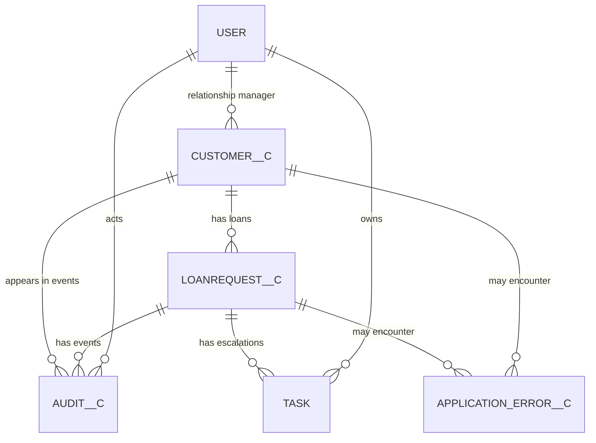

# Bank CRM Data Model

**Platform:** Salesforce  
**Sources:** `docs/project-analysis.md`, `docs/system-design.md`  
**Scope:** Salesforce objects, fields, relationships, validation, and indexing. No Apex code.

---

## 1. Design Principles

The model separates customer master data, transactional loan data, immutable business audit events, and operational errors. This avoids mixing records with different security, retention, and update requirements.

Key decisions:

- A loan references an existing customer through a required lookup. Customer names are not accepted as unverified free text.
- Lookup relationships are used instead of master-detail for loans and audits so deleting a parent does not cascade-delete regulated financial or audit history.
- Customer and loan deletion should be restricted by permissions and business process; deactivation or archival is preferred.
- Currency values are stored as Salesforce `Currency` fields. The org corporate currency is assumed to be ILS; in a multi-currency org, threshold logic must compare normalized corporate-currency values.
- Business states use restricted picklists to prevent spelling variants and make automation deterministic.
- External identifiers are unique External ID fields to support idempotent integrations and selective queries.
- Audit records contain snapshots needed to understand an event later, but not full payloads, secrets, or unnecessary personally identifiable information (PII).
- Business audit events and application errors are separate because they have different audiences, retention rules, and mutability.
- The high-value threshold and routing policy are Custom Metadata, not transactional records or hard-coded values.

Unless stated otherwise, custom objects also retain Salesforce standard fields such as `Id`, `CreatedDate`, `CreatedById`, `LastModifiedDate`, `LastModifiedById`, `SystemModstamp`, and `OwnerId` where the object supports ownership.

---

## 2. Relationship Overview

Relationship behavior:

- `Customer__c` to `LoanRequest__c` is one-to-many through a required lookup.
- `LoanRequest__c` and `Customer__c` to `Audit__c` are lookups. A loan is normally required for loan-related events; the customer is stored when available.
- `Task.WhatId` points to `LoanRequest__c`, and `Task.OwnerId` points to the manager User or an eligible Queue.
- `RelationshipManager__c` and `ActorUser__c` point to `User`.
- Error records can reference a loan and/or customer without becoming dependent on either.
- `Bank_CRM_Settings__mdt` is configuration and has no ownership or transactional parent relationship.

The model intentionally avoids master-detail cascade deletion. Financial transactions, business audits, and operational evidence must survive accidental or administrative changes to parent records.

---

## 3. `Customer__c`

### Purpose

Stores the bank customer identity and CRM state used by loan processing. It supplies the verified customer reference, approval email destination, and preferred relationship manager.

### Fields

| Field | Type | Required | Constraints / default | Design reason |
|---|---|---:|---|---|
| `Name` | Text (80) | Yes | Customer display name | Uses the familiar standard name field for search and UI display. It is not treated as a stable identifier because names can change or be duplicated. |
| `CustomerNumber__c` | Text (30) | Yes | Unique, case-insensitive, External ID | Provides an immutable bank/customer-system key for integration, deduplication, and selective lookup. |
| `Email__c` | Email | Conditional | Required before a loan can enter `Approved` | Supports approval notifications while allowing a prospect to exist before contact data is complete. |
| `Status__c` | Restricted Picklist | Yes | Default `Prospect`; values: `Prospect`, `Active Customer`, `Requires Additional Review`, `Inactive` | Controlled values make Flow decisions reliable. `Inactive` supports record retention without deletion. |
| `RelationshipManager__c` | Lookup(`User`) | Conditional | Required before submission or high-value escalation unless a configured default manager exists | Routes work to the person responsible for the customer while retaining a configurable fallback. |
| `NationalIdentifier__c` | Encrypted Text (for example, 30) | No | Shield Platform Encryption; tightly restricted FLS | Stores a regulated identifier only if the business requires it. Encryption and optionality reduce exposure. |
| `IsActive__c` | Checkbox | Yes | Default `true` | Provides a simple eligibility control independent of descriptive customer status. |

### Required-field policy

`Name`, `CustomerNumber__c`, `Status__c`, and `IsActive__c` are database-required. Email and relationship manager are conditionally required at the process stage where they are needed. This permits early customer onboarding without allowing an unrouteable or unnotifiable loan to proceed.

### Relationships

- One customer can have many `LoanRequest__c` records.
- One customer can be referenced by many `Audit__c` and `Application_Error__c` records.
- `RelationshipManager__c` is a many-to-one lookup to `User`.

The loan relationship is defined on `LoanRequest__c`; this keeps the transaction as the child and supports normal customer-centric related lists.

### Validation rules

| Rule | Condition / behavior | Reason |
|---|---|---|
| Customer number format | Reject blank values and values outside the agreed bank identifier pattern and length. | Prevents malformed integration keys. The exact pattern should match the source banking system rather than an invented national format. |
| Email format and readiness | Salesforce validates email syntax; additionally prevent a customer from being used for approval when `Email__c` is blank. | Syntax validation alone does not ensure that approval communication is possible. |
| Active/status consistency | If `IsActive__c = false`, require `Status__c = Inactive`; prevent `Inactive` while `IsActive__c = true`. | Avoids two fields expressing contradictory eligibility states. |
| National identifier handling | If populated, enforce the agreed format without exposing its value in an error message. | Preserves data quality without leaking PII. |

Cross-object loan-stage requirements are enforced when a loan is submitted or approved, because a validation rule on `Customer__c` alone cannot prevent all invalid loan transitions.

### Index recommendations

- `CustomerNumber__c`: use the automatic unique External ID index. This is the primary integration and exact-match lookup key.
- `Name`: use Salesforce standard name search capabilities. Do not request a custom index solely for partial-name search.
- `RelationshipManager__c`: lookup fields are indexed and support manager work-list filters.
- `Status__c` or `IsActive__c`: request a custom index only if customer volume is high and production query plans show selective filters. Low-cardinality flags alone are often non-selective.
- `NationalIdentifier__c`: do not depend on it as a general search key. Encryption can restrict filtering and indexing behavior; use a separately approved token or hash only if exact-match search is a documented requirement.

---

## 4. `LoanRequest__c`

### Purpose

Stores each loan application, its amount and lifecycle, external approval correlation, and automation idempotency state. It is the central transactional object for the LWC, trigger, Flow, Tasks, audits, and approval-system integration.

### Fields

| Field | Type | Required | Constraints / default | Design reason |
|---|---|---:|---|---|
| `Name` | Auto Number | Yes | Format such as `LR-{00000000}` | Produces a human-readable, immutable loan reference without relying on user input. |
| `Customer__c` | Lookup(`Customer__c`) | Yes | Required lookup; no cascade delete | Guarantees that every loan belongs to a verified customer while preserving the loan if customer retention actions occur. |
| `LoanAmount__c` | Currency (16,2) | Yes | Must be greater than zero | Currency provides locale-aware display and supports ILS/multi-currency behavior. Two decimals are retained for financial precision. |
| `LoanStatus__c` | Restricted Picklist | Yes | Default `Draft`; values: `Draft`, `Submitted`, `Under Review`, `Approved`, `Rejected`, `Integration Error` | A controlled lifecycle enables deterministic transition validation and automation. |
| `SubmissionDate__c` | Date/Time | Conditional | Required when status is beyond `Draft`; set when first submitted | Records the business submission moment rather than relying on `CreatedDate`, since drafts may exist before submission. |
| `ExternalRequestId__c` | Text (64) | Conditional | Unique, case-sensitive External ID; required once sent externally | Provides an idempotency key for outbound requests, callbacks, retries, and upserts. |
| `ExternalDecisionReference__c` | Text (100) | No | Value returned by approval system | Retains the external decision reference separately from Salesforce and request identifiers. |
| `IntegrationStatus__c` | Restricted Picklist | Yes | Default `Not Sent`; values: `Not Sent`, `Pending`, `Succeeded`, `Retry Pending`, `Failed` | Separates technical delivery state from the business loan decision. |
| `IntegrationLastAttempt__c` | Date/Time | No | Updated on each outbound attempt | Supports retry scheduling, aging reports, and operational reconciliation. |
| `HighValueTaskCreated__c` | Checkbox | Yes | Default `false` | Marks whether the current above-threshold period has produced its one required escalation Task. It resets only after the amount returns to or below the threshold. |
| `DecisionReason__c` | Long Text Area (2,000) | Conditional | Required for `Rejected`; restricted FLS | Captures a decision explanation while limiting access to potentially sensitive underwriting information. |

### Required-field policy

`Customer__c`, `LoanAmount__c`, `LoanStatus__c`, `IntegrationStatus__c`, and `HighValueTaskCreated__c` are database-required. Submission, external, and decision fields become mandatory only when the record reaches the corresponding lifecycle state. This avoids placeholder data in drafts while preserving integrity once processing begins.

### Relationships

- Many loans belong to one `Customer__c`.
- One loan can have many `Audit__c` records through `Audit__c.LoanRequest__c`.
- One loan can have many standard `Task` records through `Task.WhatId`.
- One loan can have many `Application_Error__c` records.

A lookup to `Customer__c` is preferred to master-detail. Loan ownership and sharing may differ from customer ownership, and loan/audit history must not be cascade-deleted.

### Validation rules

| Rule | Condition / behavior | Reason |
|---|---|---|
| Positive amount | `LoanAmount__c` must be greater than zero. | Zero and negative applications have no valid business meaning. |
| Active customer | Prevent submission when the related customer is inactive. | Stops new processing for customers who are not eligible for new loans. |
| Submission prerequisites | Entering `Submitted` requires customer, positive amount, active customer, resolvable manager routing, and customer email. | Ensures downstream integration, escalation, and email processes have required data. |
| Submission timestamp | Any status other than `Draft` requires `SubmissionDate__c`; once populated, ordinary users cannot clear it. | Preserves the original process timestamp. |
| Rejection reason | `Rejected` requires `DecisionReason__c`. | Supports explainability and review of adverse decisions. |
| Final decision integrity | `Approved` and `Rejected` are terminal for ordinary users; reopening requires a dedicated permission/process. | Prevents accidental reprocessing, duplicate emails, and conflicting decisions. |
| Allowed status transitions | `Draft → Submitted`; `Submitted → Under Review`, `Approved`, `Rejected`, or `Integration Error`; `Under Review → Approved`, `Rejected`, or `Integration Error`; `Integration Error → Submitted` for controlled retry. | Makes the lifecycle explicit and blocks skipped or backward transitions that could bypass controls. |
| Integration consistency | `Not Sent` must not have an external request ID; `Pending`, `Succeeded`, `Retry Pending`, or `Failed` requires one. `Succeeded` requires an external decision reference when the API supplies it. | Prevents contradictory technical states and improves reconciliation. |
| Protected integration fields | Only the integration user or a dedicated support permission may edit external IDs, external references, attempt timestamps, and technical status after submission. | Prevents users from fabricating integration evidence. |
| Decision reason length/content | Do not allow secrets, full external payloads, or national identifiers to be copied into `DecisionReason__c`. | Minimizes sensitive-data duplication. This also requires UI guidance and monitoring because a formula cannot reliably detect all sensitive text. |

The high-value rule is strictly greater than ₪250,000, matching the assignment. Exactly ₪250,000 is not high value.

### Index recommendations

- `ExternalRequestId__c`: use the automatic unique External ID index for callback lookup and idempotency.
- `Customer__c`: the lookup index supports customer-related lists and customer-scoped loan queries.
- `OwnerId`, `CreatedDate`, `SystemModstamp`, and `Name`: use standard Salesforce indexes where applicable.
- `IntegrationStatus__c`: consider a custom index when reconciliation jobs scan a large loan population. Pair filtering with a bounded `IntegrationLastAttempt__c` range; confirm selectivity with Query Plan.
- `IntegrationLastAttempt__c`: request a custom index only when aging/retry queries justify it at production volume.
- `LoanStatus__c`: consider a custom index for large, selective queues such as a small `Submitted` subset. A low-cardinality status filter across most records will not be selective by itself.
- `SubmissionDate__c`: useful for bounded work queues and archival. Request a custom index only after query-plan evidence.
- `HighValueTaskCreated__c`: do not index alone; a Boolean is normally too low-cardinality. Combine it with selective status/date criteria in operational queries.
- `LoanAmount__c`: do not index solely for the high-value automation, which evaluates changed records rather than querying the complete table.

---

## 5. `Audit__c`

### Purpose

Stores immutable, normalized business events for loan status changes, high-value reviews, approval emails, and integration results. It answers who did what, when, to which loan/customer, and with what relevant before/after state.

### Fields

| Field | Type | Required | Constraints / default | Design reason |
|---|---|---:|---|---|
| `Name` | Auto Number | Yes | Format such as `AUD-{000000000}` | Gives compliance and support a stable event reference without editable names. |
| `LoanRequest__c` | Lookup(`LoanRequest__c`) | Conditional | Required for all loan events | Connects the event to the transaction while preventing cascade deletion. |
| `Customer__c` | Lookup(`Customer__c`) | No | Populated when available | Enables customer-centric audit review even if the loan relationship is unavailable to a given process. |
| `EventType__c` | Restricted Picklist | Yes | `STATUS_CHANGED`, `HIGH_VALUE_STATUS_REVIEW`, `APPROVAL_EMAIL_SENT`, `INTEGRATION_RESULT` | Distinguishes Apex, Flow, email, and integration events and prevents overlapping requirements from producing indistinguishable records. |
| `OldValue__c` | Text (255) | No | Previous relevant state | Retains a concise transition snapshot without storing a full record payload. |
| `NewValue__c` | Text (255) | No | New relevant state | Completes the transition evidence. |
| `CustomerNameSnapshot__c` | Text (80) | Yes | Name at event time | Preserves historical meaning if the customer's current name later changes. |
| `LoanAmountSnapshot__c` | Currency (16,2) | Yes | Amount at event time | Preserves the amount used for threshold and decision context. |
| `OccurredAt__c` | Date/Time | Yes | Event time | Uses the actual business-event time, which may differ from record creation during async processing. |
| `ActorUser__c` | Lookup(`User`) | No | Initiating user when applicable | Attributes human actions while allowing system/integration events with no human actor. |
| `CorrelationId__c` | Text (64) | Yes | Transaction/integration correlation identifier | Links related logs, automation, and external activity without copying payloads. |
| `Source__c` | Restricted Picklist | Yes | `Apex`, `Flow`, `Integration`, `System` | Shows which automation boundary produced the event. |
| `Details__c` | Long Text Area (4,000) | No | Sanitized summary only | Allows useful context while explicitly excluding secrets, tokens, raw payloads, and unnecessary PII. |

### Required-field policy

Event type, snapshots, event time, correlation ID, and source are required because an audit without identity, timing, context, or provenance is not useful. `LoanRequest__c` is conditionally required for every event type currently defined; the conditional wording leaves room for future non-loan business events without weakening present rules.

### Relationships

- Many audit events can reference one loan and one customer.
- `ActorUser__c` optionally references the initiating `User`.

Lookups preserve records independently. Snapshot fields are intentionally denormalized because related names and amounts can change after the event.

### Validation rules

| Rule | Condition / behavior | Reason |
|---|---|---|
| Loan required by event type | All currently supported event types require `LoanRequest__c`. | Prevents orphaned business evidence. |
| Transition values | `STATUS_CHANGED` requires both `OldValue__c` and `NewValue__c`, and they must differ. | Ensures a status event represents a real transition. |
| Source/event consistency | `HIGH_VALUE_STATUS_REVIEW` must use `Flow`; normal `STATUS_CHANGED` must use `Apex`; integration results must use `Integration` or `System`. | Enforces the automation ownership defined in the system design and makes duplicate events detectable. |
| Actor consistency | Human-originated events require `ActorUser__c`; authenticated system/integration events may omit it. | Avoids fake user attribution while retaining accountability where available. |
| Append-only control | Deny update/delete to normal users through object permissions; a controlled compliance retention process is the only exception. | Immutability is an access-control concern and cannot be guaranteed by validation rules alone, especially for deletion. |
| Sanitized details | Prevent known secret/token patterns where practical and prohibit raw request/response payloads by policy. | Reduces sensitive data in long-lived audit storage. |

### Index recommendations

- `LoanRequest__c`, `Customer__c`, and `ActorUser__c`: lookup indexes support parent-scoped audit queries.
- `CreatedDate` and `SystemModstamp`: use standard indexes for ingestion, archival, and incremental export.
- `CorrelationId__c`: request a custom index if support and integration investigations use it frequently; make it an External ID only if external systems also use it as a lookup key. It is not unique because several events may share one correlation ID.
- `OccurredAt__c`: request a custom index for high-volume time-bounded compliance queries or archival.
- `EventType__c`: consider a custom index only when a queried event type is selective. Always combine it with a bounded date or parent filter at scale.
- Avoid filters on `Details__c`, `OldValue__c`, or `NewValue__c` for large datasets; long text is not suitable for selective transactional querying.

For very large retention volumes, archive historical events to compliant external storage or a Salesforce Big Object while preserving queryable recent events in `Audit__c`.

---

## 6. Standard `Task`

### Purpose

Represents actionable manager work when a loan first crosses above the configured high-value threshold. A Task is used because the assignment explicitly requires one and because it provides ownership, due dates, status, and standard Salesforce work-list behavior.

### Fields used

| Field | Type | Required | Constraints / default | Design reason |
|---|---|---:|---|---|
| `Subject` | Picklist/Text | Yes | Stable value such as `Review High-Value Loan` | Supports reporting and duplicate detection without embedding customer PII. |
| `WhatId` | Polymorphic Lookup | Yes | References `LoanRequest__c` | Relates the action directly to the loan under review. |
| `OwnerId` | Lookup(`User`/eligible `Group`) | Yes | Relationship manager or configured default | Places the work in the correct manager or queue work list. |
| `Status` | Picklist | Yes | Default `Not Started` | Uses the standard Task lifecycle. |
| `Priority` | Picklist | Yes | Default `High` | Makes threshold escalations visible in work queues. |
| `ActivityDate` | Date | Yes | Due date based on configured service level | Gives the escalation a measurable response deadline. |
| `Description` | Long Text Area | No | Sanitized summary and loan reference | Provides context without copying national identifiers or full underwriting details. |
| `Type` | Picklist, if enabled | No | `High-Value Loan Review` | Provides a reportable classification separate from free-form subject text. |

### Required-field policy

The platform requires core Task values, while this design additionally requires `WhatId` and `ActivityDate` for high-value Tasks. An unlinked or undated escalation would not be operationally useful.

### Relationships

- `WhatId` references the qualifying `LoanRequest__c`.
- `OwnerId` references the customer's active relationship manager, a configured default User, or an eligible Queue.

The customer is reached through the loan rather than duplicated in `WhoId`, because `Customer__c` is a custom object and the actionable subject is the loan.

### Validation rules

| Rule | Condition / behavior | Reason |
|---|---|---|
| High-value Task completeness | When `Type`/`Subject` identifies a high-value review, require `WhatId`, owner, due date, and `High` priority. | Prevents incomplete escalations. |
| Related-record type | High-value review Tasks must relate to `LoanRequest__c`. | Prevents the automation/reporting category from being attached to unrelated objects. |
| Closure requirements | Closing a high-value Task requires an approved disposition value if the bank adds one. | Supports evidence that the escalation was actually reviewed. |

Task creation is idempotent per threshold crossing. `LoanRequest__c.HighValueTaskCreated__c` is the durable marker; relying only on a subject query would be vulnerable to edits and non-selective at volume.

### Index recommendations

- Use standard indexes on `OwnerId`, `WhatId`, `Status`, `ActivityDate`, and `CreatedDate`.
- Manager work queues should filter by indexed owner and bounded due date, with status as an additional filter.
- Do not use `Subject LIKE '%value%'` for automation or large reports; leading-wildcard text searches are non-selective.
- If a dedicated Task `Type` is used, combine it with owner/date/status filters rather than expecting a low-cardinality type value to be selective alone.

---

## 7. `Application_Error__c`

### Purpose

Stores sanitized operational failures from Apex, Flow, notifications, and integration processing. It supports retries and support dashboards without polluting the immutable business audit trail.

### Fields

| Field | Type | Required | Constraints / default | Design reason |
|---|---|---:|---|---|
| `Name` | Auto Number | Yes | Format such as `ERR-{000000000}` | Stable support reference. |
| `SourceComponent__c` | Text (120) | Yes | Component, Flow, service, or endpoint name | Identifies the failing boundary without requiring a deployment-specific stack trace. |
| `Operation__c` | Text (120) | Yes | Sanitized operation name | Distinguishes actions within one component. |
| `LoanRequest__c` | Lookup(`LoanRequest__c`) | No | Populate when known | Connects failures to affected transactions while allowing platform-level errors. |
| `Customer__c` | Lookup(`Customer__c`) | No | Populate only when needed | Supports investigation without duplicating customer PII. |
| `CorrelationId__c` | Text (64) | Yes | Shared request/transaction identifier | Connects the error to audit and integration events. |
| `OccurredAt__c` | Date/Time | Yes | Failure time | Supports sequencing, alerting, and retention. |
| `Category__c` | Restricted Picklist | Yes | `Validation`, `Authorization`, `Automation`, `Notification`, `Integration Transient`, `Integration Permanent`, `Flow Fault`, `Unknown` | Drives triage and reporting with controlled values. |
| `IsRetryable__c` | Checkbox | Yes | Default `false` | Separates failures eligible for automated retry. |
| `AttemptCount__c` | Number (3,0) | Yes | Default `0`, non-negative | Tracks bounded retry attempts. |
| `NextRetryAt__c` | Date/Time | Conditional | Required for scheduled retry | Supports backoff and selective retry queries. |
| `SanitizedMessage__c` | Long Text Area (4,000) | Yes | No secrets, PII, or raw payload | Gives support useful context without turning logs into a data-leak path. |
| `StackFingerprint__c` | Text (64) | No | Stable hash/signature, not full stack text | Groups equivalent failures while limiting storage and sensitive implementation detail. |
| `ResolutionStatus__c` | Restricted Picklist | Yes | Default `Open`; `Open`, `Retry Scheduled`, `Resolved`, `Ignored` | Supports an operational lifecycle distinct from business statuses. |
| `OwnerId` | Lookup(`User`/`Queue`) | Yes | Support queue by default | Makes unresolved errors actionable. |
| `ResolvedAt__c` | Date/Time | Conditional | Required when resolved | Provides resolution evidence and duration metrics. |

### Required-field policy

Source, operation, correlation, time, category, retry state, message, resolution state, and owner are mandatory. Related business records are optional because some failures occur before a loan/customer can be resolved.

### Relationships

- Optionally references one `LoanRequest__c` and one `Customer__c`.
- Owned by a support User or Queue.

Lookups avoid coupling error retention to business-record deletion and allow errors that are not tied to a specific record.

### Validation rules

| Rule | Condition / behavior | Reason |
|---|---|---|
| Retry consistency | `IsRetryable__c = true` and `ResolutionStatus__c = Retry Scheduled` require `NextRetryAt__c`; non-retryable errors cannot be `Retry Scheduled`. | Prevents retry workers from encountering contradictory records. |
| Attempt count | Must be zero or greater and must not exceed the configured maximum except for controlled support override. | Enforces bounded retries. |
| Resolution consistency | `Resolved` requires `ResolvedAt__c`; non-resolved records must not have a resolved timestamp. | Keeps operational metrics reliable. |
| Related-record expectation | Business automation/integration categories should include a loan when one was available; platform-level failures may omit it. | Improves traceability without blocking early failures. |
| Sanitization | Reject known credential/token patterns where practical; prohibit raw payloads and full national identifiers by policy. | Logs are broadly useful and therefore require strict data minimization. |

### Index recommendations

- `LoanRequest__c`, `Customer__c`, `OwnerId`, `CreatedDate`, and `SystemModstamp`: use standard/lookup indexes.
- `CorrelationId__c`: request a custom index for direct support lookup; it is not unique because several errors can share one transaction.
- `NextRetryAt__c`: request a custom index when retry workers operate at scale. Query with `IsRetryable__c`, `ResolutionStatus__c`, and a bounded due time.
- `ResolutionStatus__c`: consider a custom index only if `Open`/`Retry Scheduled` records are a small subset of retained errors.
- `OccurredAt__c`: index when high volume makes bounded dashboard or retention queries expensive.
- `StackFingerprint__c`: index only if grouping and exact-match incident searches are frequent.

Operational errors should have a shorter, separately approved retention period than business audits.

---

## 8. `Bank_CRM_Settings__mdt`

### Purpose

Stores environment-specific business and integration policy: the high-value threshold, manager fallback, notification behavior, retry limits, and integration enablement. Custom Metadata is used because these are deployable configuration values rather than user-owned transactional data.

### Fields

| Field | Type | Required | Constraints / default | Design reason |
|---|---|---:|---|---|
| `DeveloperName` | Metadata identifier | Yes | One active record such as `Default` | Provides a stable deployment key. |
| `MasterLabel` | Text | Yes | Human-readable label | Standard Custom Metadata administration. |
| `HighValueThreshold__c` | Number/Currency-compatible Number (16,2) | Yes | Default `250000`; positive | Keeps policy out of automation code. A Number avoids assumptions that Custom Metadata participates in record currency conversion. |
| `DefaultManagerUsername__c` | Text (80) | Conditional | Username or stable routing key | Avoids storing an environment-specific Salesforce record ID in deployable metadata. |
| `DefaultQueueDeveloperName__c` | Text (80) | Conditional | Queue developer name | Supports queue routing using a stable metadata key. |
| `ManagerNotificationType__c` | Text (80) | Conditional | Custom Notification Type developer name | Allows environment-safe notification resolution without hard-coded IDs. |
| `RetryLimit__c` | Number (2,0) | Yes | Non-negative bounded value | Controls integration retry exhaustion consistently. |
| `IntegrationEnabled__c` | Checkbox | Yes | Environment-specific default | Allows safe disablement during deployment, incidents, or test setup. |
| `RetryBaseDelayMinutes__c` | Number (5,0) | Yes | Positive | Defines the base for retry backoff without changing automation. |

### Required-field policy

Threshold, retry limit, enablement, and delay are always required. At least one manager destination is required. Notification type is required only when custom notifications are enabled.

### Relationships

Custom Metadata does not use transactional lookups to `User`, Queue, or Custom Notification Type because their record IDs differ by org. Stable usernames/developer names are resolved at runtime.

This deliberate indirection improves deployment portability. A username may still differ between environments, so each environment must supply and validate its own settings record.

### Validation rules

Custom Metadata validation is primarily enforced by deployment checks and administrative process:

| Rule | Condition / behavior | Reason |
|---|---|---|
| Positive threshold | `HighValueThreshold__c > 0`. | Prevents every positive loan from being escalated accidentally. |
| Manager destination | Require a default manager username or queue developer name; define precedence if both are populated. | Ensures escalation has a resolvable owner. |
| Retry bounds | Retry limit is non-negative and within an operationally approved maximum; delay is positive. | Prevents infinite or overly aggressive retries. |
| Notification configuration | If manager custom notification is enabled, require a notification type developer name. | Prevents avoidable Flow/action failures. |
| Single effective default | Exactly one settings record is designated for the application/environment. | Avoids ambiguous policy selection. |

Because Custom Metadata does not offer all transactional validation-rule behavior, these constraints should be checked by metadata deployment tests and an administrative health check.

### Index recommendations

No custom indexes are needed. Custom Metadata has very low volume and is cached/read as configuration. Access it by a known `DeveloperName`, not by broad searches.

---

## 9. Referenced Standard `User`

### Purpose

Represents relationship managers, Task owners, support users, integration users, and human audit actors. The design reuses Salesforce identity rather than creating a separate manager object.

### Fields used

| Field | Type | Required | Use in this model | Design reason |
|---|---|---:|---|---|
| `Id` | Salesforce ID | Yes | Lookup target | Native referential identity. |
| `Username` | Text | Yes | Environment configuration resolution | Globally unique and more portable than storing an org-specific ID, though each environment must configure its own value. |
| `Name` | Text | Yes | UI display | Standard user-facing identity. |
| `Email` | Email | Conditional | Manager/support notification | Reuses managed Salesforce identity contact data. |
| `IsActive` | Checkbox | Yes | Routing eligibility | Prevents assignment to inactive users. |
| `ManagerId` | Lookup(`User`) | No | Optional fallback/escalation hierarchy | Uses the platform hierarchy when approved by business routing policy. |

### Relationships

- Referenced by `Customer__c.RelationshipManager__c`.
- Referenced by `Audit__c.ActorUser__c`.
- Referenced through standard `Task.OwnerId` and `Application_Error__c.OwnerId`.

### Validation and routing rules

- A relationship manager or fallback owner must be active before a loan is submitted or a Task is assigned.
- A user selected for notification must have a usable email address when email is the selected channel.
- The integration user must be API-only and must not be used as a relationship manager.
- If the relationship manager is inactive, routing falls back to the configured queue/user and creates an operational warning rather than silently dropping the escalation.

These rules belong mainly in loan process validation and routing configuration because changing standard User validation globally could affect unrelated Salesforce applications.

### Index recommendations

Use Salesforce standard indexes on `Id`, `Username`, `Email`, `IsActive`, and hierarchy fields. Do not add custom User fields solely to duplicate values already indexed by the platform.

---

## 10. Cross-Object Integrity and Deletion Policy

### Data integrity

- A loan cannot be submitted without an active customer, valid amount, customer email, and resolvable manager route.
- A status change creates a `STATUS_CHANGED` audit event. A high-value status change additionally creates the distinct `HIGH_VALUE_STATUS_REVIEW` event, avoiding indistinguishable duplicates.
- A high-value Task is created only on insert above the threshold or a crossing from at-or-below to above it.
- Integration state is independent from business status. A network failure must not be represented as a loan rejection.
- Correlation IDs connect loan processing, audits, and operational errors without copying complete payloads.

### Deletion and retention

- Disable delete access for `Customer__c`, `LoanRequest__c`, and `Audit__c` for ordinary users.
- Use customer inactivation and loan archival instead of deletion.
- Keep `Audit__c` append-only and retain it under the bank's compliance schedule.
- Purge `Application_Error__c` under a shorter operational retention policy after resolution, subject to legal requirements.
- Before any controlled parent purge, verify or archive related loans, Tasks, audits, and errors. Lookup relationships intentionally do not perform cascade deletion.

### Concurrency

If multiple loans for one customer can be decided concurrently, define explicit customer-status precedence. For example, `Requires Additional Review` may outrank `Active Customer` until review is resolved. Without a precedence rule, independent Flow updates would produce last-write-wins behavior.

---

## 11. Indexing and Large-Data Guidance

Index recommendations are candidates, not blanket requirements. Salesforce automatically indexes primary keys, foreign keys/lookups, audit dates, ownership fields, and fields marked Unique or External ID. Additional custom indexes should be requested only after representative data volume and Query Plan analysis demonstrate selectivity.

Recommended query patterns:

- Retrieve a customer by exact `CustomerNumber__c`.
- Retrieve an integration callback target by exact `ExternalRequestId__c`.
- Retrieve a customer's loans through indexed `Customer__c`, with a bounded submission/created date if the related list is large.
- Retrieve retryable loans/errors by selective status plus a bounded attempt/retry timestamp.
- Retrieve audits by loan/customer lookup plus bounded `OccurredAt__c`.
- Retrieve manager Tasks by `OwnerId`, open status, and bounded `ActivityDate`.

Avoid:

- leading-wildcard searches;
- Boolean-only filters;
- unbounded queries on low-cardinality picklists;
- filtering large datasets by long-text fields;
- indexing every proposed field before production query evidence exists.

As audit volume grows beyond normal custom-object storage, retain recent searchable events in Salesforce and archive older events to compliant external storage or a purpose-designed Big Object.

---

## 12. Design Decisions Traceability

| Requirement or ambiguity | Model decision | Why |
|---|---|---|
| Customer name is entered in the LWC | Use a required `Customer__c` lookup; display the related `Name`. | Prevents duplicate/unverified customer text and gives automation a stable record ID. |
| Customer must receive approval email | Add `Customer__c.Email__c`, conditionally required before submission/approval. | Supports drafts while guaranteeing notification readiness at the required stage. |
| Amount above ₪250,000 creates a Task | Store amount as Currency and use a configurable threshold plus `HighValueTaskCreated__c`. | Preserves financial semantics and prevents duplicate Tasks on unrelated updates. |
| Apex and Flow both require audit behavior | Use distinct `EventType__c` values for general status changes and high-value status reviews. | Satisfies both requirements without creating indistinguishable duplicates. |
| External approval system is unspecified | Add unique request ID, external decision reference, technical status, and last-attempt time. | Supports idempotency, callback matching, retries, and reconciliation without assuming a vendor payload. |
| Sensitive banking data | Encrypt the national identifier, restrict email/decision fields, and sanitize logs/audits. | Applies least privilege and data minimization. |
| Records may have long retention | Use lookup relationships and deny ordinary deletion. | Prevents cascade loss of financial and audit history. |
| Manager identity is unspecified | Prefer the customer's relationship manager, with metadata-configured user/queue fallback. | Supports customer-specific accountability and deployable operational fallback. |
| Errors and audits are both required | Keep `Application_Error__c` separate from `Audit__c`. | Errors are mutable/retryable operational records; audits are immutable business evidence. |
| Large data volumes | Use External IDs, lookup indexes, bounded date filters, and evidence-driven custom indexes. | Produces selective query paths without unnecessary index overhead. |

