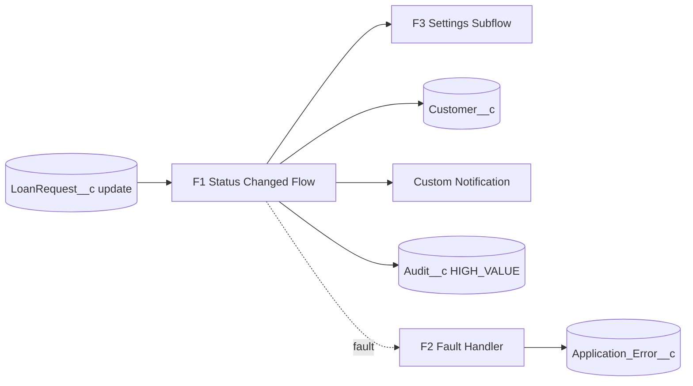
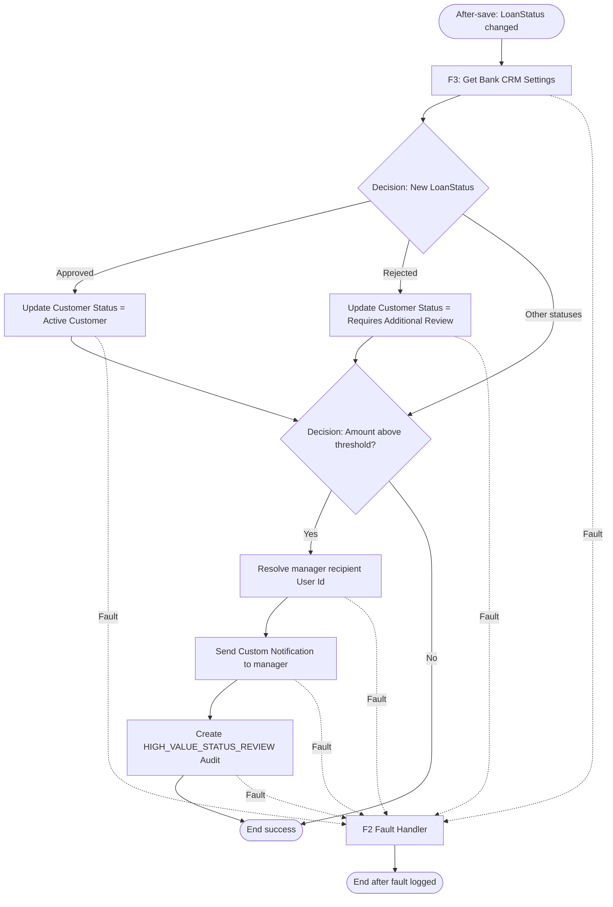
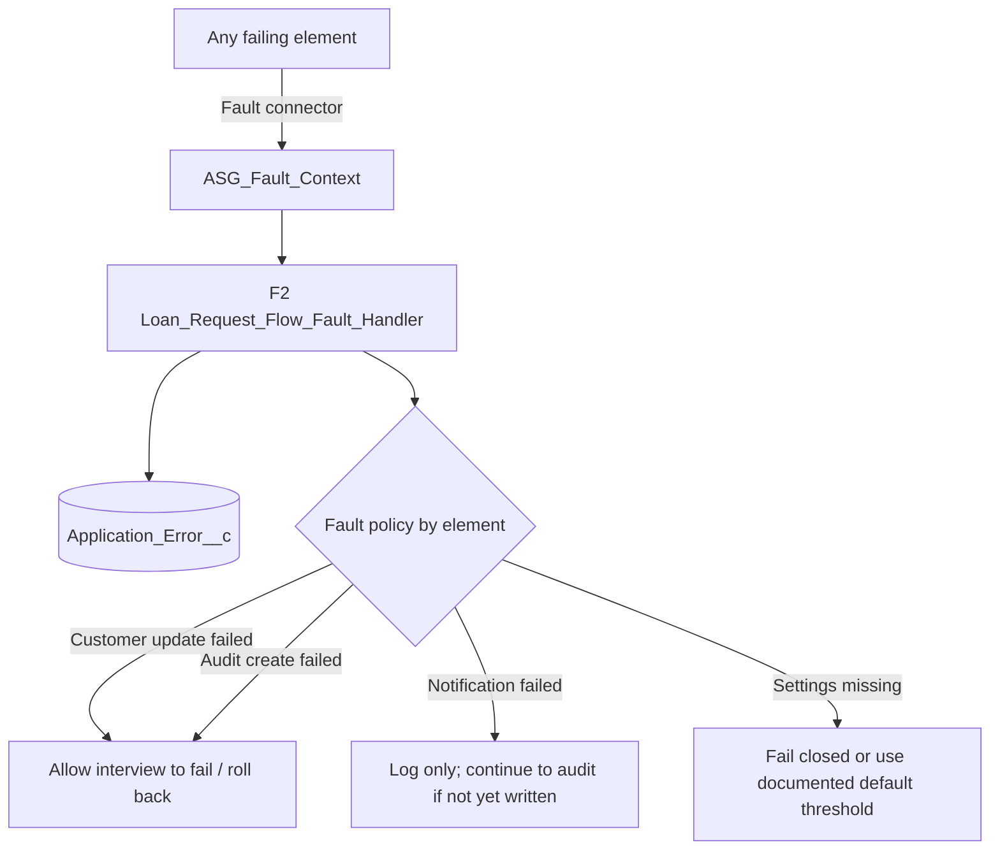
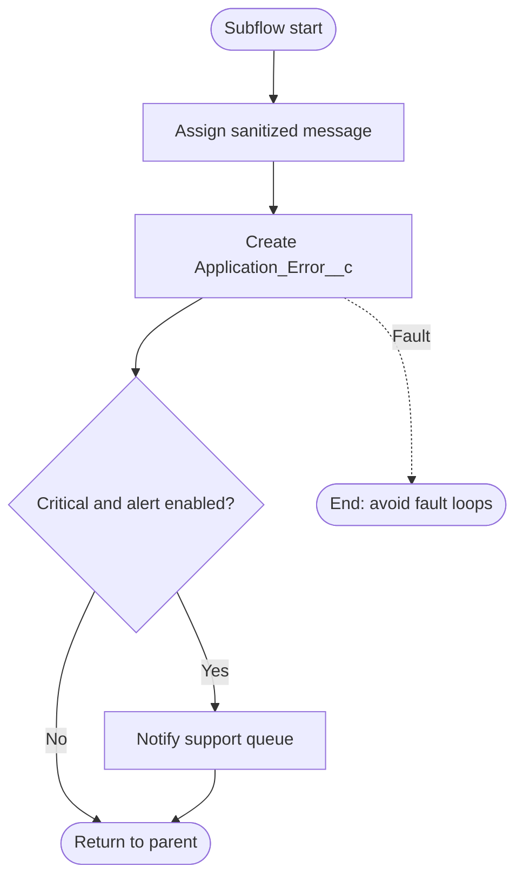
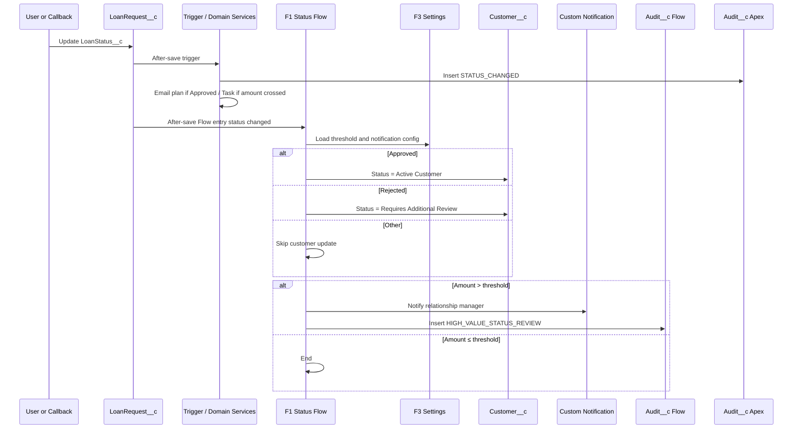

# Bank CRM Flow Design

**Platform:** Salesforce  
**Sources:** `project_task.md`, `docs/project-analysis.md`, `docs/system-design.md`, `docs/data-model.md`, `docs/apex-design.md`  
**Scope:** Salesforce Flow architecture and interview design only. No Flow Builder implementation and no Apex/LWC code.

---

## 1. Design Goals and Ownership Split

Part C requires an automated Flow that runs whenever `LoanStatus__c` changes: update customer status on Approve/Reject, and on high-value loans notify the manager and create an `Audit__c` record. Parts B and A also require high-value escalation and auditing. Those overlapping requirements are deliberately split so Flow and Apex do not create duplicate Tasks or indistinguishable audits.

### Ownership matrix

| Business concern | Owner | Why this boundary |
|---|---|---|
| High-value manager **Task** on amount threshold crossing | **Apex** (`ManagerTaskService`) | Assignment Part B; needs durable idempotency via `HighValueTaskCreated__c` and bulk owner resolution. |
| **`STATUS_CHANGED`** audit on every status change | **Apex** (`AuditService`) | Assignment Part B; must include customer name + loan details for every status transition. |
| Customer approval **email** when status becomes `Approved` | **Apex** (`CustomerEmailService`) | Assignment Part B; email limits and non-critical retry fit Apex Queueable better than Flow. |
| External approval submit / callback / retry | **Apex** (integration classes) | Callouts, Named Credentials, and idempotency are Apex-owned. |
| Customer **`Status__c`** update on Approve / Reject | **Flow** | Assignment Part C; straightforward related-record update suits after-save Flow. |
| Manager **custom notification** on high-value **status change** | **Flow** | Assignment Part C “automatic notification”; distinct from the Apex Task. |
| **`HIGH_VALUE_STATUS_REVIEW`** audit | **Flow** | Satisfies Part C audit requirement without duplicating Apex `STATUS_CHANGED`. |
| Operational fault logging for Flow failures | **Flow subflow** (+ optional invocable Apex) | Centralized fault path required by Part C exception handling. |

### Logic that must remain in Apex (do not reimplement in Flow)

- Threshold-crossing detection for Tasks and `HighValueTaskCreated__c` marker updates.
- Creating standard `Task` records for high-value escalation.
- Writing `STATUS_CHANGED`, `APPROVAL_EMAIL_SENT`, or `INTEGRATION_RESULT` audit events.
- Sending customer approval emails.
- Status transition validation, protected integration fields, and LWC save/read.
- HTTP callouts and callback processing.

### Logic that belongs in Flow (do not reimplement in Apex)

- Setting `Customer__c.Status__c` to `Active Customer` when loan status becomes `Approved`.
- Setting `Customer__c.Status__c` to `Requires Additional Review` when loan status becomes `Rejected`.
- Sending the manager custom notification when status changes **and** amount is above threshold.
- Creating `Audit__c` with `EventType__c = HIGH_VALUE_STATUS_REVIEW` and `Source__c = Flow`.

This split keeps both assignment paths visible for evaluation while preventing two Tasks, two identical audits, or two customer-status writers.

---

## 2. Flow Inventory

| # | API / Label (design) | Type | Triggering object | Purpose |
|---|---|---|---|---|
| F1 | `Loan_Request_Status_Changed` | Record-Triggered (After Save) | `LoanRequest__c` | Part C main automation: customer status, high-value notify, high-value audit. |
| F2 | `Loan_Request_Flow_Fault_Handler` | Autolaunched Subflow | — (invoked by F1) | Shared fault path: create `Application_Error__c`, optionally alert support. |
| F3 | `Resolve_Bank_CRM_Settings` | Autolaunched Subflow | — (invoked by F1) | Load threshold and notification configuration once per interview. |

No Screen Flow, Scheduled Flow, or Platform Event Flow is required for the assignment’s Part C scope. Reconciliation and email retry remain Apex Batch/Queueable per system and Apex design. A future Screen Flow for manual loan intake is out of scope; LWC owns the interactive form.

---

## 3. F1 – Loan Request Status Changed (Primary Flow)

### 3.1 Flow type and trigger

| Attribute | Design |
|---|---|
| **Flow type** | Record-Triggered Flow |
| **Object** | `LoanRequest__c` |
| **Optimize for** | Actions and Related Records (after-save) |
| **Trigger** | A record is **updated** |
| **Entry conditions** | All conditions are met (AND): (1) `LoanStatus__c` **Is Changed** = True; (2) `Customer__c` **Is Null** = False |
| **Run asynchronously?** | No — customer status and audits must stay in the same transaction as the loan decision for Part E testability and compliance consistency |
| **Does the Flow run on create?** | Only if create is also configured **and** status is set on insert **and** “Is Changed” semantics apply per org behavior. Prefer **Update only** with entry formula equivalent to status change, matching Part C (“whenever the loan request status changes”). Inserts that start in `Approved`/`Rejected` are rare under validation rules (`Draft` default); if product policy later requires create coverage, add a second entry path or broaden to Create and Update with an explicit formula comparing prior value. |

**Why these entry conditions exist**

- **Status Is Changed:** Matches Part C exactly and avoids running on amount-only or unrelated field edits (which Apex alone handles for Tasks).
- **Customer not null:** Customer status update and customer-name audit snapshots require a related customer; the data model already requires the lookup, but the entry check fails closed if data is incomplete.

### 3.2 High-level interview logic

### 3.3 Decision elements

#### D1 – `DEC_Loan_Status`

| Attribute | Detail |
|---|---|
| **Purpose** | Branch customer-status updates by new loan status. |
| **Why it exists** | Part C requires different customer outcomes for Approved vs Rejected; other statuses must not overwrite customer status. |
| **Outcomes** | **Approved** → update path A; **Rejected** → update path R; **Default** → skip customer update and continue to high-value decision. |

**Outcome rules**

| Outcome | Condition | Next |
|---|---|---|
| Approved | `{!$Record.LoanStatus__c} Equals Approved` | Update Customer → Active Customer |
| Rejected | `{!$Record.LoanStatus__c} Equals Rejected` | Update Customer → Requires Additional Review |
| Default | All other values (`Draft`, `Submitted`, `Under Review`, `Integration Error`, …) | Skip customer DML; go to D2 |

**Why Default exists:** Status changes among non-terminal values still need high-value notification/audit when amount exceeds threshold (Part C ties high-value actions to the status-change Flow, not only Approve/Reject).

#### D2 – `DEC_High_Value_Amount`

| Attribute | Detail |
|---|---|
| **Purpose** | Decide whether to notify the manager and create the Flow-owned audit. |
| **Why it exists** | Part C: “If the loan amount exceeds ₪250,000, send an automatic notification… and create an Audit__c record.” |
| **Outcomes** | **Above threshold** → notify + audit; **Default** → end successfully without notification/audit. |

**Outcome rules**

| Outcome | Condition | Next |
|---|---|---|
| Above threshold | `{!$Record.LoanAmount__c} Greater Than {!varHighValueThreshold}` | Resolve manager → Notify → Create Audit |
| Default | Amount ≤ threshold (including exactly ₪250,000) | End |

**Why the threshold is a variable, not a hard-coded 250000:** System design stores policy in `Bank_CRM_Settings__mdt.HighValueThreshold__c`. Exact equality at 250000 is **not** high value (`>` only), matching assignment and Apex `CurrencyThresholdUtil`.

**Why this decision runs after the status decision (not before):** Customer status update is independent of amount. Ordering status first then high-value keeps one happy path for Approve/Reject regardless of amount, and still applies high-value side effects for every status change above threshold.

**Why Flow does not check “first time above threshold”:** Idempotent Task creation is Apex-owned. Flow intentionally notifies on **each status change** while amount remains above threshold, which is a different business signal (“status changed on a high-value loan”) than “amount newly crossed the threshold.”

### 3.4 Variables

| API name (design) | Data type | Input / Private | Default / source | Purpose |
|---|---|---|---|---|
| `$Record` | `LoanRequest__c` | Platform | Triggering record | New loan values after save. |
| `$Record__Prior` | `LoanRequest__c` | Platform | Prior values | Available for diagnostics; entry already requires status Is Changed. |
| `varHighValueThreshold` | Number/Currency | Private | From F3 / CMDT (`250000` fallback only if settings missing and policy allows) | Threshold for D2. |
| `varManagerNotificationType` | Text | Private | CMDT `ManagerNotificationType__c` | Custom Notification Type developer name. |
| `varManagerRecipientId` | Text (Id) | Private | Resolved User Id | Custom notification recipient. |
| `varDefaultManagerUsername` | Text | Private | CMDT | Fallback routing key. |
| `varDefaultQueueDeveloperName` | Text | Private | CMDT | Optional queue path if notification targets a user derived from queue members (prefer User Id; see §3.6). |
| `varCorrelationId` | Text | Private | Formula / assignment: loan Id + timestamp, or invocable util | Links Flow audit/error to Apex correlation when available. |
| `varCustomerId` | Text (Id) | Private | `$Record.Customer__c` | Target for customer update. |
| `varCustomerNameSnapshot` | Text | Private | `$Record.Customer__r.Name` (via Get Records if not on trigger formula) | Audit snapshot. |
| `varFaultElementName` | Text | Private | Set on each fault path | Passed to F2. |
| `varFaultMessage` | Text | Private | `$Flow.FaultMessage` | Passed to F2. |
| `varLoanRequestId` | Text (Id) | Private | `$Record.Id` | Fault and audit linkage. |
| `varIsHighValue` | Boolean | Private | Assignment from D2 | Optional clarity for later elements. |

**Why these variables exist:** After-save Flows should not re-query the triggering loan. Related customer name may require one Get Records if cross-object formulas on `$Record` are insufficient in the org. Threshold and notification type must not be hard-coded literals in Decision conditions if configuration is environment-specific.

### 3.5 Assignments

| Element | Assignments | Why |
|---|---|---|
| `ASG_Init_Context` | `varLoanRequestId` ← `$Record.Id`; `varCustomerId` ← `$Record.Customer__c`; `varCorrelationId` ← generated or from input; `varCustomerNameSnapshot` ← related Name when already available | Seeds interview context once. |
| `ASG_Apply_Settings` | `varHighValueThreshold`, `varManagerNotificationType`, default manager/queue keys from F3 outputs | Applies configuration before D2. |
| `ASG_Mark_High_Value` | `varIsHighValue` ← `true` (Above-threshold branch only) | Optional explicit flag for audit Details text. |
| `ASG_Fault_Context_*` | On each connector to F2: `varFaultElementName` ← element API name; `varFaultMessage` ← `$Flow.FaultMessage` | Gives F2 actionable context without duplicating fault subflows per element. |

No Assignment should set `Customer__c.Status__c` in memory only without an Update Records element; customer persistence must be an explicit DML element for clarity and fault routing.

### 3.6 Record queries (Get Records)

| Element | Object | Filters | Store | Why |
|---|---|---|---|---|
| Via F3 | `Bank_CRM_Settings__mdt` | `DeveloperName = Default` | Threshold, notification type, routing keys | One configuration load per interview. |
| `GET_Customer` | `Customer__c` | `Id = varCustomerId` | `Name`, `RelationshipManager__c`, `Status__c`, `IsActive__c` | Needed for name snapshot and preferred manager recipient. |
| `GET_Default_Manager` | `User` | `Username = varDefaultManagerUsername` AND `IsActive = true` | Id | Fallback when relationship manager is blank/inactive. |

**Performance rule:** At most one Get Records per object type in the happy path. Do not query inside loops (this Flow has no collection loops). Prefer `$Record.Customer__r.Name` when the platform provides related fields on the triggering record without an extra query.

### 3.7 Record updates

| Element | Object | Fields set | When | Why |
|---|---|---|---|---|
| `UPD_Customer_Active` | `Customer__c` | `Status__c = Active Customer`; Id = `varCustomerId` | D1 Approved | Part C approved path. |
| `UPD_Customer_Review` | `Customer__c` | `Status__c = Requires Additional Review`; Id = `varCustomerId` | D1 Rejected | Part C rejected path. |

**What this Flow must not update**

- `LoanRequest__c` fields (avoids recursion with the same after-save trigger/Flow).
- `HighValueTaskCreated__c` (Apex-owned).
- Integration fields (Apex/integration-owned).
- Existing `Audit__c` rows (append-only; Flow only creates).

**Concurrency note:** If two loans for one customer are decided concurrently, last-write-wins can flip customer status. System design recommends an explicit precedence rule (for example, `Requires Additional Review` outranks `Active Customer` until review completes). Optional enhancement: before update, Decision on current customer status; out of minimum Part C scope but documented as a production hardening option.

### 3.8 Record creates (audit)

| Element | Object | Key field values | When |
|---|---|---|---|
| `CRT_High_Value_Status_Audit` | `Audit__c` | See table below | After successful high-value notification (or immediately after D2 Yes if notification is non-blocking—see fault policy) |

| `Audit__c` field | Value | Why |
|---|---|---|
| `LoanRequest__c` | `$Record.Id` | Required loan linkage. |
| `Customer__c` | `varCustomerId` | Customer-centric review. |
| `EventType__c` | `HIGH_VALUE_STATUS_REVIEW` | Distinguishes from Apex `STATUS_CHANGED`. |
| `OldValue__c` | `$Record__Prior.LoanStatus__c` | Status transition context. |
| `NewValue__c` | `$Record.LoanStatus__c` | Status transition context. |
| `CustomerNameSnapshot__c` | `varCustomerNameSnapshot` | Historical name at event time. |
| `LoanAmountSnapshot__c` | `$Record.LoanAmount__c` | Threshold context. |
| `OccurredAt__c` | `$Flow.CurrentDateTime` | Event time. |
| `ActorUser__c` | `$User.Id` | Human/system actor when available. |
| `CorrelationId__c` | `varCorrelationId` | Cross-automation tracing. |
| `Source__c` | `Flow` | Enforces ownership matrix / data-model validation. |
| `Details__c` | Sanitized summary e.g. “High-value loan status changed; manager notified.” | Useful context without PII/secrets. |

**Why create audit after notify (preferred order):** Notification is the user-visible Part C action; audit documents that the high-value status review path ran. If notification fails as non-critical, still create the audit and log the notification fault (see §3.10)—or reverse order if compliance prefers “audit even when notify fails.” Recommended production policy: **Create audit even if notification faults**, treating notification like Apex email (non-critical).

### 3.9 Notifications

| Channel | Design choice | Why |
|---|---|---|
| **Custom Notification** (Send Custom Notification action) | Primary Part C “automatic notification” | Distinct from Apex Task; appears in Lightning bell; uses CMDT notification type name. |
| Email Alert | Not used in F1 | Avoids duplicating Apex approval email and Task email patterns. |
| Chatter / Post to Chatter | Not used | Not required; noisier for managers. |
| Create Task | **Forbidden in Flow** | Would duplicate Apex `ManagerTaskService`. |

**Notification action design**

| Attribute | Detail |
|---|---|
| **Element** | `ACT_Notify_Manager` |
| **Type** | Send Custom Notification |
| **Notification Type** | Resolved from `varManagerNotificationType` |
| **Recipient IDs** | `{!varManagerRecipientId}` (single User) |
| **Target ID** | `$Record.Id` (loan) |
| **Title / Body** | Include loan Name/auto-number and amount; do not include national identifier or decision reason |
| **Recipient resolution order** | (1) Active `Customer.RelationshipManager__c`; (2) User resolved from `DefaultManagerUsername__c`; (3) if only a queue is configured, resolve a designated queue notification user or skip notify + log operational warning—Custom Notifications require User Ids |

**Why recipient resolution exists as its own step:** Manager identity is unspecified in the assignment; system design prefers relationship manager with metadata fallback. Missing recipient must not roll back the loan decision.

### 3.10 Fault paths and error handling

Every Update Records, Create Records, Get Records, Subflow, and Action element connects its **Fault** connector to a shared path that invokes **F2**.

| Failure category | Elements | Handling | Why |
|---|---|---|---|
| **Mandatory – customer status** | `UPD_Customer_Active`, `UPD_Customer_Review` | Log via F2; **fail the Flow interview** so the loan transaction does not commit an Approved/Rejected loan without the required customer status update (aligns with Part E expectation that approval updates customer status). | Customer status is the core Part C outcome. |
| **Mandatory – high-value audit** | `CRT_High_Value_Status_Audit` | Log via F2; **fail interview** when in the high-value branch after notify (or before notify if audit-first). | Part C explicitly requires the audit for high-value status changes; data-model treats business audits as mandatory evidence. |
| **Non-critical – notification** | `ACT_Notify_Manager` | Log via F2 with `Category__c = Notification`; **do not fail** the interview; proceed to create audit. | Matches Apex design: notification failures must not reverse the loan decision. |
| **Configuration** | F3 settings Get Records empty | Prefer fail closed in production; in demo orgs allow default threshold `250000` only if documented. | Prevents silent mis-routing. |
| **Recipient unresolved** | Manager resolution | Log warning error; skip notify; still create high-value audit. | Audit evidence remains; support can fix routing. |

**Fault path must capture**

- Loan Id, Customer Id, Flow API name, interview GUID (`$Flow.InterviewGuid`), failed element name, sanitized `$Flow.FaultMessage`, correlation Id, `Category__c = Flow Fault` (or `Notification` when applicable).

**What Flow must not do on fault**

- Swallow mandatory failures without failing the interview.
- Write secrets, stack traces with tokens, or full SObject dumps into `Details__c` / error messages.
- Create a second `STATUS_CHANGED` audit as a “backup” (that remains Apex-only).

### 3.11 Performance considerations

| Practice | Application in F1 |
|---|---|
| Narrow entry criteria | Status Is Changed + Customer present → Flow skips most updates. |
| No loops | One loan per interview; no collection processors. |
| Minimal Get Records | Settings once; customer once; optional default manager once. |
| No loan self-update | Prevents recursive Flow/trigger re-entry. |
| Direct Update Records | Update customer by Id; no Get-then-Update of loan. |
| Fast decisions | D1/D2 use in-memory `$Record` and `varHighValueThreshold` only. |
| Same-transaction awareness | Apex trigger services already consumed CPU/SOQL/DML before Flow runs—keep Flow lean. |

### 3.12 Governor limit considerations

| Limit | Risk in F1 | Mitigation |
|---|---|---|
| DML statements | Customer update + Audit create (+ error create on fault) | At most 2 happy-path DML target types; batch not needed for single-record Flow. |
| DML rows | Bulk API updating many loans | One Flow interview per record in the transaction; Salesforce runs interviews per record—avoid extra Get/Update that multiply cost. |
| SOQL | Settings + Customer + User | Cap at ≤3 queries on happy path; F3 caches conceptually per interview only. |
| CPU time | Combined Apex + Flow | Keep formulas simple; no invocable Apex unless required for correlation/sanitize. |
| Custom notification limits | Bulk status updates on many high-value loans | Prefer non-critical fault handling; monitor daily notification limits; for extreme volume consider Platform Events + async notify (future). |
| Heap | Large fault messages | Truncate/sanitize in F2. |

**Bulk update scenario:** When 200 loans change status in one transaction, Apex runs bulkified once, then up to 200 Flow interviews execute. Design therefore forbids per-interview query explosion and forbids calling heavy invocable Apex from F1.

---

## 4. F2 – Loan Request Flow Fault Handler (Subflow)

### 4.1 Flow type

| Attribute | Design |
|---|---|
| **Flow type** | Autolaunched Flow (Subflow) |
| **Triggering object** | None |
| **Called by** | F1 fault connectors (and any future loan Flows) |
| **Why it exists** | Part C requires proper exception handling; system design specifies a shared fault handler with loan Id, interview Id, failed element, sanitized message, and correlation Id. |

### 4.2 Input variables

| Variable | Type | Required | Purpose |
|---|---|---|---|
| `inLoanRequestId` | Id | No | Related loan when known. |
| `inCustomerId` | Id | No | Related customer when known. |
| `inCorrelationId` | Text | Yes | Traceability. |
| `inFaultElementName` | Text | Yes | Which element failed. |
| `inFaultMessage` | Text | Yes | `$Flow.FaultMessage` (to sanitize). |
| `inSourceFlowApiName` | Text | Yes | Parent Flow API name. |
| `inInterviewGuid` | Text | Yes | `$Flow.InterviewGuid`. |
| `inCategory` | Text | Yes | `Flow Fault` or `Notification`. |
| `inIsRetryable` | Boolean | Yes | Usually `false` for sync Flow faults. |
| `inFailParent` | Boolean | Yes | Whether parent should take the fault path that fails the interview. |

### 4.3 Elements

1. **Assignment** – Build sanitized message (formula truncate to 4,000; strip obvious token patterns if using an invocable sanitizer).
2. **Create Records** – `Application_Error__c` with fields aligned to data model (`SourceComponent__c`, `Operation__c`, `Category__c`, `SanitizedMessage__c`, `CorrelationId__c`, `OccurredAt__c`, `OwnerId` → support queue, etc.).
3. **Decision** – `inFailParent` true/false (documentation for parent; subflow itself typically just logs).
4. **Optional Action** – Custom Notification or Email Alert to support queue when category is non-notification Flow Fault and severity is high.

### 4.4 Fault path inside F2

If creating `Application_Error__c` fails, **do not** recursively call F2. End silently (or use an invocable Apex logger marked `without sharing` as last resort per Apex design). Infinite fault loops are worse than a missing error row.

### 4.5 Performance / governors

- Single Create Records; no queries unless resolving support Queue Id from CMDT developer name (one Get Records max).
- Never used in a loop collection of hundreds without bulk invocable redesign.

---

## 5. F3 – Resolve Bank CRM Settings (Subflow)

### 5.1 Flow type

| Attribute | Design |
|---|---|
| **Flow type** | Autolaunched Flow (Subflow) |
| **Why it exists** | Keeps threshold and notification type out of hard-coded Decision values; matches `Bank_CRM_Settings__mdt` from data/system design. |

### 5.2 Logic

1. Get Records: `Bank_CRM_Settings__mdt` where `DeveloperName = Default`, store first record.
2. Decision: record found?
   - **Yes:** Assign output variables from CMDT fields.
   - **No:** Assign safe defaults (`HighValueThreshold = 250000`) **or** set `outSettingsMissing = true` for F1 to fault—**prefer missing = fault in production**.
3. Return outputs to F1.

### 5.3 Output variables

| Output | Maps from |
|---|---|
| `outHighValueThreshold` | `HighValueThreshold__c` |
| `outManagerNotificationType` | `ManagerNotificationType__c` |
| `outDefaultManagerUsername` | `DefaultManagerUsername__c` |
| `outDefaultQueueDeveloperName` | `DefaultQueueDeveloperName__c` |
| `outSettingsMissing` | Boolean |

**Why a subflow instead of inline Get Records in F1:** Reuse if additional Flows later need the same settings; clearer testing of configuration resolution; single place to document fail-closed vs default behavior.

---

## 6. Optional Invocable Apex Used by Flow (Design Only)

Flow stays declarative where possible. The following invocables are **optional bridges**, not replacements for Flow ownership:

| Invocable | When to use | Must not do |
|---|---|---|
| `CorrelationIdProvider` | If LWC/Apex correlation must continue into Flow | Must not create Tasks or STATUS audits |
| `SanitizedMessageInvocable` | Harden F2 message redaction | Must not perform business DML |
| `UserRoutingInvocable` | Reuse Apex `UserRoutingResolver` for manager Id | Must not create Tasks |

Prefer pure Flow Get Records + Custom Notification when they meet requirements, to keep Part C demonstrably Flow-centric.

---

## 7. End-to-End Sequence With Apex

---

## 8. Decision Catalog (Why Each Exists)

| Decision | Flow | Why it exists |
|---|---|---|
| Entry: Status Is Changed | F1 platform entry | Part C trigger; avoid amount-only runs. |
| Entry: Customer present | F1 platform entry | Customer update and snapshots require a parent. |
| D1 Loan status Approved/Rejected/Other | F1 | Map status → customer lifecycle values; ignore non-decision statuses for customer DML. |
| D2 Amount above threshold | F1 | Gate manager notification + Flow audit per Part C. |
| Settings found vs missing | F3 | Fail closed or controlled default for threshold/notification config. |
| Manager present vs fallback | F1 (optional Decision) | Relationship manager vs CMDT default user. |
| Notification fault vs mandatory fault | F1 fault policy | Preserve loan decision when only bell notification fails. |
| Alert support vs log-only | F2 | Reduce noise for notification faults; escalate true Flow faults. |

---

## 9. Testing Design (Flow Tests)

Design-time test scenarios (Flow Trigger tests / debugging), aligned with Part E:

| Scenario | Entry record | Expected |
|---|---|---|
| Approve below threshold | Status → Approved, amount 100000 | Customer → Active Customer; no notify; no HIGH_VALUE audit; Apex still writes STATUS_CHANGED. |
| Approve above threshold | Status → Approved, amount 300000 | Customer Active; custom notification; HIGH_VALUE audit; Apex Task only if threshold **crossed** this transaction. |
| Reject above threshold | Status → Rejected, amount 400000 | Customer Requires Additional Review; notify + HIGH_VALUE audit. |
| Submitted above threshold | Status Draft → Submitted, amount 500000 | No customer status change; notify + HIGH_VALUE audit. |
| Status unchanged, amount edit | Amount raised above threshold, status same | **Flow does not run**; Apex may create Task on crossing. |
| Exactly 250000 | Status change, amount 250000 | No high-value Flow branch. |
| Fault on customer update | Force DML fault | Application_Error created; transaction fails. |
| Fault on notification | Force notification fault | Error logged; HIGH_VALUE audit still created; loan/customer updates retained. |

---

## 10. Explicit Non-Goals (Flows Not Designed)

| Possible Flow | Why excluded |
|---|---|
| Before-Save Flow for status validation | Owned by validation rules + Apex `LoanRequestValidationService`. |
| Screen Flow for loan intake | Part D uses LWC. |
| Scheduled Flow for integration reconciliation | Owned by `LoanApprovalReconciliationBatch`. |
| Record-Triggered Flow on `Customer__c` | No requirement; avoids dual writers on customer status. |
| Flow that creates Tasks or STATUS_CHANGED audits | Would duplicate Apex and break the ownership matrix. |

---

## 11. Traceability to Assignment Part C

| Part C requirement | Flow design element |
|---|---|
| Automated Flow when `LoanStatus__c` changes | F1 after-save, entry Status Is Changed |
| Approved → Customer Active Customer | D1 Approved → `UPD_Customer_Active` |
| Rejected → Requires Additional Review | D1 Rejected → `UPD_Customer_Review` |
| Amount > ₪250,000 → notify manager | D2 → Custom Notification |
| Amount > ₪250,000 → create Audit__c | D2 → `CRT_High_Value_Status_Audit` (`HIGH_VALUE_STATUS_REVIEW`) |
| Decision elements | D1, D2 (+ settings/recipient Decisions) |
| Exception handling | Fault connectors → F2 |
| Short document of main steps | This document (implementation screenshot remains a build-time deliverable) |

---

## Document Control

| Item | Value |
|---|---|
| Design type | Flow architecture only |
| Implementation / XML / screenshots | Excluded by request |
| Aligned to | System design §8, Apex ownership matrix, data model audit event types |
