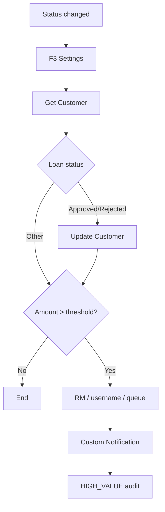

# Loan Request Status Changed Flow — Simplification Review

**Flow API name:** `Loan_Request_Status_Changed` (F1)  
**Supporting subflows:** `Resolve_Bank_CRM_Settings` (F3), `Loan_Request_Flow_Fault_Handler` (F2)  
**Sources:** `project_task.md` Part C, `docs/flow-design.md`, `docs/flow/loan-request-status-flow.md`, Flow metadata under `force-app/main/default/flows/`  
**Status:** Analysis only — no code changes until the plan below is approved and executed.

---

## Intended behavior (Part C)

Whenever `LoanRequest__c.LoanStatus__c` changes:

1. If status is **Approved** → set `Customer__c.Status__c` to `Active Customer`.
2. If status is **Rejected** → set `Customer__c.Status__c` to `Requires Additional Review`.
3. If loan amount **exceeds** ₪250,000 → send an automatic manager notification and create an `Audit__c` record.

The Flow must use Decision elements and proper exception handling. Apex retains ownership of high-value **Tasks**, `STATUS_CHANGED` audits, and approval emails (see ownership matrix in `docs/flow-design.md`).

---

## 1. Summary of the current flow

**Trigger:** Record-triggered after-save on `LoanRequest__c` **update**, when `LoanStatus__c` Is Changed and `Customer__c` is present. Repo status: **Draft / inactive**.

**Happy path:**

1. `SUB_Resolve_Settings` (F3) — load `Bank_CRM_Settings.Default` into working variables.
2. `DEC_Settings_OK` — fail closed if settings missing.
3. `GET_Customer` — load customer name and relationship manager.
4. `DEC_Loan_Status` (D1)
   - Approved → `UPD_Customer_Active`
   - Rejected → `UPD_Customer_Review`
   - Other → skip customer update
5. `DEC_High_Value_Amount` (D2) — amount **greater than** configured threshold (exact 250000 is not high value).
6. If high-value: resolve recipient (RM → CMDT username → queue) → custom notification → `HIGH_VALUE_STATUS_REVIEW` audit (`Source__c = Flow`).

**Fault policy:**

| Failure | Handling |
|---|---|
| Settings missing, customer update, high-value audit | Log via F2 (`Category__c = Flow Fault`), then fail interview (rolls back loan decision) |
| Custom notification / missing notification type / unresolved recipient | Log via F2 (`Category__c = Notification`), **continue**, still create high-value audit |

---

## 2. Main pain points

### A. Recipient resolution dominates the canvas (addressed in Step 3)

**Addressed:** Inline RM/username/queue resolution removed from F1. High-value branch calls `ManagerNotificationRecipientInvocable`, which reuses Apex `UserRoutingResolver` and accepts **User** recipients only.

**Behavior change:** Queue-only fallbacks no longer receive custom notifications; Flow logs a notification fault and still writes `HIGH_VALUE_STATUS_REVIEW`.

### B. Fault handling is copy-pasted (addressed in Step 2)

**Addressed:** Seven fat fault assignments replaced with thin `ASG_Fault_Ctx_*` (element + message) plus shared `ASG_Fault_Mandatory` / `ASG_Fault_Notification` (category + fail-parent → F2).

**Still present:** Per-source context assignments remain necessary in Flow (fault connectors cannot pass parameters). Step 3 may further reduce notification-related contexts when recipient routing is extracted.

### C. “Fail interview” is a brittle hack

`CRT_Fail_Interview_After_Fault` creates a sparse `Audit__c` (only `CorrelationId__c` + `Source__c`) so required-field validation fails the interview. It works today but depends on `Audit__c` schema and can leave confusing failed DML in logs.

### D. Dead or redundant state (partially addressed)

**Addressed in Step 1:** `varIsHighValue`, `ASG_Init_Context` Id mirroring, and the `varOut*` → `ASG_Apply_Settings` double layer were removed.

**Still present:**
- F3 fills safe defaults **and** sets `outSettingsMissing = true`; F1 then fails closed — defaults are unused by F1.
- `ASG_Customer_Context` still copies `GET_Customer.Name` into `varCustomerNameSnapshot` (candidate for Step 1 follow-up / P1).

### E. Extra query cost on every status change

Settings subflow + customer Get run even when amount is at/below threshold and status is neither Approved nor Rejected (for example Draft → Submitted under threshold still pays full setup).

### F. Over-engineering relative to Part C

Part C asks for decisions + exception handling. The implementation adds CMDT, dual subflows, correlation Ids, multi-tier routing, and a custom fail-parent protocol — reasonable for production CRM, heavy for a take-home.

### G. Testability

Routing and fault branches are hard to exercise without Flow Trigger Tests / org setup, while Apex already has testable routing in `UserRoutingResolver`.

---

## 3. Prioritized simplifications

| Priority | Change | Impact | Behavior risk |
|---|---|---|---|
| **P0** | Extract recipient resolution into one autolaunched subflow **or** a thin invocable wrapping `UserRoutingResolver` | Removes ~10 F1 elements; one routing source of truth | Low if order RM → username → queue preserved; **treat queue-only as User-only skip + log** |
| **P0** | Collapse 7 fault assignments into 2 paths (mandatory vs notification) with element name set on each connector | Clearer canvas | Low |
| **P1** | Replace `CRT_Fail_Interview_After_Fault` with a clearer fail mechanism | Removes schema-coupled hack | Medium — must still roll back the loan transaction |
| **P1** | Drop `varIsHighValue`, reduce init/settings variable copying | Less clutter | None |
| **P2** | Inline F3 Get Records into F1 **or** keep F3 but stop writing unused defaults on missing | One less hop / clearer fail-closed | Low |
| **P2** | Defer settings + high-value work when amount ≤ threshold and status is not Approve/Reject | Fewer SOQL on common path | Low if entry still requires status change |
| **P3** | Prefer `$Record.Customer__r.Name` / `RelationshipManager__c` when available to skip `GET_Customer` | −1 SOQL | Low; verify related fields on `$Record` in target API |

---

## 4. Recommended implementation plan (smallest useful changes)

Do **not** rewrite the Flow. Prefer three incremental steps:

### Step 1 — Dead-code cleanup (no behavior change)

In `Loan_Request_Status_Changed` only:

- Remove `ASG_Mark_High_Value` / `varIsHighValue`.
- Wire F3 outputs straight into working variables (drop `varOut*` + `ASG_Apply_Settings` if Builder allows).
- Use `$Record.Id` / `$Record.Customer__c` in F2 inputs where variables add nothing beyond correlation Id.

### Step 2 — Compress fault paths (same policy)

- Keep F2 as-is.
- Reduce to `ASG_Fault_Mandatory` and `ASG_Fault_Notification`.
- Each failing element sets `varFaultElementName` (plus category / fail flag), then calls the shared assignment → F2 → `DEC_After_Fault`.
- Leave continue-to-audit vs fail-parent logic unchanged.

### Step 3 — Collapse recipient routing (largest win)

Preferred minimal approach for this repo:

- Add autolaunched subflow `Resolve_Manager_Notification_Recipient` **or** an invocable adapter over `UserRoutingResolver` that returns a User Id.
- F1 high-value branch: call resolver → if blank, notification fault path → else notify → audit.
- **Do not** pass Queue Id into custom notification; if only queue resolves, treat as “recipient unresolved” (matches design intent and current continue-to-audit policy).

### Step 4 — Stabilize fail-parent (optional follow-up)

Replace incomplete Audit create with an explicit, documented failure pattern so future `Audit__c` required-field changes do not silently break rollback.

### Out of scope for v1

- Merging F2/F3 away entirely.
- Moving customer status into Apex.
- Changing the ownership matrix.
- Activating the Flow before Flow Trigger Tests pass.

---

## 5. Risks and behavior changes before modifying

| Risk | Detail |
|---|---|
| **Queue as notification recipient** | Today F1 can set `varManagerRecipientId` to a Queue `Group` Id. Custom notifications typically expect Users. Simplifying to User-only may change who gets notified (or skip more often). Confirm intended behavior before Step 3. |
| **Fail-interview via bad Audit** | Any fix must still roll back the triggering loan update after mandatory faults. Wrong pattern = loan Approved without customer status update. |
| **Notification continue → audit** | Must preserve: notify fault still creates `HIGH_VALUE_STATUS_REVIEW`. Easy to break when reconnecting fault connectors. |
| **Threshold semantics** | Keep `>` only (exact 250000 is not high value), sourced from CMDT. |
| **Ownership matrix** | Do not add Task or `STATUS_CHANGED` creation in Flow. |
| **Draft status** | Flow is inactive; refactor before activation and re-run Flow Trigger Tests (`docs/testing-strategy.md`). |
| **Bulk** | One interview per record; invocables are fine if they stay bulk-safe / cheap (`UserRoutingResolver` already is). |

---

## Bottom line

The Flow meets Part C, and the Apex/Flow ownership split is sound. Complexity is concentrated in **manager routing** and **duplicated fault scaffolding**, not in the core Approve/Reject/high-value decisions.

Highest ROI, smallest change set:

1. Strip unused variables. ✅ **Done** (see § Implementation progress)
2. Unify fault assignments. ✅ **Done**
3. Extract recipient resolution (User-only). ✅ **Done**

Do not rewrite F1’s D1/D2 happy path.

---

## Implementation progress

### Step 1 — Dead-code cleanup ✅ Done

Applied in `force-app/main/default/flows/Loan_Request_Status_Changed.flow-meta.xml` with no intentional behavior change:

| Change | Detail |
|---|---|
| Removed `ASG_Mark_High_Value` / `varIsHighValue` | D2 Above Threshold now connects straight to recipient resolution |
| Removed `ASG_Apply_Settings` + `varOut*` | F3 outputs assign directly into working variables |
| Removed `ASG_Init_Context` | Start connects to `SUB_Resolve_Settings`; Ids/correlation from `$Record` / `frmCorrelationId` |
| F2 + DML inputs | Use `$Record.Id` / `$Record.Customer__c` / `frmCorrelationId` |

### Step 2 — Compress fault paths ✅ Done

Same fail vs continue policies; duplicated category/`varFailParent` logic moved to two shared assignments:

| Change | Detail |
|---|---|
| Thin context assignments | `ASG_Fault_Ctx_*` set only `varFaultElementName` + `varFaultMessage` |
| `ASG_Fault_Mandatory` | Sets `Category__c = Flow Fault`, `varFailParent = true` → F2 |
| `ASG_Fault_Notification` | Sets `Category__c = Notification`, `varFailParent = false` → F2 |
| `DEC_After_Fault` | Unchanged: fail parent → `CRT_Fail_Interview_After_Fault`; else continue to high-value audit |

### Step 3 — Collapse recipient routing ✅ Done

| Change | Detail |
|---|---|
| New Apex | `ManagerNotificationRecipientInvocable` (+ tests) wraps `UserRoutingResolver` |
| User-only | Queue Ids are treated as unresolved (custom notifications require Users) |
| F1 high-value branch | `ACT_Resolve_Notification_Recipient` → `DEC_Recipient_Resolved` → notify type → notify → audit |
| Removed from F1 | Inline RM/username/queue Gets, Decisions, and Set Recipient assignments |

**Behavior note:** Paths that previously notified a Queue Id now skip notification, log via the notification fault path, and still create `HIGH_VALUE_STATUS_REVIEW` (same continue-to-audit policy).

**Still open (optional):** Step 4 — stabilize fail-parent (`CRT_Fail_Interview_After_Fault` hack).

---

## Related documents

| Document | Role |
|---|---|
| `docs/flow/loan-request-status-flow.md` | Current step-by-step Flow explanation |
| `docs/flow-design.md` | Full Flow architecture and ownership matrix |
| `docs/testing-strategy.md` | Flow Trigger Test scenarios |
| `project_task.md` | Assignment Part C requirements |
