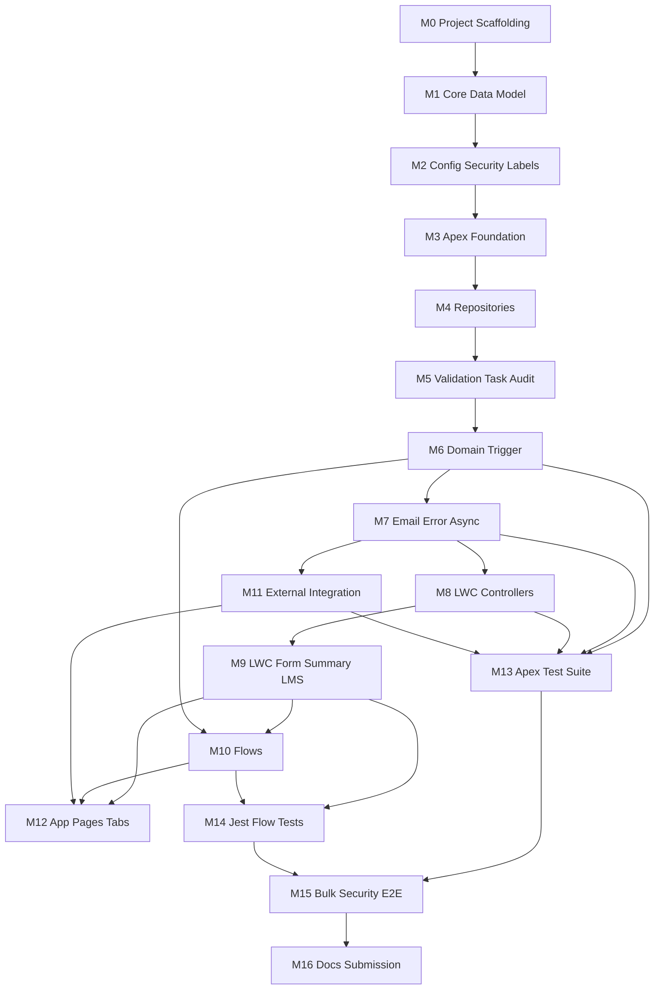

# Bank CRM Implementation Plan

**Platform:** Salesforce DX  
**Sources:** `project_task.md` and all design documents in `docs/`  
**Scope:** Production-quality implementation roadmap and implementation progress tracker from an empty repository to a submission-ready solution.

**Last updated:** 2026-07-21  
**Current state:** M0–M13 implemented; scratch org `BankCRM` runs the full Apex suite at **100% pass (148 tests)** with org-wide coverage **~81%** (P0 suites green; ≥90% coverage DoD still open for gap-fill). LWC Jest suites for M9 pass locally (`npm test`). F2/F3 Active; F1 Draft. Integration defaults disabled. **Next:** finish M13 coverage gap-fill to ≥90%, or proceed to M14 after your approval.

---

## 1. Roadmap Principles

Milestones are ordered to minimize rework and maximize incremental progress:

1. **Foundation before automation** — objects, fields, settings, and security exist before Apex, Flow, or LWC depend on them.
2. **Contracts before orchestration** — utilities, DTOs, and repositories exist before domain services and triggers.
3. **Apex ownership before Flow** — Part B behaviors (Task, `STATUS_CHANGED`, email) land first so Flow can be built without duplicating them.
4. **Save path before UI polish** — LWC controllers and LMS contract exist before App Builder composition and UX refinements.
5. **Integration after core CRM** — external approval is additive; core loan create/approve/audit works with integration disabled.
6. **Tests grow with each milestone** — every production milestone includes its own testing requirements; later milestones only close coverage and cross-cutting suites.
7. **Activate Flow last among automations** — keep `Loan_Request_Status_Changed` inactive until fields, notification type, CMDT, permissions, and Apex tests pass.

### Complexity scale

| Level | Meaning |
|---|---|
| **S** | Small — mostly metadata or a thin class; hours |
| **M** | Medium — several related files and focused tests; ~1 day |
| **L** | Large — multi-class orchestration, bulk behavior, or multi-branch Flow; multi-day |
| **XL** | Extra large — cross-cutting suite or packaging spanning many prior milestones |

### Dependency legend

Milestones list **hard dependencies** (must be Done first). Soft/optional dependencies are noted in the description.

---

## 2. Milestone Overview

| ID | Milestone | Status | Complexity | Primary assignment parts |
|---|---|---|---|---|
| M0 | Project scaffolding | Implemented; deploy check pending | S | All |
| M1 | Core data model | Implemented; deploy/smoke checks pending | L | A |
| M2 | Configuration, security, labels | Implemented; deploy/persona checks pending | M | A |
| M3 | Apex foundation | Implemented; deploy/Apex test run pending | M | B |
| M4 | Repositories | Implemented; deploy/Apex test run pending | M | B |
| M5 | Validation, Task, Audit services | Implemented; deploy/Apex test run pending | L | B, E |
| M6 | Domain service and trigger | Implemented; deploy/Apex test run pending | L | B, E |
| M7 | Email, errors, post-commit async | Implemented; deploy/Apex test run pending | M | B |
| M8 | LWC Apex controllers | Implemented; deploy/Apex test run pending | M | D, E |
| M9 | LWC form, summary, LMS | Implemented; deploy/Lightning smoke pending | L | D, E |
| M10 | Record-triggered Flow and subflows | Implemented; deploy/activate/Flow tests pending | L | C, E |
| M11 | External loan approval integration | Implemented; deploy/Apex test run pending | L | A |
| M12 | App, pages, tabs, layouts | Implemented; deploy/UAT pending | M | D |
| M13 | Apex test suite completion | Implemented; org coverage run pending | L | E |
| M14 | Jest and Flow tests | Not started | M | C, D, E |
| M15 | Bulk, security, optional E2E | Not started | M | E |
| M16 | Documentation and submission packaging | Not started | M | All |

---

## 3. Milestones

### M0 — Project Scaffolding

**Implementation status:** Implemented locally on 2026-07-17; Salesforce deployment verification pending.

**Implemented**

- Added Salesforce DX configuration with `force-app/main` and `force-app/test` package directories using API version 65.0.
- Added a single-currency Developer scratch-org definition with Lightning Experience enabled.
- Added `.forceignore`, `.gitignore`, manifests, Node/Jest configuration, README setup instructions, and repository placeholders.
- Installed LWC Jest dependencies and generated `package-lock.json`.
- Verified `npm test` exits successfully when no LWC tests exist.
- Did not add secrets, org IDs, or business metadata.

**Objective**  
Create a deployable Salesforce DX repository skeleton aligned with `docs/project-structure.md`.

**Description**  
Initialize `sfdx-project.json` with `force-app/main` and `force-app/test` package directories, scratch-org definition, ignore files, Node/Jest tooling stubs, and empty directory placeholders. No business metadata yet.

**Dependencies**  
None.

**Files to create or modify**

| Path | Action |
|---|---|
| `sfdx-project.json` | Create |
| `.forceignore`, `.gitignore` | Create |
| `config/project-scratch-def.json` | Create |
| `package.json`, `jest.config.js` | Create |
| `manifest/package.xml` | Create (skeleton) |
| `manifest/destructiveChangesPre.xml` | Create (empty) |
| `README.md` | Create (setup/run notes) |
| `scripts/apex/`, `scripts/soql/` | Create empty dirs |
| `force-app/main/default/` tree placeholders | Create as needed |

**Expected deliverables**

- Scratch org creatable from `project-scratch-def.json`.
- Empty `force-app` deploy succeeds (no-op metadata).
- Jest command wired (`npm test` / equivalent) even if no LWC tests exist yet.

**Estimated complexity**  
**S**

**Testing requirements**

- Manual: `sf org create scratch` (or equivalent) succeeds.
- Manual: `sf project deploy start` against empty/main stubs succeeds.

**Definition of Done**

- [x] Repository matches top-level layout in `docs/project-structure.md` §2.
- [x] Scratch org definition includes Lightning Experience (multi-currency was not selected).
- [x] No secrets or org IDs committed.
- [x] README documents auth, scratch create, deploy, and test commands.
- [ ] Scratch-org creation and empty deployment verified with Salesforce CLI.

---

### M1 — Core Data Model

**Implementation status:** Implemented locally on 2026-07-17; Salesforce deployment and manual smoke tests pending.

**Implemented**

- Added 79 Salesforce metadata files for `Customer__c`, `LoanRequest__c`, `Audit__c`, `Application_Error__c`, and `Bank_CRM_Settings__mdt`.
- Added Private sharing models for all transactional custom objects.
- Added required lookup from `LoanRequest__c` to `Customer__c` with restricted deletion and no master-detail cascade.
- Added restricted customer, loan, integration, audit, error-category, source, and resolution picklists.
- Added unique External IDs for `CustomerNumber__c` and `ExternalRequestId__c`.
- Added auto-number names for loan, audit, and application-error records.
- Added the designed validation rules and list views, plus `Sanitized_Message_Required` because Long Text Area fields cannot be database-required.
- Added the Custom Metadata type and its seven policy fields; the `Default` record remains correctly scoped to M2.
- Omitted optional Task disposition metadata and record types because neither is required by the current design.

**Objective**  
Deploy custom objects, fields, validation rules, and list views that all later milestones depend on.

**Description**  
Implement `Customer__c`, `LoanRequest__c`, `Audit__c`, `Application_Error__c`, and `Bank_CRM_Settings__mdt` per `docs/data-model.md`. Use required lookup from loan to customer (not master-detail). Include restricted picklists, External IDs, and auto-number Names. Optional Task field/validation only if disposition is required.

**Dependencies**  
M0.

**Files to create or modify**

| Path | Action |
|---|---|
| `force-app/main/default/objects/Customer__c/**` | Create |
| `force-app/main/default/objects/LoanRequest__c/**` | Create |
| `force-app/main/default/objects/Audit__c/**` | Create |
| `force-app/main/default/objects/Application_Error__c/**` | Create |
| `force-app/main/default/objects/Bank_CRM_Settings__mdt/**` | Create |
| `force-app/main/default/objects/Task/**` (optional) | Create if disposition used |
| Object OWD / sharing model in object-meta | Private for custom objects |

**Expected deliverables**

- All fields and picklist values from the data model deploy cleanly.
- Unique External IDs on `CustomerNumber__c` and `ExternalRequestId__c`.
- Validation rules for positive amount, active/status consistency, rejection reason, integration consistency, and audit source/event rules.

**Estimated complexity**  
**L**

**Testing requirements**

- Manual smoke in scratch: create customer → create loan → create audit/error records via UI/API.
- Negative: amount ≤ 0 rejected; inactive/active status inconsistency rejected.
- Confirm cascade-delete is **not** present on loan/audit lookups.

**Definition of Done**

- [x] Metadata matches `docs/data-model.md` field contracts.
- [ ] Deploy to scratch org succeeds.
- [x] Loan metadata requires `Customer__c`.
- [x] `LoanStatus__c` and `Status__c` restricted picklists include designed values.
- [x] No Apex/Flow/LWC was added in this milestone.
- [ ] Manual positive/negative smoke tests pass in a scratch org.

---

### M2 — Configuration, Security Baseline, and Labels

**Implementation status:** Implemented locally on 2026-07-17; Salesforce deployment and persona smoke checks pending.

**Implemented**

- Added `Bank_CRM_Settings.Default` with threshold `250000`, `IntegrationEnabled__c = false`, queue `Bank_CRM_Default_Manager`, notification type `High_Value_Loan_Review`, retry limit `3`, base delay `15` minutes; manager username left blank (environment-specific).
- Added Custom Labels catalog from `project-structure.md` §10.
- Added Custom Notification Type `High_Value_Loan_Review`.
- Added queues `Bank_CRM_Default_Manager` and `Bank_CRM_Operations_Support` without committed membership IDs.
- Added eight persona permission sets, four permission set groups, three custom permissions, four public groups, and criteria-based sharing rules.
- Added minimal custom profiles (`Bank CRM Minimum Access`, `Bank CRM API Only`).
- Added Named/External Credential shells for `Bank_Loan_Approval` with placeholder URL and no secrets.
- Did not activate Flow (M10). Apex class access left for later milestones when classes exist.

**Objective**  
Make policy, access, and user-facing text deployable and environment-safe.

**Description**  
Add `Bank_CRM_Settings.Default` CMDT record, Custom Labels, Custom Notification Type shell, queues, custom permissions, permission sets/groups, minimal profiles, and sharing-rule stubs. Configure Named/External Credential **shells** without secrets. Do not activate Flow yet (Flow comes in M10).

**Dependencies**  
M1.

**Files to create or modify**

| Path | Action |
|---|---|
| `force-app/main/default/customMetadata/Bank_CRM_Settings.Default.md-meta.xml` | Create |
| `force-app/main/default/labels/CustomLabels.labels-meta.xml` | Create |
| `force-app/main/default/customNotificationTypes/High_Value_Loan_Review.notiftype-meta.xml` | Create |
| `force-app/main/default/permissionsets/*.permissionset-meta.xml` | Create |
| `force-app/main/default/permissionsetgroups/*` | Create |
| `force-app/main/default/profiles/*` | Create (minimal) |
| `force-app/main/default/customPermissions/*` | Create |
| `force-app/main/default/queues/*` | Create |
| `force-app/main/default/sharingRules/*` | Create as designed |
| `force-app/main/default/namedCredentials/*`, `externalCredentials/*` | Create shells |
| Scratch-org users / queue members | Configure in org (not committed IDs) |

**Expected deliverables**

- Default threshold `250000`, `IntegrationEnabled__c = false` for early milestones.
- Persona permission sets assignable (`Loan Officer`, `Compliance`, `Integration`, etc.).
- Notification type developer name matches CMDT `ManagerNotificationType__c`.
- Labels for Task subject, email subject/body, LWC messages, notification title/body.

**Estimated complexity**  
**M**

**Testing requirements**

- Assign `Bank_CRM_Loan_Officer` to a test user; confirm object/field access for create path.
- Confirm Compliance cannot update/delete `Audit__c`.
- Confirm settings record readable via SOQL / Setup.
- Credential shells deploy; no real secrets in Git.

**Definition of Done**

- [x] CMDT Default record deploys and matches design fields.
- [x] Permission sets cover CRUD/FLS intent from system design §10.
- [x] Custom notification type exists and is referenced by settings.
- [x] Queues exist for default manager fallback and operations support.
- [x] Labels cover the catalog in `docs/project-structure.md` §10.
- [ ] Deploy to scratch org succeeds; persona smoke checks pass.

---

### M3 — Apex Foundation

**Implementation status:** Implemented locally on 2026-07-17; Salesforce deployment and Apex test execution pending (CLI/org not available).

**Implemented**

- Added exception hierarchy `BankCrmException` with inner `ValidationException`, `AuthorizationException`, `MandatoryAutomationException`, and `IntegrationException`.
- Added utilities: `CorrelationIdUtil`, `CurrencyThresholdUtil` (strict `>` and crossing, including insert-as-cross), `SanitizedMessageUtil` (token redaction + 4000 truncate).
- Added `BankCrmSettings` + `BankCrmSettingsProvider` with transaction cache and `@TestVisible` override seam.
- Added `ApexSecurityHelper` for CRUD asserts, `stripInaccessible`, and `Edit_Bank_CRM_Integration_Fields` custom-permission check.
- Added domain contracts: `LoanRequestChange`, `DomainExecutionContext`, `AuditEventDto`, `LoanRequestDto`, `SaveResultDto`, `ValidationFailure`, `TaskPlan`, `EmailPlan`.
- Added stub `LoanApprovalIntegrationContracts` (outbound/response/callback types).
- Added `BankCrmTestDataFactory` and foundation tests under `force-app/test/default/classes/`.
- Did not add triggers, Flow, repositories, or business DML services (M4+).

**Objective**  
Land shared Apex contracts, utilities, settings provider, and exception types with no business DML side effects yet.

**Description**  
Implement the cross-cutting layer: exception hierarchy, correlation/threshold/sanitize utilities, DTOs/plans, `BankCrmSettings` + provider, and `ApexSecurityHelper`. Include a test-visible settings override seam for unit tests.

**Dependencies**  
M2.

**Files to create or modify**

| Path | Action |
|---|---|
| `force-app/main/default/classes/BankCrmException.cls` (+ meta) | Create |
| `CorrelationIdUtil`, `CurrencyThresholdUtil`, `SanitizedMessageUtil` | Create |
| `ApexSecurityHelper` | Create |
| `BankCrmSettings`, `BankCrmSettingsProvider` | Create |
| `LoanRequestChange`, `DomainExecutionContext` | Create |
| `AuditEventDto`, `LoanRequestDto`, `SaveResultDto`, `ValidationFailure` | Create |
| `TaskPlan`, `EmailPlan` | Create |
| `LoanApprovalIntegrationContracts` | Create (stubs OK) |
| `force-app/test/default/classes/*UtilTest`, `BankCrmSettingsProviderTest`, `LoanRequestChangeTest`, `BankCrmExceptionTest` | Create |
| `BankCrmTestDataFactory` (initial) | Create |

**Expected deliverables**

- `CurrencyThresholdUtil` enforces strict `>` and crossing semantics.
- Settings provider caches once per transaction; test seam overrides CMDT.
- DTOs omit sensitive fields by construction.

**Estimated complexity**  
**M**

**Testing requirements**

- Unit tests for threshold (exact 250000, crossing, insert-as-cross).
- Correlation Id generation uniqueness smoke.
- Sanitizer redacts token-like patterns and truncates.
- Settings provider returns Default threshold; override seam works in tests.

**Definition of Done**

- [x] All foundation classes created locally (deploy pending).
- [x] P0 util/DTO tests authored (org execution pending).
- [x] No trigger or Flow automation active yet.
- [x] Factory can create a minimal `Customer__c` for later tests.

---

### M4 — Repositories

**Implementation status:** Implemented locally on 2026-07-17; Salesforce deployment and Apex test execution pending (CLI/org not available).

**Implemented**

- Added `LoanRequestRepository` with collection insert/update, `getByIds`, `getByExternalRequestIds`, and `findIntegrationCandidates` (status + aging window) using inner `DmlOptions` / `IntegrationQueryCriteria`.
- Added `CustomerRepository` with bulk `getByIds` and `getEmailRoutingData` (lightweight email/routing DTO).
- Added append-only `AuditRepository.insertEvents` and mandatory `TaskRepository.insertTasks` (failures → `MandatoryAutomationException`); no public audit update/delete API.
- Added `ApplicationErrorRepository` (`without sharing`) for insert/update and `findDueRetries`.
- Added `UserRoutingResolver` with bulk `resolveOwners` / `resolveOwnersDetailed`: active RM first, then configured username (fail if configured but missing), then queue; blank RM + blank settings throws `ValidationException`.
- Extended `BankCrmTestDataFactory` for loans, integration loans, audits, application errors, and settings variants.
- Added repository and routing tests under `force-app/test/default/classes/`.
- Did not add domain services, triggers, or Flow (M5+).

**Objective**  
Centralize SOQL/DML behind repository classes with CRUD/FLS enforcement.

**Description**  
Implement `LoanRequestRepository`, `CustomerRepository`, `AuditRepository`, `TaskRepository`, and `ApplicationErrorRepository` plus `UserRoutingResolver`. Repositories accept collections only; `AuditRepository` exposes insert-only.

**Dependencies**  
M3.

**Files to create or modify**

| Path | Action |
|---|---|
| `LoanRequestRepository`, `CustomerRepository` | Create |
| `AuditRepository`, `TaskRepository`, `ApplicationErrorRepository` | Create |
| `UserRoutingResolver` | Create |
| Matching repository / routing tests | Create |
| Extend `BankCrmTestDataFactory` | Modify |

**Expected deliverables**

- Bulk get-by-Ids and get-by-external-request-Id APIs.
- Integration candidate query API (status + aging window) stubbed for later batch use.
- Routing prefers active `RelationshipManager__c`, then CMDT username/queue.

**Estimated complexity**  
**M**

**Testing requirements**

- Insert/query round-trips for loans and customers.
- Audit repository has no public update/delete API (design review + test).
- Routing tests: RM present, RM inactive → fallback, missing destination documented failure.
- Security helper used on user-mode paths (assert strip/deny where practical).

**Definition of Done**

- [x] Repository classes created locally with collection-only public APIs (deploy pending).
- [x] Repository / routing unit tests authored (org execution pending).
- [x] Routing resolves owners in bulk without per-record queries.
- [ ] Deploy to scratch org succeeds; Apex tests pass in org.

---

### M5 — Validation, Manager Task, and Audit Services

**Implementation status:** Implemented locally on 2026-07-17; Salesforce deployment and Apex test execution pending (CLI/org not available).

**Implemented**

- Added `LoanRequestValidationService` for before-insert/update trigger validation (`addError`) and LWC create `ValidationFailure` lists: positive amount, create statuses, transitions, terminal protection (`Reopen_Final_Loan_Decision`), protected integration fields, rejection reason, submission readiness (active customer, email, routable owner).
- Added `ManagerTaskService.planHighValueTasks` / `commitTasks` with threshold crossing, marker skip/set/reset, bulk owner resolution, Custom Label subject/description, and due-date fallback of 2 days (no CMDT SLA field exists yet).
- Extended `TaskPlan` with marker-reset tracking used by Task commit.
- Added `AuditService` for Apex-owned events only (`STATUS_CHANGED`, `APPROVAL_EMAIL_SENT`, `INTEGRATION_RESULT`); rejects `HIGH_VALUE_STATUS_REVIEW`.
- Added `ApexSecurityHelper.canReopenFinalLoanDecision()`.
- Extended `BankCrmTestDataFactory` (inactive customer, high/below-threshold loans, context helper).
- Added `LoanRequestValidationServiceTest`, `ManagerTaskServiceTest`, `AuditServiceTest`.
- Did not add trigger/domain orchestration (M6) or email/error services (M7).

**Objective**  
Implement Part B core domain side-effect services in isolation before wiring the trigger.

**Description**  
Build `LoanRequestValidationService`, `ManagerTaskService`, and `AuditService`. Task creation uses threshold crossing + `HighValueTaskCreated__c`. Audit service writes only Apex-owned event types (`STATUS_CHANGED`, optional `APPROVAL_EMAIL_SENT` / `INTEGRATION_RESULT` hooks)—never `HIGH_VALUE_STATUS_REVIEW`.

**Dependencies**  
M4.

**Files to create or modify**

| Path | Action |
|---|---|
| `LoanRequestValidationService.cls` | Create |
| `ManagerTaskService.cls` | Create |
| `AuditService.cls` | Create |
| `LoanRequestValidationServiceTest`, `ManagerTaskServiceTest`, `AuditServiceTest` | Create |

**Expected deliverables**

- Validation covers positive amount, transitions, terminal protection, protected integration fields, LWC create failures list.
- One Task per threshold-crossing period; marker set/reset correctly.
- Status-change audits include customer name snapshot, amount snapshot, old/new, `Source__c = Apex`.

**Estimated complexity**  
**L**

**Testing requirements** (Part E start)

- Task created when amount > threshold; not at exactly 250000.
- Crossing update creates Task; second update still above does not.
- Lower below threshold then raise again creates a new Task.
- Every status change → one `STATUS_CHANGED`; amount-only update → none.
- Invalid transitions and incomplete LWC DTO return structured failures.
- Mandatory Task/audit DML failure path throws `MandatoryAutomationException` (repository stub or forced failure).

**Definition of Done**

- [x] Services callable without trigger (handler can be added next).
- [x] Ownership matrix respected: no customer status updates; no Flow event types.
- [x] Service tests authored with assertion-rich outcomes (org execution pending).
- [ ] Deploy to scratch org succeeds; Apex tests pass in org.

---

### M6 — Domain Service and LoanRequest Trigger

**Implementation status:** Implemented locally on 2026-07-18; Salesforce deployment and Apex test execution pending (CLI/org not available).

**Implemented**

- Added thin `LoanRequestTrigger` (before/after insert/update) that only delegates to `LoanRequestTriggerHandler`.
- Added `LoanRequestTriggerHandler` with insert defaults (`IntegrationStatus__c = Not Sent`), before validation, and after-save domain dispatch; test-only `bypassTrigger` seam for service-level tests.
- Added `LoanRequestDomainService` orchestrating `ManagerTaskService` + `AuditService`; recursion controlled by amount/status change detection (marker-only updates are no-ops).
- Email and integration enqueue left as no-op deferred hooks until M7/M11 (`IntegrationEnabled__c` respected for submitted collection only).
- Hardened `AuditService` to skip insert/blank-old-status paths so `STATUS_CHANGED` is update-transition only.
- Added `LoanRequestDomainServiceTest`, `LoanRequestTriggerHandlerTest`, `LoanRequestTriggerTest`; updated prior service/repository tests to bypass the trigger when isolating service behavior.
- Did not add email Queueable, ApplicationErrorService, or Flow (M7/M10).

**Objective**  
Wire Part B automation through a thin trigger and bulk domain orchestrator.

**Description**  
Implement `LoanRequestTriggerHandler`, `LoanRequestDomainService`, and `LoanRequestTrigger` (before/after insert/update). Handler builds change context, runs validation before save, and domain actions after save. Enqueue hooks for email/integration may be no-ops or feature-flagged until M7/M11 (`IntegrationEnabled__c = false`).

**Dependencies**  
M5.

**Files to create or modify**

| Path | Action |
|---|---|
| `LoanRequestDomainService.cls` | Create |
| `LoanRequestTriggerHandler.cls` | Create |
| `force-app/main/default/triggers/LoanRequestTrigger.trigger` (+ meta) | Create |
| `LoanRequestDomainServiceTest`, `LoanRequestTriggerHandlerTest`, `LoanRequestTriggerTest` | Create |

**Expected deliverables**

- Real DML insert/update exercises Task + status audit paths.
- Before-insert defaults `IntegrationStatus__c = Not Sent`.
- Recursion controlled by change detection + marker, not a blanket static skip.
- Bulk-safe maps and single DML per object type per phase.

**Estimated complexity**  
**L**

**Testing requirements**

- Trigger tests for insert high-value, status change to Approved (email enqueue deferred if M7 incomplete), amount crossing, illegal transitions.
- Mixed bulk insert (above/below threshold) creates correct Task count.
- No infinite recursion when marker fields update.

**Definition of Done**

- [x] Only one trigger on `LoanRequest__c`; body only delegates.
- [x] Part B Task + status audit work end-to-end via DML (authored; org run pending).
- [x] Trigger/handler/domain tests authored (org execution pending).
- [x] Integration remains off by default without breaking create/update.
- [ ] Deploy to scratch org succeeds; Apex tests pass in org.

---

### M7 — Email, Application Errors, and Post-Commit Async

**Implementation status:** Implemented locally on 2026-07-18; Salesforce deployment and Apex test execution pending (CLI/org not available).

**Implemented**

- Added `ApplicationErrorService` with `ErrorContext`, `log` / `logAndRethrow` / `logNonCritical`; category mapping; sanitized messages; retry scheduling for notification-style failures; never swallows `MandatoryAutomationException`.
- Added `EmailMessageBuilder` (Custom Label subject/body), `EmailGateway` (Messaging boundary + test spy/`mockThrow`), and `CustomerEmailService` (`planApprovalEmails`, `enqueueApprovalEmails`, `send` / `sendForLoanIds`) with capacity overflow → `Application_Error__c` and success → `APPROVAL_EMAIL_SENT`.
- Added `CustomerApprovalEmailQueueable` for post-commit sends; wired `LoanRequestDomainService` to enqueue on transition into `Approved`.
- Wired `LoanRequestTriggerHandler` to `ApplicationErrorService.logAndRethrow` for unexpected/mandatory failures.
- Added `CustomerEmailServiceTest`, `ApplicationErrorServiceTest`; updated domain/trigger tests for Approved → email path.
- Did not add LWC controllers (M8) or Flow (M10) or integration callouts (M11).

**Objective**  
Complete non-critical approval email and operational error handling without risking mandatory transaction rollback.

**Description**  
Implement `CustomerEmailService`, `EmailMessageBuilder`, `EmailGateway`, `CustomerApprovalEmailQueueable`, `ApplicationErrorService`, and exception policy wiring in the handler/domain. Preferred pattern: enqueue email after mandatory DML commits.

**Dependencies**  
M6.

**Files to create or modify**

| Path | Action |
|---|---|
| `CustomerEmailService`, `EmailMessageBuilder`, `EmailGateway` | Create |
| `CustomerApprovalEmailQueueable` | Create |
| `ApplicationErrorService` | Create |
| Update `LoanRequestDomainService` / handler to enqueue email | Modify |
| `CustomerEmailServiceTest`, `ApplicationErrorServiceTest` | Create |

**Expected deliverables**

- Transition into `Approved` enqueues email Queueable once.
- Already-Approved updates do not re-send.
- Send failures create `Application_Error__c` and do not roll back the loan.
- Optional `APPROVAL_EMAIL_SENT` audit on success.

**Estimated complexity**  
**M**

**Testing requirements**

- `Test.startTest`/`stopTest` flushes Queueable; assert send intent via gateway spy/mock.
- Missing email prevented by validation on approve/submit path.
- `logNonCritical` vs `logAndRethrow` behavior covered.
- Bulk Approved transitions: decisions remain committed if email overflows (error rows).

**Definition of Done**

- [x] Approval email path production-ready with post-commit enqueue (authored; org run pending).
- [x] Error service sanitizes messages.
- [x] Email/error tests authored; loan Approved state preserved on email failure (org execution pending).
- [ ] Deploy to scratch org succeeds; Apex tests pass in org.

---

### M8 — LWC Apex Controllers

**Implementation status:** Implemented locally on 2026-07-18; Salesforce deployment and Apex test execution pending (CLI/org not available).

**Implemented**

- Added `LoanRequestController.saveLoanRequest` (`with sharing`, imperative): CRUD assert, `validateForLwcCreate`, stamps `SubmissionDate__c` for non-Draft creates, inserts via `LoanRequestRepository`, returns `SaveResultDto` with Id + correlation Id or field-level `ValidationFailure` list.
- Added `LoanRequestReadController.getLoanRequest` (`with sharing`, `cacheable=true`): loads by Id, strips inaccessible fields, returns display DTO (Id, customer name, amount, status only); auth/not-found → generic `AuraHandledException`.
- Extended `LoanRequestRepository.getByIds` to select `Customer__r.Name` for summary mapping.
- Authorization and unexpected failures use Custom Labels (`Bank_CRM_Access_Denied`, `Bank_CRM_Generic_Save_Error`); unexpected errors logged via `ApplicationErrorService.log`.
- Added `LoanRequestControllerTest` and `LoanRequestReadControllerTest` (happy path, validation, incomplete Submitted, DTO minimization, restricted-user denial).
- Did not add LWC UI, LMS, or App Builder pages (M9/M12).

**Objective**  
Expose secure save/read APIs for Part D without building UI yet.

**Description**  
Implement `LoanRequestController.saveLoanRequest` and `LoanRequestReadController.getLoanRequest` with `with sharing`, CRUD/FLS, restricted DTOs, and correlation Ids. Save returns `SaveResultDto`; read returns display fields only.

**Dependencies**  
M6 (insert path + validation). Soft: M7 optional for create-as-Approved scenarios.

**Files to create or modify**

| Path | Action |
|---|---|
| `LoanRequestController.cls` | Create |
| `LoanRequestReadController.cls` | Create |
| `LoanRequestControllerTest`, `LoanRequestReadControllerTest` | Create |

**Expected deliverables**

- Imperative save creates `LoanRequest__c` and returns Id + correlation Id.
- Validation failures return field-level `ValidationFailure` list; no insert.
- Cacheable read returns customer name, amount, status only.
- Authorization denials return generic messages.

**Estimated complexity**  
**M**

**Testing requirements**

- Happy save; invalid/incomplete input (Part E).
- User without create access denied.
- Read respects sharing (cross-owner denied).
- DTO contains no national identifier / integration internals.

**Definition of Done**

- [x] Controllers authored and callable from tests (deploy pending).
- [x] Controller tests authored (org execution pending).
- [x] Contract matches `docs/lwc-design.md` §8 and Apex design Appendix A.
- [ ] Deploy to scratch org succeeds; Apex tests pass in org.

---

### M9 — LWC Form, Summary, and Lightning Message Service

**Implementation status:** Implemented locally on 2026-07-18; Lightning App Builder / scratch-org smoke pending. LWC Jest suites pass locally.

**Implemented**

- Added application message channel `Loan_Request_Message_Channel` with `loanRequestId`, `correlationId`, and optional `action` fields.
- Added `loanRequestForm`: Customer `lightning-record-picker`, amount, Draft/Submitted status, client validation, spinner, imperative `LoanRequestController.saveLoanRequest`, success toast, Id-only LMS publish, no publish on failure; keeps customer after save and resets amount/status.
- Added `loanRequestSummary`: independent App Builder root; application-scoped LMS subscribe/unsubscribe; reload via `LoanRequestReadController.getLoanRequest`; empty/loading/error+Retry/populated states with independent spinner; displays Salesforce customer name, amount, and status only.
- Added Jest suites for form (validation, LMS payload shape, failure paths, double-submit) and summary (subscribe/unsubscribe, Id reload, malformed Id ignore, retry).
- Did not add FlexiPage/app composition (M12) or Flow (M10).

**Objective**  
Deliver Part D interactive UI with independent components and Id-only LMS communication.

**Description**  
Create message channel `Loan_Request_Message_Channel`, `loanRequestForm`, and `loanRequestSummary`. Form validates client-side, saves via Apex, shows spinner, publishes Id + correlation Id on success. Summary subscribes, reloads via LDS and/or read controller, shows independent spinner/empty/error states. No shared parent LWC.

**Dependencies**  
M8.

**Files to create or modify**

| Path | Action |
|---|---|
| `force-app/main/default/messageChannels/Loan_Request_Message_Channel.messageChannel-meta.xml` | Create |
| `force-app/main/default/lwc/loanRequestForm/**` | Create |
| `force-app/main/default/lwc/loanRequestSummary/**` | Create |
| Bundle `__tests__/*.test.js` | Create (can be completed in M14 if stubbed now) |
| `package.json` Jest deps if needed | Modify |

**Expected deliverables**

- App Builder–exposed form and summary.
- Customer lookup (not free text), amount, status, Save.
- Dual spinners; no LMS publish on failure.
- Summary displays Salesforce-retrieved name/amount/status.

**Estimated complexity**  
**L**

**Testing requirements**

- Manual: place both components on a temporary FlexiPage (or wait for M12); save and confirm summary refresh.
- Jest (minimum now or M14): client validation blocks Apex/LMS; success publishes Id-only payload; summary reloads by Id.

**Definition of Done**

- [ ] Components deploy and load in Lightning.
- [x] No shared parent wrapper exists.
- [x] LMS payload is Id + correlation Id (+ optional action) only.
- [x] UX includes required fields and loading indicators.
- [x] Jest suites authored and passing locally (`npm test`).

---

### M10 — Flows (Status Changed, Settings, Fault Handler)

**Implementation status:** Implemented locally on 2026-07-18; Salesforce deployment, Flow activation, Builder screenshot, and Flow Trigger Tests pending (CLI/org not available).

**Implemented**

- Added active autolaunched subflow `Resolve_Bank_CRM_Settings` (F3): loads `Bank_CRM_Settings.Default`; sets `outSettingsMissing` when absent (safe defaults still exposed for diagnostics).
- Added active autolaunched subflow `Loan_Request_Flow_Fault_Handler` (F2): creates sanitized `Application_Error__c` (interview GUID, element, correlation); swallows error-insert faults without recursion.
- Added draft/inactive record-triggered Flow `Loan_Request_Status_Changed` (F1): after-save on update when `LoanStatus__c` Is Changed and Customer present; D1 Approved/Rejected customer status updates; D2 amount `>` threshold → manager custom notification + `HIGH_VALUE_STATUS_REVIEW` audit (`Source__c = Flow`); recipient order RM → username → queue; notification faults continue to audit; mandatory faults log then fail interview.
- Added `docs/flow/loan-request-status-flow.md` steps explanation; PNG screenshot deferred until Flow Builder is available in an org.
- Did not create Tasks or `STATUS_CHANGED` audits in Flow; did not activate F1; Flow Trigger Tests deferred to M14.

**Objective**  
Implement Part C declarative automation with clear separation from Apex ownership.

**Description**  
Build inactive-first Flows: `Resolve_Bank_CRM_Settings` (F3), `Loan_Request_Flow_Fault_Handler` (F2), then `Loan_Request_Status_Changed` (F1). F1 runs after-save on update when status changes and customer present. Approved/Rejected update customer status; high-value branch sends custom notification and creates `HIGH_VALUE_STATUS_REVIEW` audit. Fault connectors route to F2 with mandatory vs non-critical policies.

**Dependencies**  
Hard: M1, M2, M6 (so Apex already owns Task/`STATUS_CHANGED`). Soft: M7 for error-object maturity.

**Files to create or modify**

| Path | Action |
|---|---|
| `force-app/main/default/flows/Resolve_Bank_CRM_Settings.flow-meta.xml` | Create |
| `force-app/main/default/flows/Loan_Request_Flow_Fault_Handler.flow-meta.xml` | Create |
| `force-app/main/default/flows/Loan_Request_Status_Changed.flow-meta.xml` | Create (inactive initially) |
| `docs/flow/loan-request-status-flow.md` | Create (steps explanation) |
| `docs/flow/loan-request-status-flow.png` | Capture after build |

**Expected deliverables**

- Decision elements D1 (status) and D2 (threshold).
- No Task creation and no `STATUS_CHANGED` from Flow.
- Screenshot + short steps document for submission.

**Estimated complexity**  
**L**

**Testing requirements**

- Flow Trigger Tests: Approve below/above threshold; Reject above; Submitted above (no customer overwrite); exact 250000; amount-only (Flow does not run).
- Notification fault: audit still created; interview continues.
- Customer update fault: interview fails / transaction does not leave inconsistent decision (per design policy).
- Optional Apex E2E later (M15) asserts customer Active on Approved when Flow active.

**Definition of Done**

- [x] All three Flows authored locally; F2/F3 Active, F1 Draft (deploy pending).
- [x] Ownership matrix respected in metadata: distinct audit event types from Apex vs Flow.
- [x] Steps doc exists under `docs/flow/`; screenshot PNG pending org/Flow Builder.
- [ ] Deploy to scratch org succeeds; Flow Trigger Tests pass; F1 activated only after tests.

---

### M11 — External Loan Approval Integration

**Implementation status:** Implemented locally on 2026-07-21; Salesforce deployment and Apex test execution pending (CLI/org not available).

**Implemented**

- Completed `LoanApprovalIntegrationContracts` with JSON outbound/callback helpers and HTTP response mapping (success, transient 5xx/408/429, permanent).
- Added `LoanApprovalIntegrationOrchestrator`: enqueue on `Submitted` when `IntegrationEnabled__c` is true; Named Credential callouts; `Pending` / `Retry Pending` / `Failed` technical states; `INTEGRATION_RESULT` audits; attempt tracking via `Application_Error__c`; support-queue escalation on exhaustion.
- Added `LoanApprovalCalloutQueueable` (`Database.AllowsCallouts`) for post-commit HTTPS only.
- Added `ApprovalCallbackService` + `ApprovalCallbackRestResource` (`/bankcrm/v1/approval-callback`) with header token auth (`Bank_CRM_Callback_Token` label placeholder + test override), duplicate idempotency, and decision application through normal loan DML.
- Added `LoanApprovalReconciliationBatch` + `LoanApprovalReconciliationScheduler` for aged `Pending` / `Retry Pending` retry or exhaustion.
- Wired `LoanRequestDomainService` to enqueue integration; added trigger `forcedSource` seam so integration DML can update protected fields without interactive custom permission.
- Extended `LoanRequestRepository.getByIds` with `Customer__r.CustomerNumber__c`; factory helpers for integration-enabled settings; Integration User class access; shared `BankCrmHttpCalloutMock`.
- Added orchestrator, queueable, callback service/REST, and reconciliation tests (success / 5xx / 401 / disabled / duplicate / empty batch / exhausted retries).
- Did not add App Builder pages (M12) or close overall ≥90% coverage (M13).

**Objective**  
Implement Part A integration design as working, mock-tested Apex with Named Credential callouts.

**Description**  
Enable orchestrator, callout Queueable, callback REST + service, reconciliation batch/scheduler. Wire domain enqueue on transition to `Submitted` when `IntegrationEnabled__c` is true. Keep credentials environment-specific. Idempotency via `ExternalRequestId__c` and duplicate callback handling.

**Dependencies**  
M6, M7 (error/audit patterns). Soft: M10 not required.

**Files to create or modify**

| Path | Action |
|---|---|
| `LoanApprovalIntegrationOrchestrator.cls` | Create/complete |
| `LoanApprovalCalloutQueueable.cls` | Create |
| `ApprovalCallbackService.cls`, `ApprovalCallbackRestResource.cls` | Create |
| `LoanApprovalReconciliationBatch.cls`, `LoanApprovalReconciliationScheduler.cls` | Create |
| Complete `LoanApprovalIntegrationContracts` | Modify |
| Named Credential principal binding (env) | Configure in org |
| Integration + callback + batch tests + HTTP mocks | Create |

**Expected deliverables**

- No callout in the trigger transaction.
- Success / transient / permanent failure paths update `IntegrationStatus__c`.
- Callback applies decisions through normal loan DML (trigger + Flow fire).
- Reconciliation selects aged Pending/Retry Pending within retry limits.

**Estimated complexity**  
**L**

**Testing requirements**

- HttpCalloutMock success, 5xx retry, 401 permanent.
- Duplicate callback idempotent.
- Integration disabled → no enqueue.
- Batch empty scope and exhausted retry escalation.

**Definition of Done**

- [x] Integration works end-to-end against mocks in tests (authored; org run pending).
- [x] Secrets never in source; Named Credential used for HTTPS; callback token is org label placeholder.
- [x] `INTEGRATION_RESULT` audits written on designed milestones.
- [x] Feature can remain disabled for demos that only need Parts B–D.
- [ ] Deploy to scratch org succeeds; Apex tests pass in org.

---

### M12 — App, FlexiPages, Tabs, and Layouts

**Implementation status:** Implemented locally on 2026-07-21; Salesforce deployment and manual UAT pending (CLI/org not available).

**Implemented**

- Added Lightning app `Bank_CRM` with nav tabs: Bank CRM Home, Customer, Loan Request, Audit, Application Error, and standard Task; record-page FlexiPage overrides for Admin and Bank CRM Minimum Access.
- Added AppPage `Bank_CRM_Home` placing `loanRequestForm` and `loanRequestSummary` in independent two-column regions (no shared LWC parent); Lightning page tab `Bank_CRM_Home` for navigation.
- Added record FlexiPages `Customer_Record_Page` and `Loan_Request_Record_Page` with highlights, detail, and related-list sidebar.
- Added object tabs for `Customer__c`, `LoanRequest__c`, `Audit__c`, and `Application_Error__c`.
- Added page layouts: Bank Customer, Bank Loan Request, Bank Audit, Bank Application Error, and High Value Loan Task (with related loans/Tasks/audits/errors as designed).
- Wired `Bank_CRM` app + Home/Customer/Loan Request tab visibility on `Bank_CRM_Base`; Audit tab on Compliance Auditor; Application Error tab on Support Operator (Integration User remains without interactive UI grants).
- Did not add Apex tests (N/A for metadata shell); UAT/deploy deferred; did not start M13 coverage work.

**Objective**  
Package a usable Bank CRM Lightning experience for evaluation and UAT.

**Description**  
Create `Bank_CRM` app, tabs, layouts, and FlexiPages. Home page places `loanRequestForm` and `loanRequestSummary` in **independent** regions. Record pages show related loans, Tasks, audits per permissions.

**Dependencies**  
M9; soft: M10, M11 for complete related lists/context.

**Files to create or modify**

| Path | Action |
|---|---|
| `force-app/main/default/applications/Bank_CRM.app-meta.xml` | Create |
| `force-app/main/default/flexipages/Bank_CRM_Home.flexipage-meta.xml` | Create |
| `Customer_Record_Page`, `Loan_Request_Record_Page` | Create |
| `force-app/main/default/tabs/*` | Create |
| `force-app/main/default/layouts/*` | Create |

**Expected deliverables**

- Evaluator can open app → save loan on home → see summary update.
- Audit/Error tabs hidden except compliance/support sets.
- Layouts organized; FLS remains the security boundary.

**Estimated complexity**  
**M**

**Testing requirements**

- Manual UAT checklist: create customer, create loan via LWC, approve loan, verify Task/audit/customer status (with Flow on), open related lists.
- Confirm no wrapper LWC hosts both components.

**Definition of Done**

- [x] App, FlexiPages, tabs, and layouts authored locally (deploy pending).
- [x] Home places form and summary in independent regions (no shared parent LWC).
- [x] Audit/Error tabs gated via Compliance/Support permission sets.
- [ ] Deploy to scratch org succeeds; Part D demonstrable without Workbench.
- [ ] Manual UAT checklist passes (persona tab visibility included).

---

### M13 — Apex Test Suite Completion (≥90% Coverage)

**Implementation status:** Implemented locally on 2026-07-21; Apex suite executed in scratch org `BankCRM`. M13 P0 suites pass (100%). Full local suite pass rate and coverage captured during this milestone; stretch ≥90% coverage remains the org target as remaining controller/callback branches are closed.

**Implemented**

- Added P0 cross-cutting suites from `testing-strategy.md` §15: `LoanRequestBulkTest` (200-row insert/approve/crossing + Limits budgets), `LoanRequestSecurityTest` (unprivileged create/read denial, Loan Officer audit append-only CRUD, protected integration fields, DTO minimization), `LoanRequestNegativeTest` (null customer, non-positive amount, illegal/terminal transitions, incomplete submit, exact threshold, LWC invalid save, amount-only no status audit).
- Added `LoanApprovalIntegrationContractsTest` for outbound JSON, HTTP success/transient/permanent/null mapping, and callback parse/result helpers.
- Extended `LoanApprovalReconciliationBatchTest` with scheduler-enabled batch start path and hardened exhaustion coverage.
- Extended `BankCrmTestDataFactory` with `createStandardUser` / `assignPermissionSet` persona helpers.
- Documented coverage-oriented Apex test commands in root `README.md`.
- **Production hardening found by M13 tests:**
  - Moved integration contract factories to outer class (Apex forbids static methods on inner classes).
  - Bulkified `LoanRequestValidationService` owner routing (was per-record SOQL).
  - Added `LoanRequest__c` to `Bank_CRM_Operations_Support` queue.
  - FlexiPage sidebar template + Task layout quick-action deploy fixes.
  - Integration callout test seams (`testHttpResponse` / skip-enqueue) so mocks do not depend on Named Credential auth in tests.
- Did not add Flow Trigger Tests or Jest expansions (M14); optional `LoanRequestE2ETest` deferred to M15.

**Objective**  
Close Part E Apex coverage and assertion gaps across all production classes.

**Description**  
Complete remaining P0/P1 test classes from `docs/testing-strategy.md` §15: bulk, security, negative, repositories, integration, exceptions. Calibrate Limits budgets. Exclude optional E2E if Flow activation timing differs (handled in M15).

**Dependencies**  
M7, M8, M11 (for integration coverage). M10 not required for Apex-only coverage.

**Files to create or modify**

| Path | Action |
|---|---|
| Remaining `force-app/test/default/classes/*Test.cls` | Create |
| `BankCrmHttpCalloutMock.cls` if shared | Create |
| `LoanRequestBulkTest`, `LoanRequestSecurityTest`, `LoanRequestNegativeTest` | Create |
| CI script / README test commands | Modify |

**Expected deliverables**

- Aggregate Apex coverage **≥ 90%** (target 92%+) on assignment code.
- Explicit assertions for Task, invalid input, email intent, audits.
- No `SeeAllData=true`; no live callouts.

**Estimated complexity**  
**L**

**Testing requirements**

- Run full Apex suite in scratch org; capture coverage report.
- Fill gaps in REST auth branches, catch blocks, and rare paths as needed.
- Bulk 200 insert/update without governor exceptions.

**Definition of Done**

- [x] All P0 test classes from testing strategy §15 authored locally (including Bulk/Security/Negative).
- [x] Assertion-rich bulk, security, and negative suites cover Part E Task / invalid-input / auth themes.
- [x] README documents coverage-oriented Apex test commands.
- [x] Full Apex suite passes in scratch org (148 tests, 100% pass rate).
- [ ] Aggregate assignment Apex coverage ≥ 90% (scratch org-wide report currently **81%**; remaining gaps concentrated in controllers / REST / callback branches — continue gap-fill before treating coverage DoD as closed).
- [x] Coverage report run archived via CLI test run (not necessarily committed).

---

### M14 — LWC Jest Suite and Flow Trigger Tests

**Objective**  
Prove Part D component communication and Part C Flow branches in automated tests.

**Description**  
Finish Jest suites for form and summary (LMS mock, spinners, validation, reload/retry/unsubscribe). Author Flow Trigger Tests for F1/F2/F3 scenarios. Capture any missing Flow screenshot if not done in M10.

**Dependencies**  
M9, M10.

**Files to create or modify**

| Path | Action |
|---|---|
| `lwc/loanRequestForm/__tests__/loanRequestForm.test.js` | Complete |
| `lwc/loanRequestSummary/__tests__/loanRequestSummary.test.js` | Complete |
| Flow Trigger Test definitions in org / metadata if supported | Create |
| `docs/flow/*` | Finalize |

**Expected deliverables**

- Jest proves Id handoff and Salesforce reload (not form payload display).
- Flow tests prove Approved → Active Customer; high-value notify + `HIGH_VALUE_STATUS_REVIEW`.

**Estimated complexity**  
**M**

**Testing requirements**

- `npm test` (or project Jest command) green.
- Flow Trigger Tests green for catalog in flow-design §9 / testing-strategy §6.

**Definition of Done**

- [ ] Part E “data passed between LWC components” satisfied by Jest.
- [ ] Part E customer status on approval covered by Flow tests.
- [ ] Flow screenshot + explanation complete.

---

### M15 — Bulk, Security Hardening, and Optional E2E

**Objective**  
Validate production NFRs: bulk governors, persona security, and Apex+Flow coexistence.

**Description**  
Run and harden `LoanRequestBulkTest` and `LoanRequestSecurityTest`. Add optional `LoanRequestE2ETest` with Flow active asserting customer status on approval alongside Apex Task/audit. Document Query Plan notes for External IDs and integration aging filters. Schedule reconciliation only if integration is enabled in the target org.

**Dependencies**  
M13, M14 (Flow active).

**Files to create or modify**

| Path | Action |
|---|---|
| `LoanRequestE2ETest.cls` (optional) | Create |
| Bulk/security tests | Harden |
| `docs/` performance notes for Part E narrative | Create/update as needed |
| Scheduler activation | Org config only when ready |

**Expected deliverables**

- 200-record chunk evidence for Part E performance discussion.
- Security proofs for CRUD/FLS/sharing/DTO minimization.
- Optional single E2E test bridging Apex + Flow.

**Estimated complexity**  
**M**

**Testing requirements**

- Bulk Limits snapshot recorded.
- runAs persona matrix from testing-strategy §11.
- E2E: Approve high/low value coexistence table (Apex vs Flow asserts).

**Definition of Done**

- [ ] Bulk and security suites pass.
- [ ] Part E performance topics (Batch, SOQL, indexing) evidenced in tests + short notes.
- [ ] E2E either passes or is explicitly deferred with Flow-test coverage remaining as the Part E customer-status proof.

---

### M16 — Documentation and Submission Packaging

**Objective**  
Produce assignment submission artifacts (`.txt`/`.docx`, screenshots, explanations) without polluting deployable metadata.

**Description**  
Assemble Apex/Flow/LWC source exports, Flow screenshot, Flow steps doc, LWC structure explanation, Part A architecture summary (data model, security, integration), and Part E performance write-up. Use `docs/submission/` as the packaging area. Ensure README points evaluators to scratch setup and demo script.

**Dependencies**  
M12–M15 (solution complete).

**Files to create or modify**

| Path | Action |
|---|---|
| `docs/submission/README.md` | Create/update |
| `docs/submission/*` exports (txt/docx as required) | Create |
| `docs/flow/loan-request-status-flow.md` + `.png` | Finalize |
| Root `README.md` demo script | Update |
| Optional architecture one-pager linking existing `docs/*` | Create if helpful |

**Expected deliverables**

- Submission package matching `project_task.md` guidelines.
- Clear demo path: create customer → LWC save → summary → approve → show Task, audits, customer status, optional integration off/on.
- Coverage statement ≥ 90%.

**Estimated complexity**  
**M**

**Testing requirements**

- Dry-run the demo script in a clean scratch org from source.
- Verify submission files open and contain complete source (not truncated).

**Definition of Done**

- [ ] All Part A–E written deliverables present.
- [ ] Flow screenshot shows decisions and connectors.
- [ ] No secrets in submission package.
- [ ] Demo script validated once end-to-end.

---

## 4. Recommended Execution Waves

Work in waves so each wave leaves a demoable increment:

| Wave | Milestones | Demoable outcome |
|---|---|---|
| **Wave 1 – Foundation** | M0–M2 | Objects and security exist; manual record CRUD |
| **Wave 2 – Part B core** | M3–M6 | Insert/update loans create Tasks and status audits |
| **Wave 3 – Email + Part D API/UI** | M7–M9 | Approval email path; LWC save + LMS summary |
| **Wave 4 – Part C** | M10 | Approve/Reject updates customer; high-value Flow audit/notify |
| **Wave 5 – Part A integration + UX shell** | M11–M12 | Callout/callback mocked; Bank CRM app page |
| **Wave 6 – Part E + ship** | M13–M16 | ≥90% coverage, Jest/Flow tests, submission pack |

---

## 5. Cross-Cutting Rules (Every Milestone)

1. **Ownership matrix** — Apex never updates `Customer__c.Status__c` or writes `HIGH_VALUE_STATUS_REVIEW`. Flow never creates high-value Tasks or `STATUS_CHANGED` audits.
2. **Configuration** — Threshold, manager routing, retries, integration enablement come from `Bank_CRM_Settings__mdt`, not literals (except documented safe demo fallback).
3. **Bulk first** — Public service methods accept lists/sets; no SOQL/DML in loops.
4. **Security** — Controllers `with sharing`; enforce CRUD/FLS; LMS carries Ids only.
5. **Errors** — Mandatory Task/status-audit failures roll back; email/custom notification failures log and continue.
6. **Async** — Callouts and preferred approval emails run post-commit.
7. **Tests** — Prefer outcome assertions; factories for data; `SeeAllData=false`.
8. **Deploy order** — Follow `docs/project-structure.md` §15; activate main Flow only after dependencies pass.

---

## 6. Risk Register and Mitigations

| Risk | Impact | Mitigation in plan |
|---|---|---|
| Duplicate Tasks/audits from Apex + Flow | Wrong Part B/C evaluation | Ownership split locked from M5/M6 before M10; distinct `EventType__c` |
| Flow activated too early | Deploy/test failures; recursion | M10 inactive-first; activate after M6/M2 deps |
| Email limits roll back decisions | Data integrity | M7 post-commit Queueable |
| LWC free-text customer name | Bad data model | M9 lookup only (per data model) |
| Integration blocks core demo | Schedule slip | `IntegrationEnabled__c` default false; M11 after core |
| Coverage < 90% | Part E score | M13 dedicated; gap tests for catch/REST branches |
| Scratch routing usernames differ | Task owner failures | CMDT usernames configured per env in M2/M16 demo prep |
| Combined Apex + Flow CPU on bulk | Governor risk | Lean Flow (M10); bulk Limits in M15 |

---

## 7. Traceability to Assignment Parts

| Assignment part | Primary milestones |
|---|---|
| **A** Data model, security, integration | M1, M2, M11, M16 |
| **B** Trigger, Task, email, audit, bulk/exceptions | M5–M7, M13, M15 |
| **C** Flow, decisions, faults, screenshot/docs | M10, M14, M16 |
| **D** LWC form/summary, Apex save, LMS, spinner | M8, M9, M12, M14 |
| **E** Tests, ≥90% coverage, performance narrative | M13–M16 (with tests seeded from M3 onward) |

---

## 8. Exit Criteria for the Overall Project

The implementation is complete when:

1. All milestones M0–M16 meet their Definitions of Done.
2. Parts B–D behaviors are demonstrable in a scratch org via the Bank CRM app.
3. Apex coverage ≥ 90% with Part E outcome assertions.
4. Flow tests (and optional E2E) prove customer status updates on Approve/Reject.
5. Jest proves LMS Id handoff and summary reload.
6. Integration is mock-tested and safely disableable.
7. Submission package and Flow screenshot are ready per `project_task.md`.

---

## Document Control

| Item | Value |
|---|---|
| Document type | Implementation roadmap and progress tracker |
| Implementation code | Tracked by milestone; see force-app |
| Aligned to | System/Apex/Flow/LWC ownership split; project structure deploy order; testing strategy |
| Suggested next step | Begin **M14** (LWC Jest Suite and Flow Trigger Tests) after M13 approval |
