# Bank CRM LWC Design

**Platform:** Salesforce Lightning Web Components  
**Sources:** `project_task.md`, `docs/project-analysis.md`, `docs/system-design.md`, `docs/data-model.md`, `docs/apex-design.md`, `docs/flow-design.md`  
**Scope:** Lightning Web Component architecture and interaction design only. No LWC, Apex, HTML, or CSS implementation code.

---

## 1. Design Goals and Constraints

Part D requires an interactive loan request experience with two Lightning Web Components that do **not** share a common parent: a form that saves through Apex, and a summary that displays authoritative data after save. The UI must be clean, include all required fields, show a loading spinner during processing, and refresh Component B from Salesforce after a successful create.

### Design principles

- Treat Salesforce as the source of truth after save; never display client-only form values as authoritative summary data.
- Keep Components A and B independently placeable on Lightning pages, App Builder regions, or different tabs.
- Communicate across components with a platform-supported, page-scoped channel that works without a shared parent.
- Publish a minimal message (record Id + correlation Id), then reload the summary from Salesforce.
- Enforce validation on the client for fast feedback and again in Apex for integrity and security.
- Enforce CRUD/FLS and sharing in Apex controllers; do not treat LWC field visibility as a security boundary.
- Align form inputs with the data model: customer is a required lookup to an existing `Customer__c`, not unverified free text.
- Keep LWC responsibilities presentation- and orchestration-focused; business automations (Tasks, audits, emails, Flow) remain server-side.

### Key assumptions (aligned with prior design docs)

- Component A API name: `loanRequestForm`.
- Component B API name: `loanRequestSummary`.
- Customer selection uses a lookup/search against `Customer__c`; the displayed “Customer Name” is the related `Name`.
- Loan status uses the controlled picklist: `Draft`, `Submitted`, `Under Review`, `Approved`, `Rejected`, `Integration Error` (create path typically `Draft` or `Submitted` per validation rules).
- Save uses `LoanRequestController.saveLoanRequest`; refresh uses `LoanRequestReadController.getLoanRequest` and/or Lightning Data Service.
- Cross-component messaging uses Lightning Message Service (LMS) on an application message channel.
- Components may be placed on the same Lightning record/app page in separate regions, or on separate pages that share the Lightning Experience application context when LMS application scope is used.

---

## 2. Component Inventory

| # | Component API name | Label (design) | Type | Exposed to App Builder | Purpose |
|---|---|---|---|---|---|
| C1 | `loanRequestForm` | Loan Request Form | LWC | Yes | Capture loan input, validate, save via Apex, publish success message. |
| C2 | `loanRequestSummary` | Loan Request Summary | LWC | Yes | Subscribe to save events, reload loan from Salesforce, display customer name / amount / status. |
| C3 | `Loan_Request_Message_Channel` | Loan Request Message Channel | Lightning Message Channel (metadata) | N/A | Typed LMS channel for form → summary signaling. |
| C4 | `loanRequestFormFields` (optional) | Loan Request Form Fields | LWC (child of C1) | No | Presentational field group if form markup grows; not required for minimum Part D. |
| C5 | `loanRequestSummaryView` (optional) | Loan Request Summary View | LWC (child of C2) | No | Presentational display-only block; not required for minimum Part D. |

**Minimum deliverable for Part D:** C1, C2, and C3. Optional child components exist only for reusability and testability if the form/summary markup becomes large; they are **not** a shared parent between A and B.

**Explicitly out of inventory**

| Candidate | Why excluded |
|---|---|
| Shared parent / wrapper LWC | Forbidden by Part D (“must not share a common parent”). |
| Screen Flow host | Intake is LWC-owned per Flow design. |
| Audit or Task LWCs | Not required by Part D. |
| Integration status dashboard LWC | Out of Part D scope. |

---

## 3. Responsibilities of Each Component

### 3.1 `loanRequestForm` (Component A)

| Concern | Responsibility |
|---|---|
| **UI** | Render Customer lookup, Loan Amount, Loan Status, and Save. |
| **Client validation** | Completeness and basic format checks before Apex call. |
| **Save** | Call `LoanRequestController.saveLoanRequest` with a restricted DTO. |
| **UX during save** | Show spinner; disable Save to prevent double-submit. |
| **Success path** | Receive saved record Id + correlation Id; publish LMS message; optionally reset or retain form per UX policy. |
| **Failure path** | Map Apex/validation errors to field-level and toast/inline messages; do not publish LMS on failure. |
| **What it must not do** | Treat local form values as the summary source of truth; write audits/Tasks; bypass Apex; publish full PII payloads on LMS. |

### 3.2 `loanRequestSummary` (Component B)

| Concern | Responsibility |
|---|---|
| **Subscribe** | Register to the Loan Request message channel on connect; unsubscribe on disconnect. |
| **Refresh** | On message receipt, reload loan by Id from Salesforce (LDS/UI API preferred; Apex read controller as fallback/tailored DTO). |
| **Display** | Show Customer Name, Loan Amount, and Loan Status from the reloaded record. |
| **Empty state** | Show a calm placeholder until a successful save message arrives. |
| **Loading / error** | Independent spinner and error presentation for reload failures. |
| **What it must not do** | Trust form payload fields as authoritative without reload; call the save controller; share Apex wire adapters with the form as a coupling mechanism. |

### 3.3 `Loan_Request_Message_Channel` (metadata)

| Concern | Responsibility |
|---|---|
| **Contract** | Define message shape: `loanRequestId` (required), `correlationId` (required), optional `action` (`created`). |
| **Scope** | Application scope so independently placed page regions can communicate without a DOM parent. |
| **Documentation** | Channel purpose and payload fields so unrelated LWCs do not misuse it. |

### 3.4 Optional presentational children

If used, children receive `@api` props and fire only upward events to their **own** parent (form or summary). They never publish LMS and never call Apex directly unless delegated. This preserves the “no shared parent between A and B” rule.

---

## 4. Component Hierarchy

There is **no shared hierarchy** between the form and the summary. Each is a root LWC on the Lightning page.

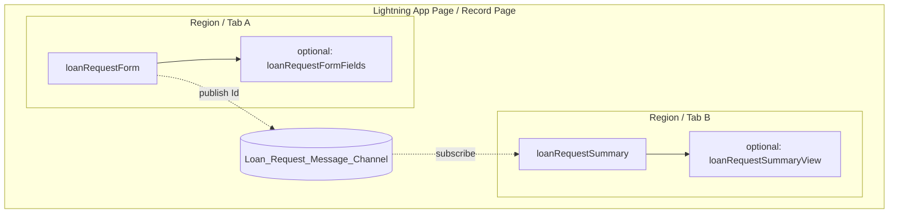

### Placement rules

- App Builder exposes both components as independent targets.
- Regions may be side-by-side, stacked, or on different tabs of the same page.
- A shared Aura/LWC wrapper that hosts both is **not** allowed for the assignment solution.
- FlexiPage composition is page layout only; it is not a Lightning component parent for event bubbling.

---

## 5. Communication Approach Comparison

Part D requires A → B communication without a shared parent. Three common Salesforce options are compared below.

### 5.1 Comparison matrix

| Approach | Works without shared parent? | Typical latency | Payload / coupling | Best fit | Risks for this assignment |
|---|---|---|---|---|---|
| **Lightning Message Service (LMS)** | Yes — application or active-area scope | Near-instant in the Lightning page | Typed message channel; publisher/subscriber decoupled | Cross-component UI events on Experience/LEX pages | Over-broad subscriptions if channel is abused; must unsubscribe |
| **Pub/Sub (custom event bus / `pubsub` utility)** | Partially — historically used for Aura/LWC without LMS | Instant in same page JS context | Informal; often a shared module singleton | Legacy patterns / demos | Not a first-class platform product for LWC; fragile across lockers, navigation, and multiple page contexts; harder to justify in production bank CRM |
| **Platform Events** | Yes — org-wide bus | Async; requires CometD/empApi subscription | Event object + fields; durable/replay options | Cross-user, cross-session, server-originated notifications | Overkill for same-user form→summary refresh; consumes event allocations; adds latency and complexity; not needed for Part D UX |

### 5.2 Detailed evaluation

#### Lightning Message Service

- Designed for LWC-to-LWC communication when components are not in the same DOM hierarchy.
- Message channels are metadata, versionable, and discoverable.
- Application scope covers independently placed regions on a Lightning page.
- Payload can be restricted to Ids, matching the system-design refresh model.
- Supported by Jest testing patterns for publish/subscribe behavior.

#### Custom pub/sub module

- A shared JavaScript module holds subscribers in memory.
- Can work on a single page load if both components import the same module.
- Lacks formal channel contracts, scoping, and Salesforce-supported lifecycle guarantees across navigation and Locker/Lightning Web Security boundaries.
- Often appears in older Trailhead samples; inferior to LMS for a production-oriented bank CRM design.

#### Platform Events

- Excellent when the server must notify many clients, or when another org process should fan out UI updates.
- Poor fit for “user clicked Save in Component A; Component B on the same page should refresh”: introduces asynchronous delivery, subscription management (`lightning/empApi`), and operational overhead.
- Would still require Component B to reload by Id afterward; LMS already provides the Id handoff faster.

### 5.3 Chosen solution: Lightning Message Service

**Decision:** Use LMS with message channel `Loan_Request_Message_Channel` (application scope).

**Justification**

1. Satisfies the explicit constraint of no shared parent.
2. Matches `docs/system-design.md` and `docs/apex-design.md` assumptions.
3. Keeps communication synchronous to the user’s page session without Platform Event cost/latency.
4. Encourages publishing an Id rather than a full record, which forces the required post-save Salesforce reload.
5. Is the supported, interview-defensible Salesforce pattern for Part D.

**Rejected alternatives (summary)**

- Pub/sub utility: avoid for production architecture and evaluation clarity.
- Platform Events: reserve for multi-client or server-push scenarios outside Part D.
- Custom DOM events / `@api` parent callbacks: require a shared parent — disallowed.
- Direct Apex polling only: possible but weaker UX and does not demonstrate required A→B communication.

---

## 6. How Communication Works Without a Shared Parent

### 6.1 Mechanism

1. Both components independently import the same Lightning Message Context and channel reference.
2. `loanRequestForm` obtains a message context and **publishes** after a successful Apex save.
3. `loanRequestSummary` **subscribes** on `connectedCallback` (or equivalent lifecycle) and handles messages.
4. Lightning Experience delivers the message to active subscribers in the configured scope without requiring a common LWC ancestor.
5. `loanRequestSummary` unsubscribes in `disconnectedCallback` to prevent leaks and stale handlers.

### 6.2 Message contract

| Field | Type | Required | Description |
|---|---|---|---|
| `loanRequestId` | Id (18-char string) | Yes | Newly created `LoanRequest__c` Id. |
| `correlationId` | String | Yes | Trace Id from save response; aligns with Apex/Flow correlation. |
| `action` | String | No | e.g. `created` — reserved for future update flows. |

**Why not publish customer name / amount / status**

- Client values may differ from database defaults, triggers, or formula-derived display.
- Assignment requires reload from Salesforce for Component B.
- Smaller, safer LMS payloads reduce accidental PII broadcast to other subscribers.

### 6.3 Sequence (success path)

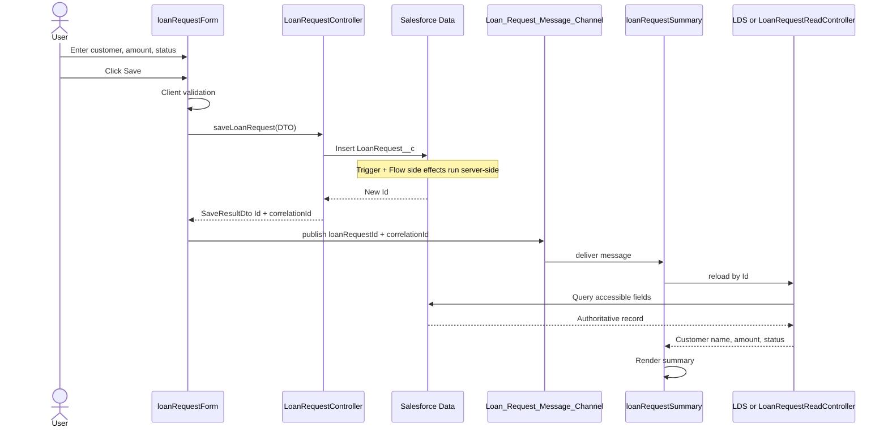

### 6.4 Failure path (no LMS publish)

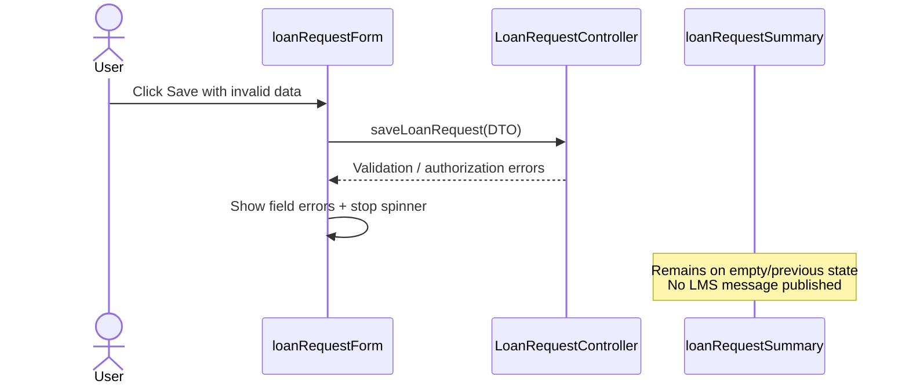

### 6.5 Communication topology diagram

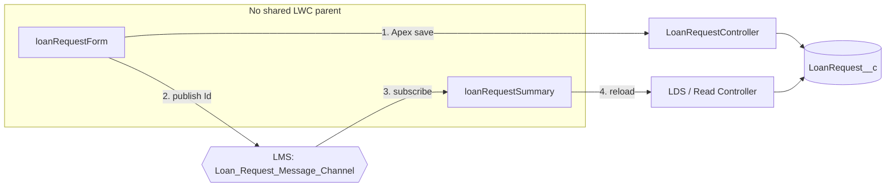

---

## 7. State Management

### 7.1 Principles

- Each component owns **local UI state** only.
- There is **no shared Redux-like store** and no parent-held state between A and B.
- Authoritative loan data for display lives in Salesforce; Component B’s view state is a cached read model refreshed after LMS messages.
- Correlation Ids bridge UI and server observability without becoming business state.

### 7.2 `loanRequestForm` state

| State | Owner | Lifetime | Notes |
|---|---|---|---|
| Selected `customerId` / display name | Form | Until reset or navigation | Lookup selection. |
| `loanAmount` | Form | Until reset | Local input. |
| `loanStatus` | Form | Until reset | Controlled picklist value. |
| `isSaving` | Form | Per request | Drives spinner and button disable. |
| `fieldErrors` / `formError` | Form | Until next edit/save | Client + server validation messages. |
| Last `saveResult` Id | Form (optional) | Session | For debugging/confirmation toast only. |

**Post-save form policy (recommended):** Clear amount/status to defaults and keep customer selected for rapid repeat entry, **or** clear all fields. Either is acceptable; do not leave the form implying unsaved edits are already “committed” in the summary.

### 7.3 `loanRequestSummary` state

| State | Owner | Lifetime | Notes |
|---|---|---|---|
| `loanRequestId` | Summary | Until new message or disconnect | From LMS. |
| `correlationId` | Summary | Per message | Display optional; useful for support. |
| `customerName`, `loanAmount`, `loanStatus` | Summary | Until next successful reload | From Salesforce only. |
| `isLoading` | Summary | Per reload | Independent of form spinner. |
| `loadError` | Summary | Until retry/new message | Reload failures. |
| `hasData` | Summary | Derived | Empty vs populated view. |

### 7.4 What is intentionally not shared state

- Form input values are not mirrored into the summary via LMS.
- Summary does not write back into the form.
- Wire-service cache may be shared by the platform under the hood (LDS), but components must not depend on each other importing the same Apex wire adapter as a communication hack.

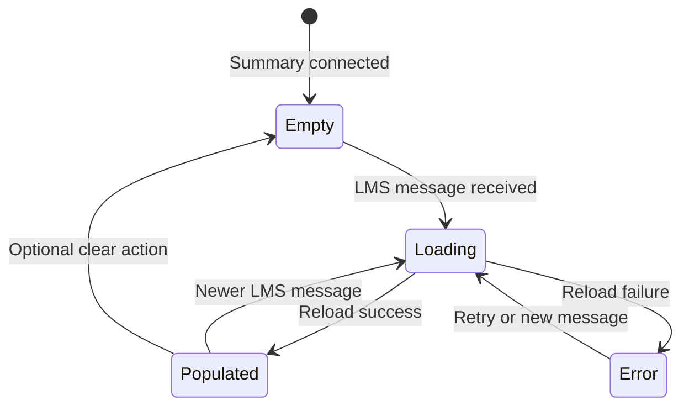

---

## 8. Apex Interactions

Aligned with `docs/apex-design.md` Appendix A.

### 8.1 Controllers used by LWC

| Apex class | LWC consumer | Method (design) | Mode | Purpose |
|---|---|---|---|---|
| `LoanRequestController` | `loanRequestForm` | `saveLoanRequest(LoanRequestDto)` | Imperative `@AuraEnabled` | Validate, insert, return Id + correlation Id. |
| `LoanRequestReadController` | `loanRequestSummary` | `getLoanRequest(Id)` | `@AuraEnabled(cacheable=true)` preferred | Authoritative DTO for summary fields. |

Lightning Data Service / UI API (`lightning/uiRecordApi`) may replace or precede the read controller when standard record access and field sets are sufficient. Apex read remains the design fallback for a tailored, security-stripped DTO.

### 8.2 DTO contracts (design-level)

**Save request (`LoanRequestDto` inbound)**

| Field | Required | Notes |
|---|---|---|
| `customerId` | Yes | Lookup to `Customer__c`. |
| `loanAmount` | Yes | Positive currency. |
| `loanStatus` | Yes | Allowed create statuses per validation. |

**Save response (`SaveResultDto`)**

| Field | Notes |
|---|---|
| `success` | Boolean. |
| `loanRequestId` | Present on success. |
| `correlationId` | Present on success (and optionally on failure for support). |
| `errors` | List of `ValidationFailure` (field + user-safe message). |

**Read response (`LoanRequestDto` outbound)**

| Field | Notes |
|---|---|
| `id` | Loan Id. |
| `customerName` | From related customer (accessible). |
| `loanAmount` | Accessible amount. |
| `loanStatus` | Accessible status. |

Sensitive fields (`NationalIdentifier__c`, integration internals, decision reason) are never returned to these LWCs.

### 8.3 Interaction diagram

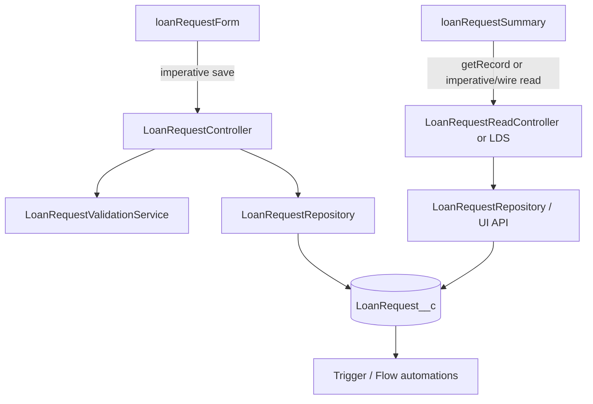

### 8.4 What LWC does not call

- Trigger handler, domain services, audit/task/email services — invoked only by platform automation after DML.
- Integration Queueables or callback REST — not part of the interactive create UX.
- Flow APIs — Flow runs automatically after status-change criteria are met on the saved record.

---

## 9. Data Loading Strategy

### 9.1 Form data loading

| Data | Strategy | Why |
|---|---|---|
| Customer options | Lookup / search component against `Customer__c` (debounced query, capped results) | Data model forbids free-text customer names as the loan relationship. |
| Loan status values | Static picklist adapter or UI API picklist values | Keep controlled values aligned with metadata. |
| Threshold / manager config | Not loaded in LWC | Server/CMDT-owned; not needed for create form UX. |
| Existing loan for edit | Out of Part D scope | Part D is create-oriented. |

### 9.2 Summary data loading

| Phase | Strategy |
|---|---|
| Initial | No loan query; show empty state. |
| After LMS message | Load **by Id only** — never by customer name alone. |
| Primary read | Lightning Data Service `getRecord` for `LoanAmount__c`, `LoanStatus__c`, and `Customer__r.Name` (or equivalent layout fields). |
| Alternate read | Wire/imperative `LoanRequestReadController.getLoanRequest` when a DTO or extra security stripping is required. |
| Field minimization | Request only fields displayed in the summary. |

### 9.3 Caching

- Prefer LDS caching for repeated views of the same Id.
- After insert, refresh must bypass stale cache: use `getRecordNotifyChange` / `notifyRecordUpdateAvailable` (design intent) after save, or imperative Apex read that returns fresh data.
- Do not set long client-side TTLs that could show pre-automation values if the summary ever expands to trigger-updated fields; for Part D’s three fields, insert-time values are usually stable, but Id-based reload remains mandatory.

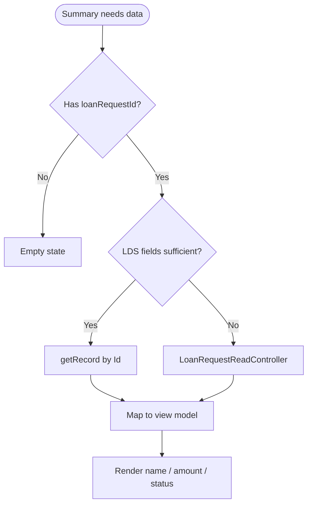

---

## 10. Refresh Strategy

### 10.1 Requirements coverage

| Assignment need | Design response |
|---|---|
| After save, reload latest data from Salesforce | Summary re-queries by Id after LMS message. |
| Component B shows updated Salesforce information | Display only reload results, not LMS field copies. |

### 10.2 Refresh triggers

| Trigger | Action |
|---|---|
| Successful save in form | Publish LMS → summary reload. |
| User Retry on summary error | Re-run load for current Id. |
| New LMS message | Replace Id and reload (latest wins). |
| Component reconnect | Do not auto-reload historical Id unless stored intentionally; default empty until message. |

### 10.3 Refresh algorithm (summary)

1. Receive LMS payload; validate `loanRequestId` format.
2. Set `isLoading = true`; clear prior `loadError`.
3. Fetch record by Id (LDS and/or Apex).
4. On success: map accessible fields → view state; `isLoading = false`.
5. On failure: set user-safe `loadError`; keep prior data only if product policy prefers stale-over-blank (recommended: show error, keep last good data if any).
6. Optionally call platform notify APIs so other LDS consumers on the page update.

### 10.4 Form-side refresh

The form does not need to reload the created loan for Part D. A success toast with loan auto-number/Id is sufficient. If the form later supports edit, it would load by Id independently—still without parenting the summary.

### 10.5 End-to-end refresh diagram

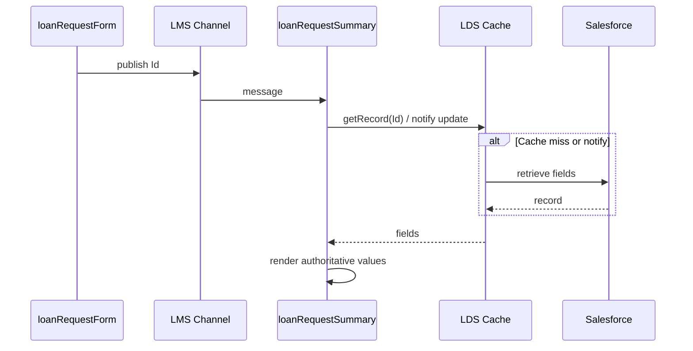

---

## 11. Validation Strategy

Validation is layered: client for UX speed, Apex for authority, declarative rules for defense in depth.

### 11.1 Client-side (form)

| Check | Rule | UX |
|---|---|---|
| Customer required | Lookup must have an Id | Inline error on customer field |
| Amount required | Non-null | Inline error |
| Amount positive | `> 0` | Inline error |
| Status required | Non-blank picklist | Inline error |
| Status allowed for create | Restrict to statuses permitted on insert (typically `Draft` / `Submitted`) | Prevent invalid picklist choices in UI |
| Double submit | Block while `isSaving` | Disabled Save |

Client checks **do not** implement full transition matrices, high-value Task rules, or integration field protection—those remain server-side.

### 11.2 Server-side (Apex)

`LoanRequestValidationService.validateForLwcCreate` (per Apex design) enforces:

- Positive amount, required customer, active customer when submitting.
- Email / manager readiness when status requires it.
- Allowed initial statuses and CRUD/FLS.
- Returns structured `ValidationFailure` list for field mapping.

Declarative validation rules on `LoanRequest__c` remain a second server barrier.

### 11.3 Summary validation

- Validate LMS payload contains a plausible Id before querying.
- Ignore malformed messages; optionally log to browser console in unlocked orgs only—never throw uncaught errors that break the page.

### 11.4 Validation flow

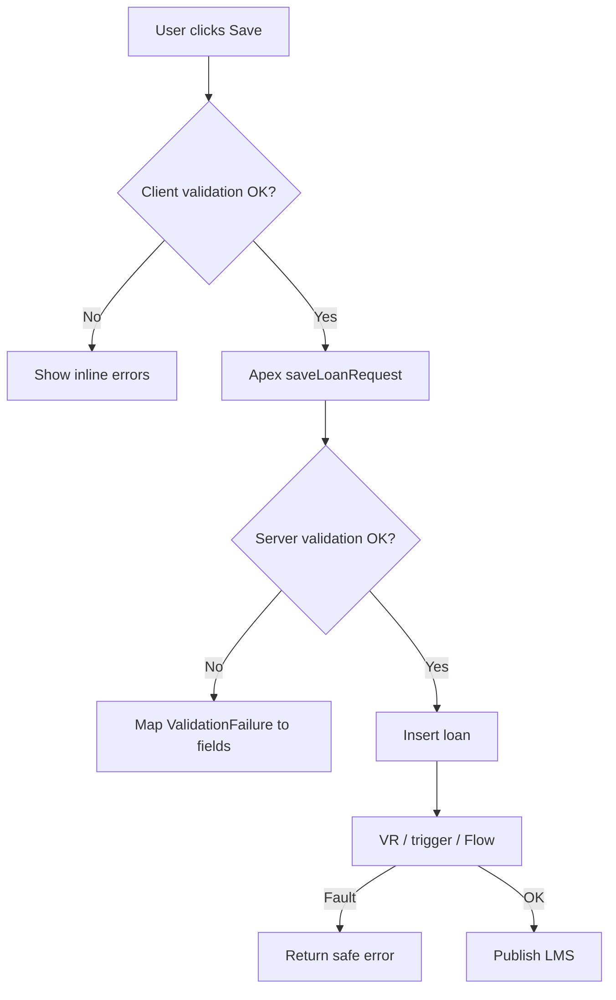

---

## 12. Error Handling

### 12.1 Error categories in the UI

| Category | Source | User experience | Logging |
|---|---|---|---|
| Client validation | Form | Inline field messages; no toast required | None |
| Server validation | Apex `ValidationFailure` | Inline per field + optional summary alert | Optional Apex only |
| Authorization | Apex `AuthorizationException` | Generic “you don’t have access” message | Sanitized `Application_Error__c` server-side |
| Unexpected save failure | Apex / platform | Toast: save failed; try again | Server error service |
| LMS delivery miss | Rare / timing | Summary stays empty; user can be guided to refresh page | N/A |
| Summary reload failure | LDS/Apex read | Inline error + Retry | Server if Apex path |

### 12.2 Policies

- Never surface stack traces, SOQL, or restricted field API names to end users.
- Never publish LMS on failed save.
- Form and summary errors are isolated: a summary load failure does not roll back a committed loan.
- Correlation Id from save may be shown in a support-friendly success detail, not in error toasts that leak internals.

### 12.3 Error handling diagram

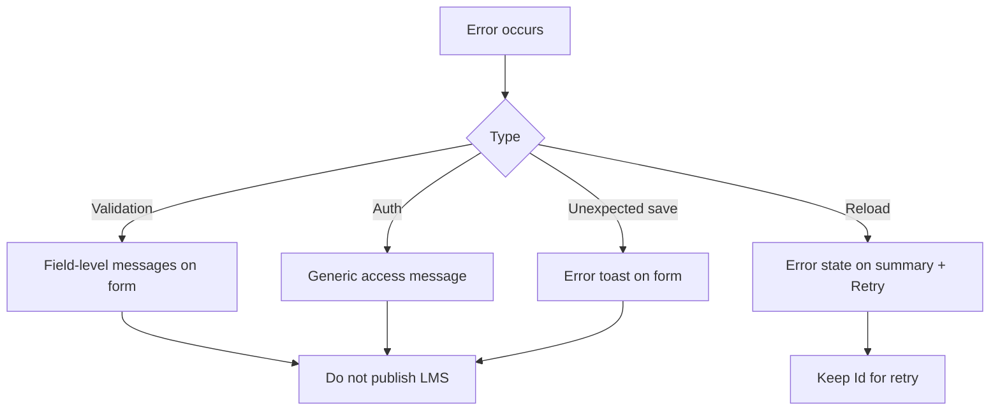

---

## 13. Loading Indicators

Assignment NFR: display a loading spinner while processing or saving.

### 13.1 Form spinner

| Property | Design |
|---|---|
| When shown | From Save click (after client validation passes) until Apex promise settles |
| Scope | Overlay or section-level spinner on the form card/region |
| Concurrent UX | Disable Save and inputs that would change the in-flight payload |
| Success | Hide spinner, then publish LMS, then toast |
| Failure | Hide spinner, show errors |

### 13.2 Summary spinner

| Property | Design |
|---|---|
| When shown | From LMS message handling start until reload completes |
| Independence | Must not rely on form’s `isSaving` flag |
| Empty + loading | Prefer spinner over blank flash when a load is in progress |
| Retry | Show spinner again on Retry |

### 13.3 Dual-spinner sequence

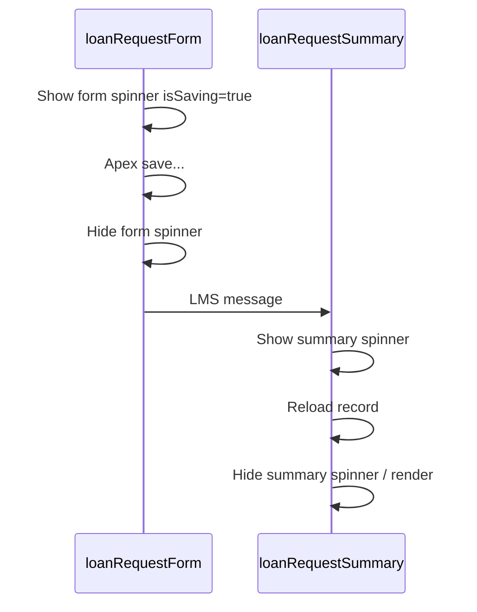

Using two spinners avoids a gap where save has finished but summary has not yet loaded, and avoids coupling the components’ local state.

---

## 14. UX / UI Considerations

### 14.1 Required experience

- Clean, intuitive layout with clear labels for Customer, Loan Amount, and Loan Status.
- Obvious primary Save action.
- Currency display appropriate for ILS (org locale).
- Status as a picklist, not free text.
- Customer as searchable lookup with name display—not a raw Id field.

### 14.2 Layout guidance

- Form and summary are separate page regions so evaluators can see independent placement (supports the no-shared-parent requirement visually).
- Summary uses a simple definition-list / read-only field layout rather than an editable form.
- Empty summary state: short instruction such as “Saved loan details appear here after a successful save.”
- Success toast on form: confirm creation without duplicating the entire summary payload.

### 14.3 Accessibility

- Associate labels with inputs.
- Announce errors via `aria-live` regions or equivalent SLDS patterns.
- Spinner has assistive text (“Saving loan request”, “Loading loan details”).
- Do not rely on color alone for error/success.

### 14.4 SLDS / design system

- Prefer standard Lightning Base Components (`lightning-input`, `lightning-combobox`, `lightning-record-picker` or lookup pattern, `lightning-button`, `lightning-spinner`, `lightning-card` only if needed as an interaction container).
- Avoid custom card-heavy dashboards; each component has one job (compose vs display).

### 14.5 UX state map

| User moment | Form | Summary |
|---|---|---|
| Page load | Editable empty/default form | Empty state |
| Saving | Spinner + disabled Save | Unchanged |
| Save success | Toast; optional reset | Spinner then populated fields |
| Save failure | Inline/toast errors | Unchanged |
| Reload failure | Idle | Error + Retry |

---

## 15. Reusability Considerations

| Asset | Reuse approach |
|---|---|
| Message channel | Single channel for loan-request UI events; document payload versioning if extended |
| Form field child (optional) | Reusable in future Screen-less intake variants |
| Summary view child (optional) | Reusable in record pages if given `@api recordId` |
| Apex DTOs | Shared by any future UI that creates/reads loans safely |
| Validation messages | Prefer server-returned messages for consistency across clients |

**Reuse boundaries**

- Do not reuse the form LMS publish logic inside unrelated components without adopting the same message contract.
- Do not turn the summary into a generic “record dump” that exposes sensitive fields.
- Future edit mode should be a separate responsibility or explicit mode flag—not silent overload of create.

---

## 16. Security Considerations

| Topic | LWC design control |
|---|---|
| CRUD/FLS | Enforced in `LoanRequestController` / `LoanRequestReadController` via `ApexSecurityHelper`; UI hiding is not sufficient |
| Sharing | Controllers `with sharing`; summary only shows records the user can read |
| LMS payload | Ids + correlation only; no national identifiers, emails, or decision reasons |
| DTO minimization | Outbound DTO limited to display fields |
| Injection / XSS | Use standard LWC templating bindings; do not use `lwc:dom="manual"` for untrusted strings |
| Guest / Experience Cloud | Not in scope; components assume authenticated bank users |
| Clickjacking / CSRF | Platform session handling for `@AuraEnabled`; no custom browser cookies |
| Debug info | No correlation-to-payload leakage of restricted data in client logs for production |
| Double submit | Disabled Save reduces duplicate creates; server remains authoritative |

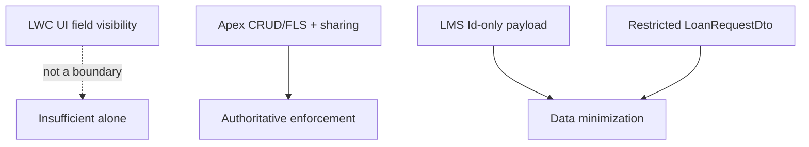

---

## 17. Testing Design (LWC-focused)

Part E requires verifying data passed between components and invalid input handling. Design-time test intent (no implementation code):

| Scenario | Component under test | Expectation |
|---|---|---|
| Valid save | Form | Apex called with DTO; LMS published with Id; spinner lifecycle correct |
| Invalid client input | Form | Apex not called; LMS not published |
| Apex validation errors | Form | Errors mapped; LMS not published |
| LMS received | Summary | Reload invoked with Id; fields render from mock read |
| Reload failure | Summary | Error state; Retry works |
| Unsubscribe | Summary | Handler removed on disconnect |
| No shared parent | Architecture test / review | Components instantiate independently; communication only via LMS mock |

Jest tests mock Apex and LMS adapters. End-to-end verification in an org places both components on one App Page without a wrapper LWC.

---

## 18. Traceability to Assignment Part D

| Part D requirement | Design element |
|---|---|
| Form: Customer Name, Loan Amount, Loan Status | `loanRequestForm` fields (Customer via lookup name) |
| Save to `LoanRequest__c` | Apex `LoanRequestController` |
| Apex controller creates record | §8 Apex interactions |
| Component A sends data to Component B after Save | LMS publish of Id after success |
| Component B displays name, amount, status | `loanRequestSummary` after reload |
| No shared parent | Independent roots + LMS §5–§6 |
| Reload latest data from Salesforce | Refresh strategy §10 |
| B shows Salesforce-retrieved data | Id-only message + read path |
| Clean UX + required fields | §14 |
| Loading spinner while processing/saving | §13 (form + summary) |

---

## 19. Alignment With Broader Architecture

| Concern | Owner outside LWC | LWC awareness |
|---|---|---|
| High-value Task | Apex trigger services | Transparent after insert |
| `STATUS_CHANGED` audit | Apex | Transparent |
| Customer status / high-value notify / `HIGH_VALUE_STATUS_REVIEW` | Flow | Runs if create/update meets status-change entry; LWC does not invoke Flow |
| Approval email | Apex Queueable | Transparent |
| External approval | Integration layer | Only if status is `Submitted` and integration enabled |

The LWC layer remains a thin interactive create-and-notify-UI shell over the designed server automations.

---

## Document Control

| Item | Value |
|---|---|
| Design type | LWC architecture only |
| Implementation code | Excluded by request |
| Chosen communication | Lightning Message Service |
| Aligned to | System design §9, Apex controllers Appendix A, data model customer lookup, Flow non-goals for Screen Flow intake |
| Minimum components | `loanRequestForm`, `loanRequestSummary`, `Loan_Request_Message_Channel` |
