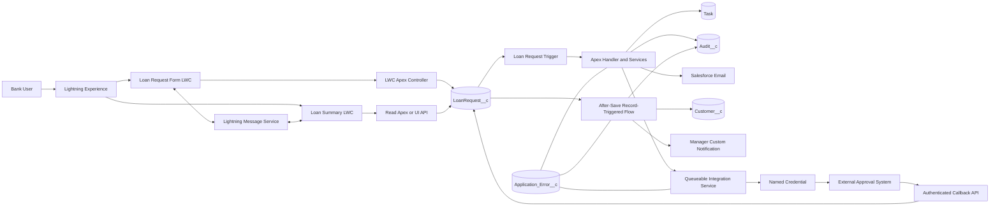
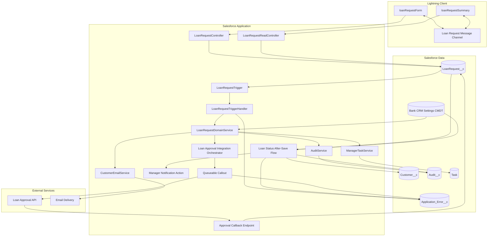
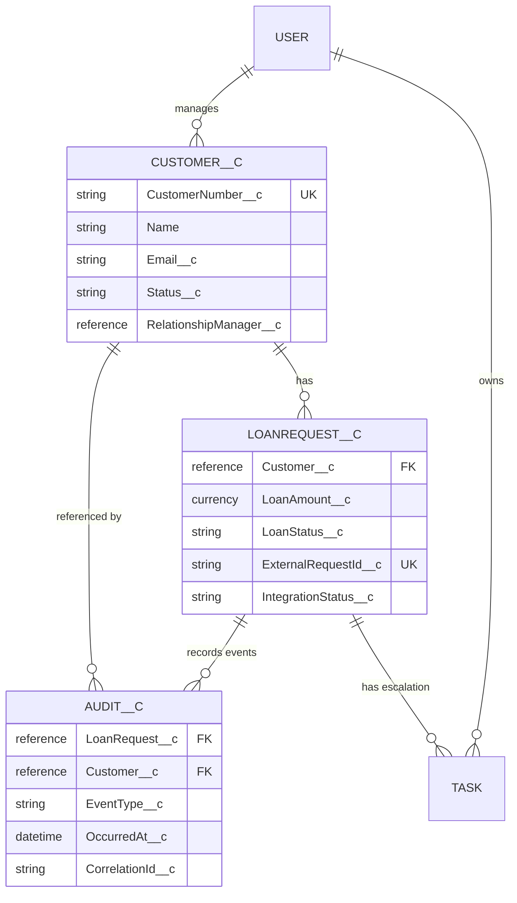
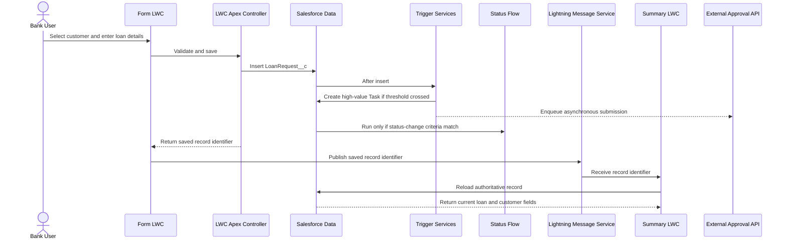
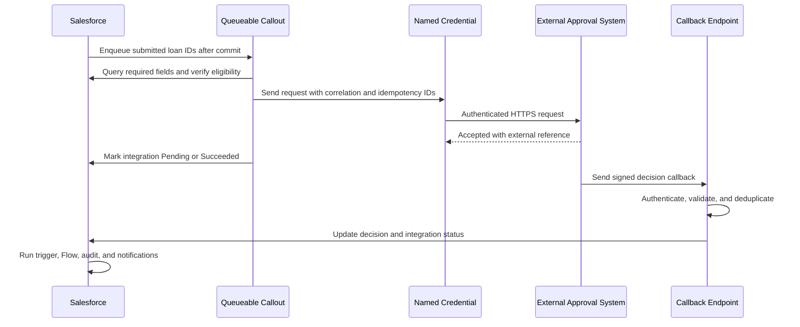
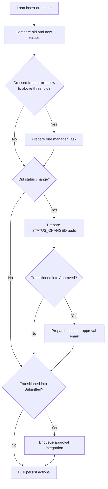
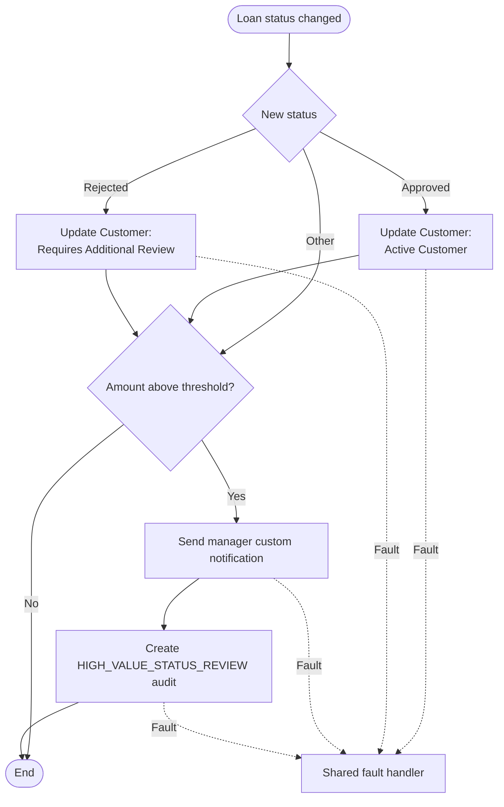
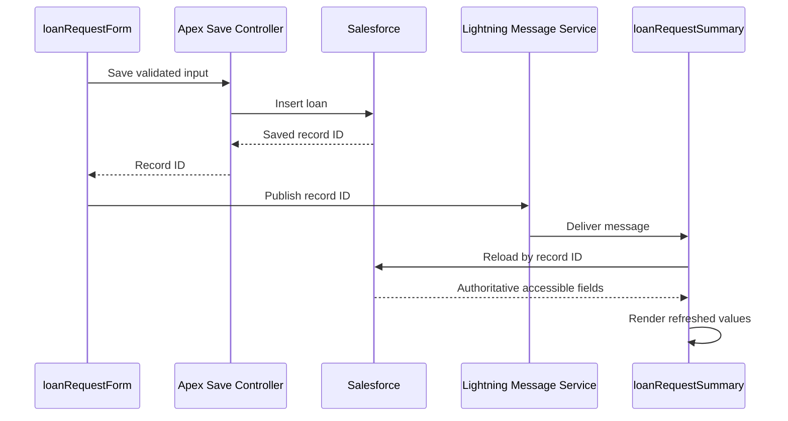

# Bank CRM System Design

**Platform:** Salesforce  
**Source:** `docs/project-analysis.md`  
**Scope:** Architecture and design only; no implementation code

---

## 1. Design Goals and Decisions

The system manages bank customers and their loan requests, automates high-value loan escalation, updates customer status after loan decisions, records auditable business events, and exchanges loan decisions with an external approval system.

The design follows these principles:

- Use Salesforce declarative capabilities for straightforward record updates and notifications.
- Use Apex where bulk processing, transaction control, email, integration, or reusable domain logic is required.
- Keep the trigger logic-free and place behavior in testable handler and service layers.
- Give each automation a distinct responsibility to prevent accidental duplicate Tasks, notifications, and audit records.
- Enforce least privilege, record-level sharing, field-level security, and Apex security checks.
- Preserve an immutable, searchable audit trail without storing unnecessary sensitive data.
- Make high-volume and integration work asynchronous where immediate user feedback is not required.
- Treat the ₪250,000 threshold, manager destination, and integration behavior as configuration rather than hard-coded policy.

### Key assumptions

- A loan belongs to one existing customer, selected through a lookup rather than entered as unverified free text.
- `LoanAmount__c` is stored in ILS. If Salesforce multi-currency is enabled, the threshold comparison uses a normalized corporate-currency value.
- Supported loan statuses are `Draft`, `Submitted`, `Under Review`, `Approved`, `Rejected`, and `Integration Error`.
- A high-value Task is created once when a loan first becomes greater than ₪250,000, not on every qualifying update.
- A later change from at-or-below the threshold to above it creates a new escalation Task.
- Manager assignment and the threshold are held in Custom Metadata.
- Apex owns required Tasks, approval emails, and status-change audits.
- Flow owns customer status updates and the additional manager notification required on high-value status changes.
- To satisfy the explicit Flow audit requirement without creating indistinguishable duplicates, Flow writes a separate `HIGH_VALUE_STATUS_REVIEW` audit event while Apex writes `STATUS_CHANGED`.
- Lightning Message Service is used because the two LWCs do not share a common parent.
- The external approval API supports authenticated HTTPS requests and an idempotency/correlation identifier.

---

## 2. High-Level Architecture

### Architectural layers

1. **Presentation layer:** Lightning pages and two independent LWCs.
2. **Application layer:** LWC controller, trigger handler, Flow, notification service, audit service, and integration orchestration.
3. **Domain/data layer:** Customer, loan request, audit, Task, and application error records.
4. **Integration layer:** Queueable Apex, Named Credential, outbound API, and authenticated callback endpoint.
5. **Cross-cutting controls:** security, configuration, observability, idempotency, and governor-limit protection.

---

## 3. Component Diagram

---

## 4. Data Architecture

### `Customer__c`

- `Name`: customer display name.
- `CustomerNumber__c`: unique, external identifier; marked Unique and External ID.
- `Email__c`: approval notification address.
- `Status__c`: controlled picklist including `Prospect`, `Active Customer`, and `Requires Additional Review`.
- `RelationshipManager__c`: lookup to `User`; preferred manager for Tasks and notifications.
- `NationalIdentifier__c`: encrypted sensitive identifier, if required.
- `IsActive__c`: indicates whether the customer can receive new loan requests.

### `LoanRequest__c`

- `Name`: auto-number loan reference.
- `Customer__c`: required lookup to `Customer__c`.
- `LoanAmount__c`: Currency with positive-value validation.
- `LoanStatus__c`: controlled picklist.
- `SubmissionDate__c`: timestamp when submitted for approval.
- `ExternalRequestId__c`: unique External ID used for integration idempotency.
- `ExternalDecisionReference__c`: reference returned by the external system.
- `IntegrationStatus__c`: `Not Sent`, `Pending`, `Succeeded`, `Retry Pending`, or `Failed`.
- `IntegrationLastAttempt__c`: last callout timestamp.
- `HighValueTaskCreated__c`: transaction-safe idempotency marker for the current threshold crossing.
- `DecisionReason__c`: protected decision explanation.

`Customer__c` is a lookup rather than master-detail so a loan record and its audit history are not cascade-deleted with a customer. Deletion of either object should be restricted operationally; records should normally be deactivated or archived.

### `Audit__c`

- `LoanRequest__c`: lookup to the loan.
- `Customer__c`: lookup to the customer.
- `EventType__c`: controlled value such as `STATUS_CHANGED`, `HIGH_VALUE_STATUS_REVIEW`, `APPROVAL_EMAIL_SENT`, or `INTEGRATION_RESULT`.
- `OldValue__c` and `NewValue__c`: relevant state transition values.
- `CustomerNameSnapshot__c`: customer name at event time.
- `LoanAmountSnapshot__c`: amount at event time.
- `OccurredAt__c`: event timestamp.
- `ActorUser__c`: initiating user when applicable.
- `CorrelationId__c`: links related automation and integration activity.
- `Source__c`: `Apex`, `Flow`, `Integration`, or `System`.
- `Details__c`: sanitized summary; must not contain secrets or unnecessary PII.

Audit records are append-only for normal users. A dedicated compliance permission set may read them; updates and deletes are denied except through a controlled retention process.

### Supporting records

- Standard `Task` represents the actionable high-value escalation and relates to the loan through `WhatId`.
- `Application_Error__c` stores sanitized operational failures, correlation IDs, retry state, and source component.
- `Bank_CRM_Settings__mdt` stores the high-value threshold, default manager/queue, notification type, retry limit, and integration enablement.

### Relationships

---

## 5. End-to-End Data Flow

### Create and submit a loan

### Status decision

1. A user or integration callback updates `LoanStatus__c`.
2. Before-save validation prevents invalid transitions.
3. After-save Apex compares old and new values in bulk.
4. Apex inserts one `STATUS_CHANGED` audit per changed loan.
5. Apex sends approval emails only for transitions into `Approved`.
6. The after-save Flow updates the related customer based on Approved or Rejected.
7. For a high-value loan, Flow sends a manager custom notification and writes one `HIGH_VALUE_STATUS_REVIEW` audit.
8. Fault paths create an operational error record and notify support when appropriate.

### External approval exchange

If callbacks are unavailable, a scheduled reconciliation process queries pending external requests in bounded batches. Retries use exponential backoff and a maximum attempt count; exhausted records move to a support queue.

---

## 6. Apex Architecture

### Layers and responsibilities

- **Trigger:** receives insert/update events and delegates once per transaction.
- **Trigger handler:** determines event type and coordinates bulk work.
- **Domain service:** compares old/new values, validates transitions, and creates action plans.
- **Task service:** resolves manager ownership and prepares deduplicated high-value Tasks.
- **Audit service:** creates immutable audit records from normalized event descriptions.
- **Email service:** builds approval messages and submits bulk-safe email operations.
- **Integration orchestrator:** identifies newly submitted loans and enqueues post-commit callouts.
- **LWC controller:** validates requests, enforces object/field access, saves records, and returns only the new record identifier or a restricted DTO.
- **Read controller:** returns the latest accessible loan data for Component B and is cacheable where safe.
- **Callback service:** authenticates external decisions, applies idempotency, and updates records through the same domain rules.
- **Error service:** captures sanitized failures consistently without hiding business-critical transaction failures.

### Transaction boundaries

- Loan creation and its required synchronous side effects run in one Salesforce transaction.
- Callouts occur asynchronously after the database transaction commits.
- A failure in a mandatory Task or status audit rolls back the triggering transaction to avoid an untracked business state.
- Non-critical email delivery and manager custom notification failures are logged and can be retried without rolling back the loan decision.
- Integration callback processing is one transaction per bounded request and uses an external correlation identifier to prevent replay.

### Bulk behavior

- Accept sets or lists of records; never process only the first record.
- Query customers, managers, settings, and existing escalation markers once per transaction.
- Use maps keyed by record ID for old/new comparisons and related-data lookup.
- Prepare collections and perform one DML statement per object where practical.
- Keep SOQL and DML outside loops.
- Avoid trigger recursion with change detection and idempotent state, not a transaction-wide static Boolean that could skip valid chunks.
- Use partial-success DML only for non-mandatory side effects and log each failed result.

---

## 7. Trigger Architecture

One trigger exists on `LoanRequest__c`; it delegates all behavior to the handler.

### Events

- **Before insert:** validate required relationships, positive amount, allowed initial status, and initial integration state.
- **Before update:** validate permitted status transitions and protected integration fields.
- **After insert:** create a high-value Task when amount is above the configured threshold; enqueue external submission if the initial status is `Submitted`.
- **After update:** detect threshold crossings, status transitions, and newly submitted records.

### Decision rules

The threshold condition uses a crossing check to prevent duplicate Tasks. A record inserted above the threshold counts as a crossing. If business policy requires a new escalation after an amount is lowered and later raised, the marker is reset when the amount returns to or below the threshold.

---

## 8. Flow Architecture

Use one optimized **after-save record-triggered Flow** on `LoanRequest__c`.

### Entry criteria

- Run on update when `LoanStatus__c` is changed.
- Require a related `Customer__c`.
- Use only fields already on the triggering record unless a lookup is necessary.

### Elements

1. **Status Decision**
   - Approved branch: set customer status to `Active Customer`.
   - Rejected branch: set customer status to `Requires Additional Review`.
   - Default branch: no customer status update.
2. **High-Value Decision**
   - If amount is above the configured threshold, invoke the manager notification action.
   - Create one `HIGH_VALUE_STATUS_REVIEW` audit for this status-change transaction.
3. **Fault handling**
   - Each Update Records, Create Records, and action element routes to a shared fault subflow/action.
   - The fault handler records the loan ID, Flow interview identifier, failed element, sanitized message, and correlation ID.
   - Operational support receives an alert for non-recoverable failures.

The Flow does not create the high-value Task or the general status audit; those are Apex responsibilities. This separation keeps the assignment requirements visible while avoiding duplicate records with the same purpose.

---

## 9. LWC Architecture

### Component A: `loanRequestForm`

- Presents a customer lookup, loan amount, and controlled loan status input.
- Performs client-side completeness checks for immediate feedback.
- Calls the save Apex method and shows a spinner while the request is pending.
- Disables repeated submission until the current request finishes.
- Displays safe, user-actionable error messages.
- After success, publishes only the saved `LoanRequest__c` ID and a correlation ID through Lightning Message Service.
- Clears or retains form state according to the result; it does not treat its input values as the saved source of truth.

### Component B: `loanRequestSummary`

- Subscribes to the application-scoped Lightning Message Channel.
- Receives the saved record ID.
- Reloads the record from Salesforce through Lightning Data Service/UI API when possible, or a security-enforcing read Apex method when a tailored DTO is required.
- Displays the authoritative customer name, amount, and status.
- Shows independent loading and error states.
- Unsubscribes during component teardown.

### Communication and refresh

Publishing an ID rather than the full form payload prevents stale or unsaved client values from being displayed as authoritative data. The message channel is scoped and documented so unrelated pages do not react accidentally.

---

## 10. Security Architecture

### Identity and access

- Use Salesforce SSO with MFA and the bank identity provider.
- Use permission sets and permission set groups instead of profile-specific customization.
- Separate personas such as Loan Officer, Relationship Manager, Approver, Compliance Auditor, Integration User, and Support Operator.
- Give the integration user API-only access and only the fields and operations required by the approval exchange.

### Record-level security

- Set organization-wide defaults for `Customer__c`, `LoanRequest__c`, and `Audit__c` to Private.
- Grant loan officers access through ownership and role hierarchy only where organizational policy permits.
- Use criteria-based or owner-based sharing for assigned managers and approval teams.
- Give compliance users read-only access to audit records.
- Do not expose financial records through guest or unauthenticated access.

### Object and field security

- Restrict create/update/delete rights by persona.
- Protect national identifiers, decision reasons, email addresses, and financial fields with field-level security.
- Use Shield Platform Encryption for regulated identifiers and other fields selected through data-classification review.
- Mask sensitive values in lower environments.
- In Apex, use inherited/user sharing as appropriate, enforce CRUD/FLS, and strip inaccessible fields before DML or response serialization.
- Do not rely on LWC field visibility as a security boundary.

### Data integrity and compliance

- Validation rules enforce positive amount, required customer, valid statuses, and permitted transition prerequisites.
- Unique external IDs prevent duplicate customers and integration requests.
- Audit records are append-only and retained according to bank policy.
- Field History Tracking may supplement, but not replace, business audit events.
- Event Monitoring and Setup Audit Trail support privileged-access review.
- Transaction Security Policies can restrict suspicious exports or API activity.

### Integration security

- Store endpoint and credentials in Named Credentials and External Credentials; never in Apex, Flow, Custom Metadata, or LWC.
- Prefer OAuth 2.0 client credentials or JWT-based authentication with short-lived tokens.
- Require TLS, validate callback signatures/tokens, allowlist expected integration paths, and apply replay protection.
- Include only necessary data in payloads; avoid sending full customer records.
- Keep secrets, access tokens, and complete sensitive payloads out of logs and audit records.

---

## 11. Error Handling and Observability

### Error categories

- **Validation errors:** returned to the user with a clear field-level correction.
- **Authorization errors:** returned as a generic access message and logged without exposing restricted field names or data.
- **Mandatory automation errors:** fail and roll back the transaction so the loan is not left in an unaudited state.
- **Non-critical notification errors:** record failure and retry asynchronously without reversing the decision.
- **Integration transient errors:** retry with backoff for timeouts, rate limits, and temporary server failures.
- **Integration permanent errors:** stop retrying for invalid payloads or rejected authentication and route to support.
- **Flow faults:** route through a shared fault handler with record and interview context.

### Error record design

`Application_Error__c` should capture:

- source component and operation;
- related loan/customer IDs;
- correlation ID;
- occurred-at timestamp;
- category and retryability;
- attempt count and next retry time;
- sanitized message and stack fingerprint;
- resolution status and owner.

### Operational monitoring

- Use correlation IDs across LWC save, Apex automation, audits, and external requests.
- Report failed integrations, exhausted retries, Flow faults, and unsent notifications through an operations dashboard.
- Alert support on sustained failure rates or aged pending integrations.
- Use a scheduled reconciliation job to find loans stuck in `Pending` or `Retry Pending`.
- Define retention and purge policies for operational errors separately from immutable business audits.

---

## 12. Performance and Scalability

### Governor-limit protection

- Bulkify trigger, service, and callback processing.
- Query related customers and users with set-based SOQL.
- Use one configuration load per transaction.
- Consolidate DML by object and avoid SOQL, DML, email, or Flow record operations inside loops.
- Keep synchronous logic limited to validation and required immediate side effects.
- Enqueue callouts and retry work after commit.

### Query and index strategy

- Mark `CustomerNumber__c` and `ExternalRequestId__c` as Unique External IDs.
- Request custom indexes only for selective, frequently used filters such as `IntegrationStatus__c` combined with an aging timestamp when data volume justifies it.
- Filter large queries by selective indexed fields and bounded date ranges.
- Avoid leading-wildcard searches and non-selective filters on large loan or audit datasets.
- Review query plans before production rollout and as volumes grow.

### Large data volumes

- Use Batch Apex for historical migration, backfill, archival, and reconciliation involving large record counts.
- Use Queueable Apex for bounded callout workloads, chaining only when necessary and within platform limits.
- Use Scheduled Apex to initiate reconciliation and retention jobs.
- Consider Platform Events for higher-throughput, loosely coupled integration if external volume or resiliency requirements exceed the direct Queueable pattern.
- Archive old audits to compliant external storage or Big Objects if retention volume outgrows normal custom-object storage.

### Flow efficiency

- Use narrow entry criteria so the Flow runs only on actual status changes.
- Prefer direct field updates over loops.
- Avoid redundant Get Records operations.
- Keep fault handling centralized.
- Monitor Flow interview and CPU consumption alongside Apex limits because both execute in the same transaction.

### LWC performance

- Send record IDs rather than full records through Lightning Message Service.
- Load only fields required by the summary.
- Use Lightning Data Service caching where appropriate.
- Prevent duplicate saves and unnecessary refreshes.
- Debounce any customer search and cap result sets.

### Contention and concurrency

- Use idempotency fields and unique external IDs to tolerate retries.
- Minimize repeated updates to the same customer when processing many loans.
- If concurrent decisions for one customer are possible, define customer-status precedence rather than relying on last-write-wins.
- Use row locking only when required and keep locked transactions short.

---

## 13. Automation Ownership Summary

- **Apex trigger/services:** high-value Task, status-change audit, approval email, integration enqueue.
- **Record-triggered Flow:** customer status update, high-value manager custom notification, high-value status-review audit.
- **LWC/Apex controller:** user-driven creation, validation feedback, message publication, authoritative refresh.
- **Integration services:** outbound submission, callback processing, retries, reconciliation, integration audits.
- **Platform security:** identity, sharing, CRUD/FLS, encryption, monitoring, and retention controls.

This ownership model deliberately distinguishes the assignment's overlapping Apex and Flow requirements. It prevents repeated Tasks and indistinguishable audits while preserving both automation paths for evaluation.

---

## 14. Deployment and Testability Considerations

- Deploy metadata through source control and Salesforce DX environments.
- Keep threshold, manager routing, retry limits, and integration enablement configurable by environment.
- Activate Flow only after dependent fields, notification types, permissions, and Apex actions exist.
- Use Apex tests for bulk inserts/updates, threshold crossings, status changes, invalid transitions, email intent, security behavior, callout responses, retries, and callback idempotency.
- Use Flow tests for Approved, Rejected, high-value, default, and fault branches.
- Use LWC Jest tests for validation, spinner behavior, save success/failure, message publication/subscription, and post-message refresh.
- Target at least 90% Apex coverage, while treating assertions over business outcomes—not coverage alone—as the acceptance standard.

