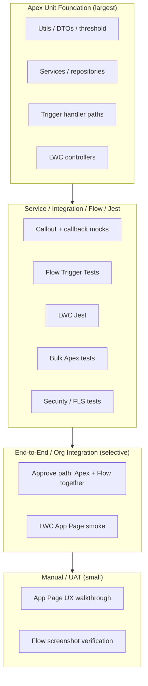

# Bank CRM Testing Strategy

**Platform:** Salesforce  
**Sources:** `project_task.md`, `docs/project-analysis.md`, `docs/system-design.md`, `docs/data-model.md`, `docs/apex-design.md`, `docs/flow-design.md`, `docs/lwc-design.md`  
**Scope:** Complete testing strategy for Unit, Trigger, Flow, LWC, Integration, Bulk, Negative, Security, and Performance tests. No implementation code.

---

## 1. Testing Goals and Principles

Part E requires unit tests that verify high-value Task creation, customer status update on approval, LWC component communication, and incomplete/invalid input handling, with **at least 90% Apex code coverage**. Coverage is necessary but not sufficient: every test must assert business outcomes defined by the ownership matrix.

### Goals

| Goal | Measure |
|---|---|
| Correctness | Mandatory Apex outcomes (Task, `STATUS_CHANGED` audit, approval email intent) behave per design. |
| Declarative outcomes | Flow updates customer status and writes `HIGH_VALUE_STATUS_REVIEW` without duplicating Apex Tasks/`STATUS_CHANGED`. |
| UI contract | LWC form validates, saves, publishes LMS Id-only messages; summary reloads from Salesforce. |
| Bulk safety | 200-record trigger chunks stay within governor limits with one DML/SOQL pattern per object. |
| Security | CRUD/FLS, sharing, and DTO minimization are enforced; negative auth paths return generic messages. |
| Resilience | Mandatory failures roll back; email/notification failures are non-critical and logged. |
| Coverage | ≥90% Apex line coverage across all assignment Apex classes; prefer assertion-rich tests over empty coverage stubs. |

### Principles

- **One ownership, one assertion owner:** Apex tests assert Apex-owned side effects; Flow tests assert Flow-owned side effects; do not require Apex unit tests to assert Flow customer-status updates unless running true end-to-end org tests with Flow active.
- **Arrange with factories, assert outcomes:** Prefer shared `BankCrmTestDataFactory` over duplicated setup SOQL.
- **Test behavior, not private methods:** Exercise public service APIs, controllers, handlers, and trigger paths.
- **Isolate callouts:** Use `HttpCalloutMock` / `MultiRequestMock`; never hit real Named Credentials in unit tests.
- **SeeAllData=false:** All Apex tests use `@IsTest` with synthetic data only.
- **CMDT in tests:** Deploy `Bank_CRM_Settings__mdt` Default record (or stub via provider test seam) so threshold/routing are deterministic.
- **Email:** Use `Messaging.SendEmailResult` / email limits awareness; prefer asserting enqueue of `CustomerApprovalEmailQueueable` or captured messages via a testable Messaging wrapper.
- **Idempotency first:** High-value Task tests must cover crossing, non-crossing, marker already true, and reset below threshold.

### Automation ownership under test

| Concern | Owner | Primary test type |
|---|---|---|
| High-value Task + `HighValueTaskCreated__c` | Apex | Apex unit / trigger / bulk |
| `STATUS_CHANGED` audit | Apex | Apex unit / trigger |
| Approval email | Apex | Apex unit / async |
| Integration enqueue / callout / callback | Apex | Apex unit / integration / mock |
| Customer `Status__c` on Approve/Reject | Flow | Flow tests (+ optional E2E Apex) |
| Manager custom notification | Flow | Flow tests |
| `HIGH_VALUE_STATUS_REVIEW` audit | Flow | Flow tests |
| LWC save / LMS / refresh | LWC + Apex controllers | Jest + Apex controller tests |

---

## 2. Test Pyramid

| Layer | Approx. share of effort | Purpose |
|---|---|---|
| Apex unit + trigger | ~55% | Core Part B logic, coverage ≥90% |
| Flow tests | ~10% | Part C branches and faults |
| LWC Jest | ~15% | Part D communication and UX states |
| Integration / bulk / security / performance | ~20% | Production readiness and Part E NFRs |

---

## 3. Test Data Strategy

### 3.1 Principles

- Centralize creation in `BankCrmTestDataFactory` (and optional `BankCrmTestUserFactory`).
- Create only fields required for the scenario; avoid over-populated “god records.”
- Use unique `CustomerNumber__c` / `ExternalRequestId__c` per test method (append `Crypto.getRandomInteger()` or static counters).
- Prefer `System.runAs` for persona-based security tests.
- Disable or stub integration (`IntegrationEnabled__c = false`) unless the test is specifically about integration.
- Never hard-code User Ids; resolve a known active user or create a test User with required permission sets in `@TestSetup`.

### 3.2 Factory catalog

| Factory method (design) | Creates | Typical use |
|---|---|---|
| `createCustomer(overrides)` | `Customer__c` with email, active flag, relationship manager | Most scenarios |
| `createInactiveCustomer(...)` | Inactive / `Status__c = Inactive` | Negative submission |
| `createLoan(customerId, amount, status, overrides)` | `LoanRequest__c` | Trigger, Flow, controller |
| `createHighValueLoan(...)` | Amount `threshold + 1` | Task / Flow high-value |
| `createBelowThresholdLoan(...)` | Amount `threshold` or below | Edge at exactly ₪250,000 |
| `createDraftLoan(...)` | Status `Draft` | LWC create baseline |
| `createSubmittedLoan(...)` | Status `Submitted` + submission date | Integration enqueue |
| `createAudit(...)` | Rarely inserted by tests (prefer asserting automation-created audits) | Negative append-only |
| `enableIntegrationSettings()` / `disableIntegrationSettings()` | Via CMDT or settings provider test stub | Integration on/off |
| `mockHttpSuccess()` / `mockHttpTransient()` / `mockHttpPermanent()` | `HttpCalloutMock` | Callout tests |
| `assignPermissionSet(user, apiName)` | Permission set assignment | Security tests |

### 3.3 `@TestSetup` pattern

| Setup once per class | Why |
|---|---|
| Base customer(s) with email + relationship manager | Avoid repeated user/email setup |
| Active manager User + optional default manager username alignment | Task owner resolution |
| Permission set assignments for “loan officer” runAs user | Controller/CRUD tests |
| Do **not** create loans in setup when tests need isolated DML counts | Clearer Limits assertions |

### 3.4 Settings and threshold

| Item | Test approach |
|---|---|
| `HighValueThreshold__c` | Default `250000`; assert using `BankCrmSettingsProvider.getSettings().highValueThreshold` |
| Exactly `250000` | Not high value (`>` only) |
| Manager routing | Prefer customer `RelationshipManager__c`; fallback CMDT username in dedicated tests |
| Integration enablement | Off by default in unit tests; on only in integration suites |

### 3.5 Email and notification

| Concern | Strategy |
|---|---|
| Approval email | Assert Queueable enqueue and/or Messaging wrapper spy; do not depend on real delivery |
| Custom notification (Flow) | Flow tests assert action path; org must have Custom Notification Type if running live Flow tests |
| Limits | Bulk Approved transitions: assert overflow path logs `Application_Error__c` rather than failing loan DML |

### 3.6 Async testing

| Pattern | How |
|---|---|
| Queueable callout / email | `Test.startTest()` / `Test.stopTest()` to flush async |
| Batch reconciliation | `Database.executeBatch` inside start/stop; assert updated integration fields |
| Mixed sync + async | Assert synchronous mandatory side effects before stopTest; async after stopTest |

### 3.7 Data cleanup

Salesforce rolls back test DML automatically. Do not write cleanup DML. Prefer not inserting CMDT from Apex (CMDT is metadata); rely on packaged Default settings or a `@TestVisible` settings override seam on `BankCrmSettingsProvider`.

---

## 4. Apex Unit Tests

### 4.1 Scope

Unit tests target services, repositories, utilities, domain models, validation, controllers, and exception/error services **in isolation** where practical (handler invoked with constructed lists, or thin trigger integration).

### 4.2 Feature matrix

#### F-A1 High-value Task (`ManagerTaskService`)

| Aspect | Detail |
|---|---|
| **What to test** | Insert above threshold creates one Task; update crossing ≤→> creates Task; amount already above with marker true creates none; amount returns ≤ threshold resets marker; later re-cross creates Task again; owner = relationship manager or fallback. |
| **Expected results** | One `Task` with `WhatId` = loan, High priority, subject/type per design; `HighValueTaskCreated__c = true` after create; owner resolvable. |
| **Edge cases** | Amount exactly `250000` → no Task; insert at `250000.01` → Task; inactive relationship manager → fallback + optional warning error; bulk mixed above/below → Tasks only for crossings. |
| **Failure scenarios** | Task DML failure → `MandatoryAutomationException`, loan transaction rolls back; unresolved owner → fail closed or documented fallback (assert chosen design). |

#### F-A2 Status-change audit (`AuditService`)

| Aspect | Detail |
|---|---|
| **What to test** | Every status change inserts one `STATUS_CHANGED` audit with customer name snapshot, amount snapshot, old/new values, `Source__c = Apex`, correlation Id. |
| **Expected results** | Audit count = number of status-changed loans; `EventType__c = STATUS_CHANGED`; old ≠ new. |
| **Edge cases** | Amount-only update → no status audit; same status re-save → no audit; customer name change after event does not alter snapshot. |
| **Failure scenarios** | Audit insert failure → mandatory rollback; missing customer name → fail or load via repository (assert bulk name query used). |

#### F-A3 Approval email (`CustomerEmailService` / Queueable)

| Aspect | Detail |
|---|---|
| **What to test** | Transition into `Approved` plans/sends email; already Approved update does not re-send; missing email logged as non-critical; successful send may create `APPROVAL_EMAIL_SENT`. |
| **Expected results** | Email Queueable enqueued or Messaging invoked once per approved loan; loan remains Approved on send failure. |
| **Edge cases** | Bulk 10 Approved in one chunk → one sendEmail with multiple messages; email governor overflow → errors + retry flags. |
| **Failure scenarios** | Messaging exception → `Application_Error__c`, no loan rollback; blank `Email__c` blocked earlier by validation on submit/approve path. |

#### F-A4 Validation (`LoanRequestValidationService`)

| Aspect | Detail |
|---|---|
| **What to test** | Positive amount; required customer; active customer on submit; allowed transitions; rejection requires reason; terminal statuses protected; protected integration fields; LWC create validation returns `ValidationFailure` list. |
| **Expected results** | Trigger path: `addError` prevents save; LWC path: structured failures, no insert. |
| **Edge cases** | `Draft → Approved` skipped transition rejected; `Integration Error → Submitted` allowed; exactly zero / negative amount rejected. |
| **Failure scenarios** | Ordinary user editing `ExternalRequestId__c` after submit → authorization/validation error. |

#### F-A5 Threshold util (`CurrencyThresholdUtil`)

| Aspect | Detail |
|---|---|
| **What to test** | `isAboveThreshold`, `crossedThreshold` for null-safe amounts, exact threshold, crossing both directions. |
| **Expected results** | `>` only; crossed true only when old ≤ threshold and new > threshold (insert treated as cross when new > threshold). |
| **Edge cases** | Null old on insert; equal old/new above threshold → not a crossing. |
| **Failure scenarios** | N/A (pure functions). |

#### F-A6 Routing (`UserRoutingResolver`)

| Aspect | Detail |
|---|---|
| **What to test** | Prefer active RM; fallback username; queue developer name path; inactive RM warning. |
| **Expected results** | Map of customer Id → owner Id; bulk resolve uses batched queries. |
| **Edge cases** | Blank RM and blank settings → documented failure. |
| **Failure scenarios** | Username not found → error path. |

#### F-A7 Controllers (`LoanRequestController`, `LoanRequestReadController`)

| Aspect | Detail |
|---|---|
| **What to test** | Happy save returns Id + correlation Id; validation errors; CRUD denial; read returns DTO fields only; inaccessible record throws/returns safe error; cacheable read path. |
| **Expected results** | No sensitive fields in DTO; `with sharing` respected. |
| **Edge cases** | Save with `Submitted` when customer incomplete → failures; read after insert sees amount/status/name. |
| **Failure scenarios** | User without create access → `AuthorizationException` / generic message. |

#### F-A8 Error service / sanitization

| Aspect | Detail |
|---|---|
| **What to test** | `logNonCritical` vs `logAndRethrow`; sanitized messages strip token-like patterns; categories map correctly. |
| **Expected results** | `Application_Error__c` rows with correlation; mandatory exceptions still propagate. |
| **Edge cases** | Truncation at 4000 chars. |
| **Failure scenarios** | Error insert failure must not hide original mandatory exception. |

#### F-A9 Domain models / DTOs

| Aspect | Detail |
|---|---|
| **What to test** | `LoanRequestChange` predicates; `AuditEventDto.toSObject`; `LoanRequestDto` mapping strips inaccessible fields. |
| **Expected results** | Predicates match design; DTO omits national identifier / integration internals. |
| **Edge cases** | Null old map on insert. |
| **Failure scenarios** | N/A. |

---

## 5. Trigger Tests

### 5.1 Scope

Exercise `LoanRequestTrigger` → `LoanRequestTriggerHandler` through real DML (preferred for Part B evidence) with assertions on after/before outcomes.

### 5.2 Scenarios

| Scenario | What to test | Expected results | Edge cases | Failure scenarios |
|---|---|---|---|---|
| Before insert defaults | New Draft loan | `IntegrationStatus__c = Not Sent`; validation passes | Missing customer → error | Invalid initial status → error |
| After insert high value | Amount > threshold | One Task; marker true | Exact threshold → no Task | Task failure rolls back insert |
| After insert Submitted | Status Submitted, integration on | Queueable enqueued; external Id set if designed | Integration disabled → no enqueue | Callout not in same TX (assert no callout exception on insert) |
| After update status change | Draft→Submitted→Approved path stepwise | Each status change → one `STATUS_CHANGED`; Approved → email plan | No-op update → no audit | Audit DML fail rolls back |
| After update amount crossing | Raise amount across threshold | Task created once | Second update still above → no second Task | Marker reset when lowered then raised again |
| Before update transitions | Illegal transition | Save fails with field error | Terminal reopen without permission | Protected field edit denied |
| Recursion safety | Updates that change only marker | No infinite loop; no duplicate Tasks | Flow updates customer (different object) | Static-skip anti-pattern not used (behavioral: second chunk still processes) |

### 5.3 Explicit Part E assertions (trigger/Apex)

1. **Task when amount > ₪250,000** — insert or crossing update.
2. **Invalid/incomplete input** — missing customer, non-positive amount, illegal status → no successful save (and LWC controller returns failures).

Customer status on approval is **Flow-owned**; cover in Flow tests and optional E2E (section 6 / 14).

---

## 6. Flow Tests

### 6.1 Scope

Flow Trigger Tests (and debug interviews) for:

| Flow | API (design) |
|---|---|
| F1 | `Loan_Request_Status_Changed` |
| F2 | `Loan_Request_Flow_Fault_Handler` |
| F3 | `Resolve_Bank_CRM_Settings` |

### 6.2 F1 scenarios

| Scenario | Entry record | Expected results | Edge cases | Failure scenarios |
|---|---|---|---|---|
| Approve below threshold | Status → Approved, amount 100000 | Customer → `Active Customer`; no custom notification; no `HIGH_VALUE_STATUS_REVIEW` | Prior customer Prospect | Customer update fault → interview fails, error logged |
| Approve above threshold | Status → Approved, amount 300000 | Customer Active; notify; `HIGH_VALUE_STATUS_REVIEW` with `Source__c = Flow` | Does not create Task / `STATUS_CHANGED` (Apex) | Notification fault → log, still create audit |
| Reject above threshold | Status → Rejected, amount 400000 | Customer → `Requires Additional Review`; notify + high-value audit | Decision reason present on loan | Audit create fault → fail interview |
| Non-terminal status above threshold | Draft → Submitted, amount 500000 | No customer status change; notify + high-value audit | Under Review change same | Settings missing → fail closed (prod policy) |
| Exactly 250000 | Any status change | No high-value branch | 250000.01 enters branch | — |
| Status unchanged | Amount-only update | **Flow does not run** | — | — |
| Recipient unresolved | High value, blank RM, bad fallback | Skip notify; still create audit; warning error | — | — |

### 6.3 F2 / F3 scenarios

| Scenario | Expected |
|---|---|
| F2 creates `Application_Error__c` with interview GUID, element name, sanitized message | Row exists; no recursive fault loop if error insert fails |
| F3 finds Default CMDT | Outputs threshold + notification type |
| F3 missing settings | `outSettingsMissing = true` or controlled default per env policy |

### 6.4 Flow vs Apex coexistence (verification)

When running E2E with both active:

| Event | Apex asserts | Flow asserts |
|---|---|---|
| Approve high value | Task (if crossed), `STATUS_CHANGED`, email plan | Customer Active, custom notification, `HIGH_VALUE_STATUS_REVIEW` |
| Approve low value | `STATUS_CHANGED`, email plan; no Task | Customer Active; no Flow audit |
| Amount cross, status same | Task only | Flow does not run |

---

## 7. LWC Jest Tests

### 7.1 Scope

| Component / asset | Test file (design) |
|---|---|
| `loanRequestForm` | `loanRequestForm.test.js` |
| `loanRequestSummary` | `loanRequestSummary.test.js` |
| LMS channel contract | Shared mock helpers for `lightning/messageService` |

Mock: Apex adapters, LMS publish/subscribe, `lightning/uiRecordApi` if used, toasts/spinner.

### 7.2 `loanRequestForm`

| Scenario | What to test | Expected results | Edge cases | Failure scenarios |
|---|---|---|---|---|
| Renders required fields | Customer lookup, amount, status, Save | All present and labeled | Default status Draft | — |
| Client validation | Empty/invalid submit | Apex **not** called; LMS **not** published; inline errors | Amount 0 / negative | — |
| Valid save | Mock Apex success | Spinner shown then hidden; Save disabled while saving; LMS published with `loanRequestId` + `correlationId` only | Double-click Save → single Apex call | — |
| Apex validation errors | Mock `SaveResultDto` failures | Field errors mapped; no LMS | Correlation on failure optional | — |
| Apex auth/unexpected | Mock reject | Generic/safe toast; no LMS; spinner cleared | — | Stack traces never shown |
| Payload shape | Publish args | No customer name/amount/status in LMS | — | — |

### 7.3 `loanRequestSummary`

| Scenario | What to test | Expected results | Edge cases | Failure scenarios |
|---|---|---|---|---|
| Empty state | Connect without message | Placeholder text; no Apex/LDS call | — | — |
| LMS received | Publish mock message | Reload by Id; spinner; render name/amount/status from **read mock**, not message fields | Malformed Id ignored | — |
| Reload failure | Read rejects | Error state + Retry re-invokes load | Keep last good data policy | — |
| Unsubscribe | Disconnect | `unsubscribe` called | Stale message after disconnect ignored | — |
| Independent spinner | Form saving vs summary loading | Summary spinner only after LMS | — | — |

### 7.4 Architecture / Part E communication

| Scenario | Expectation |
|---|---|
| No shared parent | Tests instantiate form and summary separately; communication only via LMS mock |
| Data passed between components | Assert publish payload Id equals Id used by summary reload (Part E requirement) |

---

## 8. Integration Tests

### 8.1 Scope

Apex tests for outbound/inbound approval exchange with mocks; optional org smoke for Named Credential wiring (manual/CI with secure secrets).

### 8.2 Scenarios

#### Outbound (`LoanApprovalIntegrationOrchestrator` + `LoanApprovalCalloutQueueable`)

| Aspect | Detail |
|---|---|
| **What to test** | Transition/insert `Submitted` with integration enabled enqueues job; job callout via Named Credential mock; updates `IntegrationStatus__c`, external reference; writes `INTEGRATION_RESULT` audit. |
| **Expected results** | No callout in trigger transaction; after `stopTest`, status `Pending`/`Succeeded` per design; `ExternalRequestId__c` present. |
| **Edge cases** | Integration disabled → no job; loan no longer eligible on re-query → skip; idempotent re-enqueue. |
| **Failure scenarios** | HTTP 5xx → `Retry Pending` + attempt count; HTTP 401 → permanent `Failed` / allow `Integration Error`; timeout mock → transient retry. |

#### Inbound (`ApprovalCallbackRestResource` + `ApprovalCallbackService`)

| Aspect | Detail |
|---|---|
| **What to test** | Valid signed callback updates decision through repository (trigger/Flow fire); duplicate callback returns duplicate result without double status transition side effects beyond idempotent design. |
| **Expected results** | Loan status mapped; external decision reference stored; unauthorized callback rejected with non-revealing body. |
| **Edge cases** | Unknown `ExternalRequestId__c`; replay same correlation; Approved callback triggers email path. |
| **Failure scenarios** | Invalid signature → 401/403; validation transition illegal → error logged, loan unchanged. |

#### Reconciliation (`LoanApprovalReconciliationBatch`)

| Aspect | Detail |
|---|---|
| **What to test** | Selects aged `Pending`/`Retry Pending`; retries or escalates exhausted to support queue / `Application_Error__c`. |
| **Expected results** | Bounded scope processing; respects `RetryLimit__c`. |
| **Edge cases** | Empty scope; mixed success/fail in one execute. |
| **Failure scenarios** | Permanent failure stops retry; alert path recorded. |

---

## 9. Bulk Tests

### 9.1 Goals

Prove bulkification: no SOQL/DML in loops; stay under limits for 200-record chunks (standard trigger batch size).

### 9.2 Scenarios

| Scenario | Volume | What to assert | Expected | Edge / failure |
|---|---|---|---|---|
| Bulk insert mixed amounts | 200 | Tasks only for above-threshold; markers set | Task count = high-value count; Limits SOQL/DML stable | One invalid row with allOrNone=false if used — prefer allOrNone true for mandatory paths |
| Bulk status change to Approved | 200 | 200 `STATUS_CHANGED`; email plan/queue for 200 | Single audit DML; email overflow handled | Non-critical email failures do not roll back |
| Bulk status change high value | 200 | Apex audits + (Flow interviews) | Apex bulk OK; document Flow interview cost | Performance note if CPU high |
| Bulk crossing updates | 200 | One Task each on first cross | No duplicate Tasks on second update still above | Marker idempotency |
| Bulk callback simulation | 50–200 | Idempotent updates | No duplicate decision emails beyond rules | Partial failures logged |

### 9.3 Governor assertions (representative)

Within `Test.startTest`/`stopTest` after bulk DML:

- Assert SOQL queries below a documented budget (for example, settings once + customers once + owners once).
- Assert DML statements: Tasks, audits, loan marker updates consolidated.
- Fail the test if query count grows linearly with naive per-record queries (catch regressions).

Exact numeric budgets should be calibrated once implementation exists; design target is **O(1) queries per object type per chunk**.

---

## 10. Negative Tests

| Area | Scenario | Expected |
|---|---|---|
| Validation | Null customer, amount ≤ 0, blank status | Save blocked |
| Transitions | `Approved → Draft`, `Draft → Under Review` | Error |
| Terminal | Ordinary user reopens Approved/Rejected | Error |
| Incomplete submit | Submitted without email/manager | Error |
| Inactive customer | Submit loan | Error |
| LWC incomplete | Missing fields | Client block; no Apex/LMS |
| LWC server reject | Apex returns failures | No LMS |
| Audit immutability | User updates/deletes `Audit__c` | Denied by permissions (security test) |
| Integration | Callback with bad auth | Rejected |
| Mandatory automation | Force audit/Task failure (stub repository in unit test) | Full rollback |
| Flow notification fault | Simulated | Loan + customer + high-value audit retained |
| Exactly 250000 | Treated as not high value | No Task; no Flow high-value branch |

---

## 11. Security Tests

### 11.1 Personas (minimum)

| Persona | Permission focus |
|---|---|
| Loan Officer | Create/read/update loans and customers (limited); no audit edit; no integration fields |
| Compliance Auditor | Read audits; no edit loans beyond policy |
| Integration User | API + integration fields; narrow object access |
| Unprivileged User | No loan create |

### 11.2 Scenarios

| Scenario | What to test | Expected results | Edge cases | Failure scenarios |
|---|---|---|---|---|
| CRUD create denial | Loan Officer stripped of create | Controller throws/returns auth error | UI may hide button — Apex still denies | Message is generic |
| FLS strip | User without amount FLS | DTO/read omits or denies field | Save attempt without amount fails validation | No leakage of restricted API names |
| Sharing private OWD | User cannot read other’s loan | Read controller fails safely | Role hierarchy grant allows | — |
| Integration field protection | Loan Officer edits external Id | Validation/auth blocks | Integration user allowed | — |
| DTO minimization | Inspect JSON/DTO in test | No `NationalIdentifier__c`, secrets, raw payloads | — | — |
| LMS payload | Jest asserts | Ids + correlation only | — | — |
| REST callback | Unauthenticated/invalid signature | Non-revealing 401/403 | — | — |
| Audit append-only | Update/delete as Loan Officer | Failure | Compliance retention user documented exception | — |
| Error sanitization | Exception with token-like string | Stored message redacted | — | — |
| `with sharing` controllers | Cross-owner read | Denied | — | — |

---

## 12. Performance Tests

Performance in Salesforce is primarily **governor-limit and pattern verification**, plus documented Batch/index strategy (Part E narrative). Automated “load tests” of thousands of records are optional in a sandbox.

### 12.1 Automated performance-oriented tests

| Test | What to measure | Pass criteria |
|---|---|---|
| Bulk 200 insert/update | CPU, SOQL, DML via `Limits` | Completes without limit exceptions; query count within budget |
| Queueable fan-out | Enqueue count | Does not exceed Queueable limits; batches Ids sensibly |
| Reconciliation batch | Scope size | Completes one execute; selective query uses status + time window |
| Settings cache | Multiple service calls | Single CMDT read per transaction (assert via provider call counter test seam) |

### 12.2 Manual / analysis (Part E explanation support)

| Topic | How tested / evidenced |
|---|---|
| Batch Apex | `LoanApprovalReconciliationBatch` tests + design doc |
| SOQL governor limits | Bulk tests + repository patterns |
| Database indexing | Query Plan review on `ExternalRequestId__c`, `CustomerNumber__c`, integration aging filters (not an Apex assert) |
| Flow + Apex CPU | Bulk status update observation in full sandbox |
| LWC | Jest ensures no duplicate saves; debounce documented for lookup |

### 12.3 Failure / degradation scenarios

| Scenario | Expected handling |
|---|---|
| Email limit exceeded in bulk Approved | Log + retry; decisions committed |
| Notification limits in bulk Flow | Non-critical; audits still written |
| Callout timeouts | Retry Pending + backoff |
| Large audit volume | Archival strategy (design); not blocking unit tests |

---

## 13. Major Feature Test Specifications

### 13.1 High-value manager Task

| | |
|---|---|
| **What** | Threshold crossing creates exactly one Task per above-threshold period |
| **Expected** | Task on loan; High priority; owner resolved; marker true |
| **Edges** | Exact 250000; insert above; lower then raise; mixed bulk |
| **Failures** | Task DML fails → rollback |

### 13.2 Status-change audit (Apex)

| | |
|---|---|
| **What** | Every status change → `STATUS_CHANGED` |
| **Expected** | Snapshots + old/new + Source Apex |
| **Edges** | Non-status field updates; multi-step lifecycle |
| **Failures** | Audit fail → rollback |

### 13.3 Approval email

| | |
|---|---|
| **What** | Entering Approved notifies customer |
| **Expected** | One send plan per transition; optional `APPROVAL_EMAIL_SENT` |
| **Edges** | Re-save Approved; bulk; missing email prevented earlier |
| **Failures** | Send fail → error log only |

### 13.4 Customer status via Flow

| | |
|---|---|
| **What** | Approved → Active Customer; Rejected → Requires Additional Review |
| **Expected** | Customer field updated in same transaction when Flow active |
| **Edges** | Other statuses skip; concurrent loans last-write-wins (document precedence option) |
| **Failures** | Customer update fault fails interview/transaction |

### 13.5 Flow high-value notify + audit

| | |
|---|---|
| **What** | Status change AND amount > threshold |
| **Expected** | Custom notification + `HIGH_VALUE_STATUS_REVIEW` |
| **Edges** | Exactly 250000; status-only vs amount-only |
| **Failures** | Notify non-critical; audit mandatory in branch |

### 13.6 LWC create + LMS + refresh

| | |
|---|---|
| **What** | Form save → publish Id → summary reload |
| **Expected** | Summary shows Salesforce name/amount/status; dual spinners |
| **Edges** | Invalid input; save fail no publish; malformed LMS |
| **Failures** | Reload error + Retry |

### 13.7 External approval integration

| | |
|---|---|
| **What** | Submit → callout → callback → domain rules |
| **Expected** | Idempotent external Ids; integration status accurate |
| **Edges** | Disabled flag; duplicate callback; reconciliation |
| **Failures** | Transient vs permanent error paths |

### 13.8 Incomplete / invalid input (Part E)

| | |
|---|---|
| **What** | Client + Apex + VR reject bad data |
| **Expected** | No loan / no LMS / clear field errors |
| **Edges** | Partial DTO; inactive customer; illegal status |
| **Failures** | Authorization vs validation distinguished safely |

---

## 14. End-to-End and Part E Traceability

| Part E requirement | Primary tests | Secondary |
|---|---|---|
| Task when amount > ₪250,000 | `ManagerTaskServiceTest`, `LoanRequestTriggerTest` | Bulk mixed amounts |
| Customer status Active on Approved | Flow Trigger Test Approve path | Optional `LoanRequestE2ETest` with Flow active |
| Data passed between LWC components | Jest LMS publish/subscribe + reload | Manual App Page |
| Incomplete/invalid input | Jest client validation + `LoanRequestControllerTest` + validation service tests | Trigger before-insert errors |
| ≥90% Apex coverage | Full Apex suite below | CI coverage report |
| Performance narrative | Bulk Limits tests + Batch/Queueable tests | Index Query Plan notes in submission |

---

## 15. Required Test Classes and Coverage Estimates

Coverage estimates assume implementation matches `docs/apex-design.md`. Triggers contribute little coverage percentage but must be exercised. **Target overall Apex coverage ≥ 90%** (stretch 92–95%).

### 15.1 Apex test classes

| Test class | Production types primarily covered | Priority | Est. coverage contribution / notes |
|---|---|---|---|
| `BankCrmTestDataFactory` | (test utility, not covered) | P0 | Enables all suites |
| `CurrencyThresholdUtilTest` | `CurrencyThresholdUtil` | P0 | ~100% of util |
| `CorrelationIdUtilTest` | `CorrelationIdUtil` | P1 | ~100% |
| `SanitizedMessageUtilTest` | `SanitizedMessageUtil` | P1 | ~95% |
| `LoanRequestChangeTest` | `LoanRequestChange` | P0 | ~95% |
| `BankCrmSettingsProviderTest` | `BankCrmSettingsProvider` | P0 | ~90% (CMDT present) |
| `UserRoutingResolverTest` | `UserRoutingResolver` | P0 | ~90% |
| `ApexSecurityHelperTest` | `ApexSecurityHelper` | P0 | ~85–90% |
| `LoanRequestValidationServiceTest` | `LoanRequestValidationService`, `ValidationFailure` | P0 | ~92% |
| `ManagerTaskServiceTest` | `ManagerTaskService`, `TaskPlan`, `TaskRepository` | P0 | ~93% |
| `AuditServiceTest` | `AuditService`, `AuditEventDto`, `AuditRepository` | P0 | ~93% |
| `CustomerEmailServiceTest` | `CustomerEmailService`, `EmailMessageBuilder`, `EmailPlan`, `CustomerApprovalEmailQueueable` | P0 | ~90% |
| `ApplicationErrorServiceTest` | `ApplicationErrorService`, `ApplicationErrorRepository`, exception types | P0 | ~90% |
| `LoanRequestDomainServiceTest` | `LoanRequestDomainService`, `DomainExecutionContext` | P0 | ~90% |
| `LoanRequestTriggerHandlerTest` | `LoanRequestTriggerHandler` | P0 | ~92% |
| `LoanRequestTriggerTest` | `LoanRequestTrigger` (+ handler/services via DML) | P0 | Exercises trigger; boosts handler/domain |
| `LoanRequestRepositoryTest` | `LoanRequestRepository` | P1 | ~88–92% |
| `CustomerRepositoryTest` | `CustomerRepository` | P1 | ~90% |
| `LoanRequestControllerTest` | `LoanRequestController`, `SaveResultDto`, `LoanRequestDto` | P0 | ~92% |
| `LoanRequestReadControllerTest` | `LoanRequestReadController`, `LoanRequestDto` | P0 | ~90% |
| `LoanApprovalIntegrationOrchestratorTest` | Orchestrator | P0 | ~88–92% |
| `LoanApprovalCalloutQueueableTest` | `LoanApprovalCalloutQueueable` + Http mocks | P0 | ~90% |
| `ApprovalCallbackServiceTest` | `ApprovalCallbackService` | P0 | ~90% |
| `ApprovalCallbackRestResourceTest` | `ApprovalCallbackRestResource` | P1 | ~85–90% |
| `LoanApprovalReconciliationBatchTest` | `LoanApprovalReconciliationBatch` | P1 | ~88% |
| `BankCrmExceptionTest` | Exception hierarchy | P2 | ~100% small types |
| `LoanRequestBulkTest` | Cross-cutting bulk paths | P0 | Regression for governors |
| `LoanRequestSecurityTest` | Controllers/repos under runAs | P0 | Security branches |
| `LoanRequestNegativeTest` | Validation/terminal/incomplete | P0 | Negative paths |
| `LoanRequestE2ETest` (optional) | Trigger + Flow coexistence | P2 | Org-dependent; assert customer status if Flow deployed |

### 15.2 Flow tests (not Apex coverage)

| Test asset | Covers |
|---|---|
| Flow Trigger Tests for F1 | Approve/Reject/high-value/default/exact threshold |
| Flow tests / debug for F2 | Fault logging |
| Flow tests for F3 | Settings resolution |

### 15.3 LWC Jest suites (not Apex coverage)

| Suite | Covers |
|---|---|
| `loanRequestForm.test.js` | Validation, spinner, save, LMS publish, errors |
| `loanRequestSummary.test.js` | Subscribe, reload, spinner, error/retry, unsubscribe |
| Optional channel helper tests | Message shape |

### 15.4 Coverage rollup (expected)

| Production area | Est. coverage with suite above |
|---|---|
| Trigger + handler + domain + task + audit + validation | 92–96% |
| Controllers + DTOs + security helper | 90–94% |
| Email + error + utils | 90–95% |
| Integration + callback + batch + queueables | 88–93% |
| **Overall org Apex (assignment code)** | **≥ 90% (target 92%+)** |

Gaps most likely under 90% if: REST auth branches, rare multi-currency paths, or catch blocks are untested—add focused tests rather than `@TestVisible` hacks that skip logic.

---

## 16. Test Execution Strategy

| Stage | When | What runs |
|---|---|---|
| Local / CI on PR | Every Apex change | All Apex tests except optional E2E |
| Local Jest | Every LWC change | Form + summary suites |
| Pre-demo | Once Flow/CMDT/notification type exist | Flow Trigger Tests + optional E2E |
| Sandbox perf check | Before submission narrative | Bulk 200 + Limits snapshot |
| UAT | Final | App Page: save form, see summary, approve loan, verify Task/audit/customer |

### Order of implementation for coverage efficiency

1. Factory + utils + validation + threshold  
2. Task + audit + domain + trigger tests (Part B + Part E Task)  
3. Controllers + negative + security (Part D/E invalid input)  
4. Email queueable + error service  
5. Integration mocks + batch  
6. Jest LMS communication  
7. Flow tests + optional E2E customer status  

---

## 17. Exit Criteria

The testing strategy is satisfied when:

1. All P0 Apex test classes pass with **≥90%** aggregate Apex coverage on assignment code.  
2. Assertions prove: high-value Task; status audits; approval email intent; invalid input rejection.  
3. Flow tests prove: Approved/Rejected customer status; high-value notification + `HIGH_VALUE_STATUS_REVIEW`; fault behavior.  
4. Jest proves: LMS Id handoff and summary reload; client validation blocks Apex/LMS.  
5. Bulk tests complete 200-record operations without governor exceptions.  
6. Security tests prove CRUD/FLS/sharing denials and DTO/LMS minimization.  
7. Integration mocks cover success, transient failure, permanent failure, and duplicate callback.  
8. No test relies on `SeeAllData=true` or production callouts.

---

## Document Control

| Item | Value |
|---|---|
| Document type | Testing strategy only |
| Implementation test code | Excluded by request |
| Coverage target | ≥90% Apex (stretch 92%+) |
| Aligned to | System/Apex/Flow/LWC ownership split; Part E requirements |
